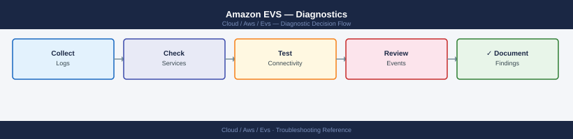
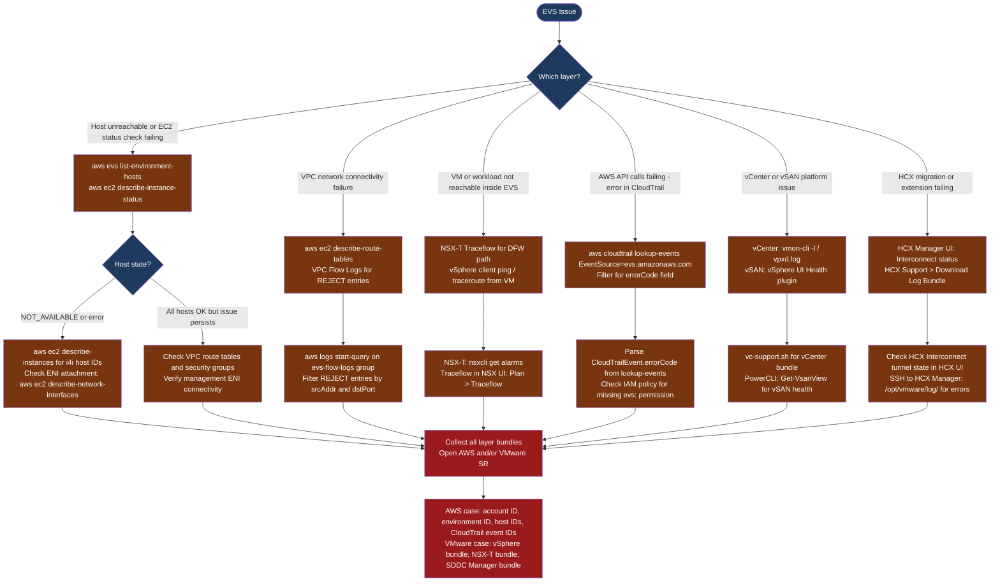

---
tags:
  - aws
  - evs
  - troubleshooting
search:
  boost: 1.5
---
# Amazon EVS — Diagnostics

<div class="kb-summary">
EVS diagnostic commands: check AWS host and ENI state, inspect CloudTrail for API errors, query VPC Flow Logs for dropped traffic, verify VMware platform health (vCenter, vSAN, NSX-T), collect the vSphere and NSX-T support bundles, and diagnose HCX migration failures.

*Applies to: Amazon EVS (Elastic VMware Service)*
</div>





## Before you begin

- **Access:** AWS CLI configured with EVS permissions; vCenter admin credentials; NSX-T admin credentials; HCX admin credentials
- **Gather first:** the specific symptom (host unreachable, VM I/O error, BGP down, migration failed), the affected EVS environment ID, and when the issue started
- **Scope:** confirm whether the issue is at the AWS infrastructure layer, the VMware platform layer, the NSX-T networking layer, or the application layer

---

## Step 1 — Check AWS host and infrastructure state

```bash
# List all EVS hosts and their state
aws evs list-environment-hosts --environment-id $ENV_ID \
  --query 'hostSummaries[*].[hostId,state]' --output table
# Expected: all hosts state = AVAILABLE

# EC2 instance status for EVS hosts (i4i bare-metal instances)
aws ec2 describe-instance-status \
  --filters Name=instance-state-name,Values=running \
  --query 'InstanceStatuses[?SystemStatus.Status!=`ok` || InstanceStatus.Status!=`ok`]' \
  --output table
# Problem: any instance with SystemStatus or InstanceStatus != ok

# VPC route tables — missing routes cause NSX-T BGP and TEP failures
aws ec2 describe-route-tables \
  --filters Name=vpc-id,Values=$EVS_VPC_ID \
  --query 'RouteTables[*].Routes[*].[DestinationCidrBlock,State,GatewayId,NetworkInterfaceId]' \
  --output table
# Problem: any route in blackhole state

# ENI attachment status for EVS hosts
aws ec2 describe-network-interfaces \
  --filters Name=subnet-id,Values=$EVS_MGMT_SUBNET_ID \
  --query 'NetworkInterfaces[*].[NetworkInterfaceId,Status,Attachment.Status,Description]' \
  --output table
# Expected: all Status = in-use, Attachment.Status = attached
```

---

## Step 2 — Check CloudTrail for EVS API errors

```bash
# All EVS API calls in the last 24 hours
aws cloudtrail lookup-events \
  --lookup-attributes AttributeKey=EventSource,AttributeValue=evs.amazonaws.com \
  --start-time $(date -u -v-24H +%Y-%m-%dT%H:%M:%SZ) \
  --query 'Events[*].[EventTime,EventName,Username,ErrorCode]' \
  --output table

# Filter for failed EVS API calls (errorCode present)
aws cloudtrail lookup-events \
  --lookup-attributes AttributeKey=EventSource,AttributeValue=evs.amazonaws.com \
  --start-time $(date -u -v-24H +%Y-%m-%dT%H:%M:%SZ) | \
  python3 -c "
import sys, json
events = json.load(sys.stdin).get('Events', [])
for e in events:
    ct = json.loads(e.get('CloudTrailEvent','{}'))
    if ct.get('errorCode'):
        print(f\"{e['EventTime']} {e['EventName']}: {ct['errorCode']} - {ct.get('errorMessage','')}\")
"

# CloudWatch EVS host metrics
aws cloudwatch get-metric-statistics \
  --namespace AWS/EVS \
  --metric-name HostState \
  --dimensions Name=EnvironmentId,Value=$ENV_ID \
  --start-time $(date -u -v-1H +%Y-%m-%dT%H:%M:%SZ) \
  --end-time $(date -u +%Y-%m-%dT%H:%M:%SZ) \
  --period 300 --statistics Average
```

---

## Step 3 — Inspect VPC Flow Logs for network drops

```bash
# Query VPC Flow Logs via CloudWatch Logs Insights
# Go to: CloudWatch → Logs Insights → select evs-flow-logs log group

# Via CLI: start a query for REJECT entries in the last 5 minutes
aws logs start-query \
  --log-group-name evs-flow-logs \
  --start-time $(($(date +%s) - 300)) \
  --end-time $(date +%s) \
  --query-string 'fields @timestamp, srcAddr, dstAddr, dstPort, action | filter action = "REJECT" | sort @timestamp desc | limit 50'

# Poll for query results
aws logs get-query-results --query-id <query-id> | \
  python3 -c "
import sys, json
results = json.load(sys.stdin).get('results', [])
for row in results:
    fields = {f['field']: f['value'] for f in row}
    print(f\"{fields.get('@timestamp','')} {fields.get('srcAddr','')} -> {fields.get('dstAddr','')}:{fields.get('dstPort','')} ACTION={fields.get('action','')}\")
"
# REJECT entries show which flows are blocked by security group or NACL
```

---

## Step 4 — Check VMware platform health

```bash
# vCenter service health (SSH to VCSA)
ssh root@<vcenter-ip>
vmon-cli -l | grep -v STARTED
# Expected: all services STARTED
# Problem: any service STOPPED

# Key vCenter log
tail -100 /var/log/vmware/vpxd/vpxd.log | grep -i "error\|fail\|exception"

# vSAN health via PowerCLI
Connect-VIServer -Server $VCENTER -User administrator@vsphere.local -Password $PASS
$vsanHealth = Get-VsanView -Id "VsanVcClusterHealthSystem-vsan-cluster-health-system"
$summary = $vsanHealth.QueryVsanClusterHealthSummary(
    (Get-Cluster).Id, $null, $null, $true, $null, $null, "defaultView")
$summary.OverallHealth
$summary.Groups | Where-Object {$_.GroupHealth -ne "green"} | Select GroupName, GroupHealth

# ESXi host connectivity
Get-VMHost | Select Name, ConnectionState, PowerState | Where-Object {$_.ConnectionState -ne "Connected"}
```

---

## Step 5 — Check NSX-T health in EVS

```bash
# NSX-T Manager cluster health
curl -sk -u "admin:$NSX_PASSWORD" "$NSX_URL/api/v1/cluster/status" | \
  python3 -c "import sys,json; d=json.load(sys.stdin); print(f\"Cluster: {d['mgmt_cluster_status']['status']}\")"

# NSX-T transport node state (ESXi hosts)
curl -sk -u "admin:$NSX_PASSWORD" "$NSX_URL/api/v1/transport-nodes/status" | \
  python3 -c "
import sys,json
for tn in json.load(sys.stdin).get('results',[]):
    state = tn.get('state','?')
    name  = tn.get('display_name','?')
    if state != 'success':
        print(f'PROBLEM: {name} state={state}')
"

# T0 BGP neighbor state (check inter-VPC BGP with AWS VGW)
curl -sk -u "admin:$NSX_PASSWORD" \
  "$NSX_URL/policy/api/v1/infra/tier-0s/<t0-id>/locale-services/<svc-id>/bgp/neighbors/status" | \
  python3 -c "
import sys,json
for n in json.load(sys.stdin).get('results',[]):
    print(f\"{n['neighbor_address']}: {n['connection_state']}\")
"
# Expected: all peers ESTABLISHED
```

---

## Step 6 — Collect vSphere, NSX-T, and SDDC Manager bundles

```bash
# vCenter support bundle (SSH to VCSA)
ssh root@<vcenter-ip>
vc-support.sh -L /tmp/vc-support
# Or: VAMI → https://<vcenter>:5480 → Monitoring → Create Support Bundle

# NSX-T support bundle (REST API)
TASK_ID=$(curl -sk -u "admin:$NSX_PASSWORD" \
  -X POST "$NSX_URL/api/v1/support-bundles?action=collect" \
  -H "Content-Type: application/json" \
  -d '{"log_age": 1440}' | python3 -c "import sys,json; print(json.load(sys.stdin)['id'])")

# Monitor NSX-T bundle progress
curl -sk -u "admin:$NSX_PASSWORD" \
  "$NSX_URL/api/v1/tasks/$TASK_ID" | python3 -c "import sys,json; d=json.load(sys.stdin); print(d['status'])"

# SDDC Manager logs (SSH to SDDC Manager)
ssh vcf@<sddc-manager-ip>
tail -100 /var/log/vmware/vcf/lcm/lcm.log | grep -i "error\|fail"
tail -100 /var/log/vmware/vcf/domainmanager/domainmanager.log | grep -i "error\|fail"

# ESXi vm-support bundle (from each host)
ssh root@<esxi-host-ip>
vm-support -w /tmp
# Output: /tmp/esx-<hostname>-<timestamp>.tgz

# HCX log bundle (if HCX-related issue)
# HCX Manager UI → Support → Download Log Bundle
```

---

## Step 7 — Diagnose HCX and collect escalation data

```bash
# HCX Interconnect tunnel status (from HCX Manager UI)
# HCX Manager → Interconnect → Service Mesh → verify tunnel state

# HCX Manager SSH
ssh admin@<hcx-manager-ip>
tail -100 /opt/vmware/log/edge/edge-main.log | grep -i "error\|fail\|warn"

# AWS-specific: account and environment IDs for the support case
aws sts get-caller-identity
aws evs list-environments --query 'environmentSummaries[*].[name,environmentId,state]' --output table

# Provide in AWS support case:
# - Account ID and Environment ID
# - EVS host IDs from list-environment-hosts
# - CloudTrail event IDs for failed API calls
# - VPC ID, subnet IDs, and route table IDs
# - CloudWatch log group name for Flow Logs

# Provide in VMware support case:
# - vCenter support bundle + NSX-T support bundle
# - SDDC Manager log excerpts
# - EVS version: vSphere version + NSX-T version
# - HCX log bundle (for HCX-related issues)
```

---

## Log locations

| Component | Source | What to look for |
|---|---|---|
| AWS EVS API | `aws cloudtrail lookup-events EventSource=evs.amazonaws.com` | errorCode on any EVS call |
| VPC network | VPC Flow Logs in CloudWatch Logs or S3 | REJECT entries for EVS subnets |
| vCenter | `/var/log/vmware/vpxd/vpxd.log` | Task failures, auth errors |
| NSX-T Manager | `/var/log/vmware/nsx-manager/manager.log` | Control plane errors |
| SDDC Manager | `/var/log/vmware/vcf/lcm/lcm.log` | Lifecycle and upgrade errors |
| ESXi host | `vmkernel.log`, `hostd.log` | NIC, storage, NSX VIB errors |
| HCX Manager | `/opt/vmware/log/` | Migration and tunnel errors |

---

## See also

- [Amazon EVS — Common Issues](common-issues/)
- [Amazon EVS — Escalation](escalation/)

## Verify resolution

- `aws evs list-environment-hosts` shows all hosts in AVAILABLE state
- `aws ec2 describe-instance-status` shows no hosts with SystemStatus or InstanceStatus failures
- `GET /api/v1/cluster/status` shows NSX-T cluster STABLE with BGP peers ESTABLISHED
- VPC Flow Logs query shows no new REJECT entries for the affected source/destination pair
- VM connectivity test succeeds: ping from affected VM to target IP returns 0% loss
- `vc-support.sh` bundle collection completes without errors — no new Error events in vpxd.log
