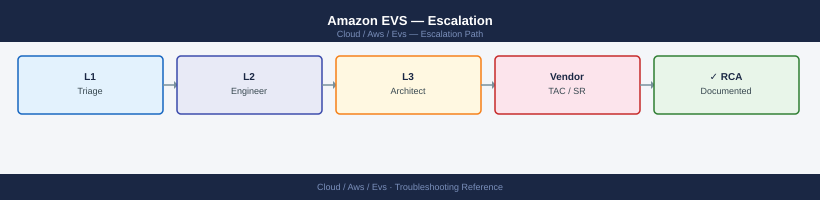

---
tags:
  - aws
  - troubleshooting
search:
  boost: 1.5
---
# Amazon EVS — Escalation

<div class="kb-summary">
AWS support escalation for EVS: severity levels, required data for support cases, joint VMware/AWS ticket coordination, and TAM escalation for production-critical issues.

*Applies to: Amazon EVS*
</div>



```d2
direction: down

symptom: Identify Symptom {shape: diamond}
case_routing_matrix: "Case Routing Matrix" {shape: rectangle}
severity_levels: "Severity Levels" {shape: rectangle}
aws_support_case_requirements: "AWS Support Case Requirements" {shape: rectangle}
vmware_support_case_requirements: "VMware Support Case Requirements" {shape: rectangle}
tam_and_account_team_escalation: "TAM and Account Team Escalation" {shape: rectangle}
escalation_path: "Escalation Path" {shape: rectangle}
resolution: Resolve or Escalate {shape: oval}

symptom -> case_routing_matrix: investigate
symptom -> severity_levels: investigate
symptom -> aws_support_case_requirements: investigate
symptom -> vmware_support_case_requirements: investigate
symptom -> tam_and_account_team_escalation: investigate
symptom -> escalation_path: investigate
case_routing_matrix -> resolution
severity_levels -> resolution
aws_support_case_requirements -> resolution
vmware_support_case_requirements -> resolution
tam_and_account_team_escalation -> resolution
escalation_path -> resolution
```

## Before you begin

- **Access:** Admin credentials on all affected systems
- **Gather first:** recent error message text, event timestamps, and affected object names
- **Scope:** confirm whether the issue affects a single object, host, cluster, or site
- **Escalation:** open a vendor support ticket before running any destructive step
- **Logging:** document each command and output — required if escalation is needed

---

## Case Routing Matrix

Use this matrix to determine who to contact first and when to open joint cases.

| Issue Type | First Contact | Escalation | Joint Case? |
|---|---|---|---|
| Host FAILED or CREATE_FAILED | AWS Support | AWS TAM after 2 hours with no progress | No — AWS owns host infrastructure |
| vSAN data loss risk (object inaccessible) | VMware/Broadcom GSS | VMware TAM / Duty Manager | Yes if EVS host or ENI is also failed |
| NSX-T control plane down (Manager VMs unreachable) | VMware/Broadcom GSS | VMware TAM | Yes if vSAN or host failure contributed |
| HCX migration failure | AWS Support (DX/network layer) + VMware GSS (HCX layer) | Both TAMs | Always — HCX spans both |
| EVS API error (InternalServerException) | AWS Support | AWS TAM after 1 hour | No |
| DX connectivity loss affecting EVS management | AWS Support | AWS TAM immediately (P1 scope) | No |
| SDDC Manager workflow stuck | VMware/Broadcom GSS | VMware TAM | No |
| vCenter unreachable (not vSAN-related) | VMware/Broadcom GSS | VMware TAM | No |

When an issue involves both infrastructure and software (e.g., a host failure that triggered vSAN degradation which then caused NSX-T Manager VMs to lose storage), open cases with both vendors simultaneously and share case IDs between them. AWS and VMware/Broadcom have a joint escalation process for EVS specifically.

## Severity Levels

| Severity | Definition | AWS Response SLA |
|---|---|---|
| Critical | Production cluster down; business-critical workloads unavailable | 15 min (Business/Enterprise) |
| High | Production degraded; significant function impaired | 1 hour |
| Medium | Non-critical failure; workaround available | 4 hours |
| Low | General question or guidance needed | 1 business day |

Enterprise Support plan required for Critical SLA. Business Support provides High = 4 hours.

## AWS Support Case Requirements

Always include this data when opening an EVS case with AWS. Missing information causes round-trip delays averaging 4-6 hours per exchange.

```bash
# 1. EVS environment and host IDs
aws evs get-environment --environment-id $ENV_ID \
  --query '[environment.environmentName, environment.state]' --output text

aws evs list-environment-hosts --environment-id $ENV_ID \
  --query 'hostSummaries[*].[hostId,instanceType,state]' --output table

# 2. CloudTrail export (last 24 hours of EVS events)
aws cloudtrail lookup-events \
  --lookup-attributes AttributeKey=EventSource,AttributeValue=evs.amazonaws.com \
  --start-time $(date -u -v-24H +%Y-%m-%dT%H:%M:%SZ) \
  --output json > cloudtrail-evs-24h.json

# 3. EC2 instance status for EVS hosts
aws ec2 describe-instance-status \
  --instance-ids $(aws evs list-environment-hosts --environment-id $ENV_ID \
    --query 'hostSummaries[*].hostId' --output text) \
  --output json > ec2-instance-status.json

# 4. VPC and subnet configuration
aws ec2 describe-subnets \
  --filters Name=vpc-id,Values=$EVS_VPC_ID --output json > vpc-subnets.json

# 5. Symptom timeline: when did the issue start? what changed?
# Include: last successful operation timestamp, first error observed, any DX/VPN changes
```


```text title="Expected output"
prod-analytics-env	ACTIVE
hostId                          instanceType    state
──────────────────────────────  ──────────────  ───────
host-0a7f2c1b9e4d5f3a          m5.2xlarge      RUNNING
host-1b8e3d2c0f5e6g4b          m5.2xlarge      RUNNING
host-2c9f4e3d1g6f7h5c          m5.xlarge       STOPPED
host-3d0g5f4e2h7g8i6d          m5.2xlarge      RUNNING

{
  "Events": [
    {
      "EventId": "a1b2c3d4-e5f6-7890-abcd-ef1234567890",
      "EventName": "CreateEnvironment",
      "EventSource": "evs.amazonaws.com",
      "EventTime": "2024-01-15T14:32:18Z",
      "Username": "arn:aws:iam::123456789012:user/devops-admin"
    },
    {
      "EventId": "b2c3d4e5-f6g7-8901-bcde-f12345678901",
      "EventName": "UpdateEnvironmentHosts",
      "EventSource": "evs.amazonaws.com",
      "EventTime": "2024-01-15T18:47:52Z",
      "Username": "arn:aws:iam::123456789012:role/EVSAutomation"
    }
  ],
  "ResponseMetadata": {
    "RequestId": "req-9f8e7d6c5b4a3210",
    "HTTPStatusCode": 200
  }
}

(output written to ec2-instance-status.json)

(output written to vpc-subnets.json)
```

!!! warning "Common errors"
    **`An error occurred (InvalidParameterValue) when calling the ListEnvironmentHosts operation: Invalid environment ID format`** — Verify that `$ENV_ID` is set correctly with `echo $ENV_ID` and matches the format `env-xxxxxxxxxxxxxxxx`.
    **`An error occurred (UnauthorizedOperation) when calling the DescribeInstanceStatus operation: You are not authorized to perform: ec2:DescribeInstanceStatus`** — Add `ec2:DescribeInstanceStatus` permission to your IAM user/role policy.
    **`date: illegal time format`** — Use `date -u -d '24 hours ago' +%Y-%m-%dT%H:%M:%SZ` on Linux systems instead of the BSD `-v` flag.
For networking issues (HCX tunnel down, BGP failure), also include:

```bash
# VPC route tables
aws ec2 describe-route-tables \
  --filters Name=vpc-id,Values=$EVS_VPC_ID --output json > vpc-route-tables.json

# ENI status for EVS management subnet
aws ec2 describe-network-interfaces \
  --filters Name=subnet-id,Values=$EVS_MGMT_SUBNET_ID \
  --output json > eni-status.json

# DX connection state
aws directconnect describe-connections \
  --query 'connections[*].[connectionId,connectionName,connectionState,bandwidth]' \
  --output table
```


```text title="Expected output"
{
    "RouteTables": [
        {
            "RouteTableId": "rtb-0a7f2c8e9d1b4f6a2",
            "VpcId": "vpc-047e3f9c2d8b1a5e6",
            "Routes": [
                {
                    "DestinationCidrBlock": "10.0.0.0/16",
                    "GatewayId": "local",
                    "State": "active"
                },
                {
                    "DestinationCidrBlock": "0.0.0.0/0",
                    "GatewayId": "igw-0c2f8a1d9e7b3f4a5",
                    "State": "active"
                }
            ]
        }
    ]
}
{
    "NetworkInterfaces": [
        {
            "NetworkInterfaceId": "eni-0f3a8c2d1b9e7f4a6",
            "SubnetId": "subnet-0d7e2f1a9c8b3e5f4",
            "Status": "in-use",
            "PrivateIpAddress": "10.0.12.47",
            "Association": {
                "PublicIp": "203.0.113.42"
            }
        },
        {
            "NetworkInterfaceId": "eni-0a1b2c3d4e5f6g7h8",
            "SubnetId": "subnet-0d7e2f1a9c8b3e5f4",
            "Status": "available",
            "PrivateIpAddress": "10.0.12.89"
        }
    ]
}
|  connectionId          | connectionName      | connectionState | bandwidth   |
|------------------------|---------------------|-----------------|-------------|
|  dxcon-0f8a2c1d9e7b3f4 |  EVS-Primary-DX     |  available      |  10Gbps     |
|  dxcon-0a1b2c3d4e5f6g7 |  EVS-Backup-DX      |  down           |  10Gbps     |
```

!!! warning "Common errors"
    **`An error occurred (InvalidParameterValue) when calling the DescribeRouteTables operation: The filter 'vpc-id' is invalid`** — Verify the filter name is correct; use `Name=vpc-id` (not `vpcId`) and ensure `$EVS_VPC_ID` variable is set with `echo $EVS_VPC_ID`.
    **`Unable to locate credentials`** — Configure AWS credentials using `aws configure` or set `AWS_PROFILE`, `AWS_ACCESS_KEY_ID`, and `AWS_SECRET_ACCESS_KEY` environment variables.
    **`An error occurred (InvalidSubnetID.NotFound) when calling the DescribeNetworkInterfaces operation: The subnet ID 'subnet-xxx' does not exist`** — Confirm the subnet ID in `$EVS_MGMT_SUBNET_ID` exists in the correct region with `aws ec2 describe-subnets --region <region>`.
## VMware Support Case Requirements

```bash
# Always gather before calling VMware support

# 1. NSX-T support bundle
curl -sk -u "admin:$NSX_PASSWORD" \
  -X POST "$NSX_URL/api/v1/support-bundles?action=collect" \
  -H "Content-Type: application/json" -d '{}' | python3 -m json.tool

# 2. vCenter log bundle
# vCenter UI → Administration → Support → Create Support Bundle
# Or SFTP: /var/log/vmware/support/*.zip on vCenter appliance

# 3. SDDC Manager bundle
curl -sk -u "$SDDC_USER:$SDDC_PASS" \
  -X POST "https://sddc-manager.vcf.internal/v1/support-bundles" \
  -H "Content-Type: application/json" | python3 -m json.tool

# 4. vSAN Health XML export
# vCenter → Cluster → vSAN → Skyline Health → Export Health Data
```


```text title="Expected output"
{
  "resource_type": "SupportBundle",
  "id": "support-bundle-20240115-093847",
  "status": "COLLECTING",
  "bundle_size": 0,
  "created_time": "2024-01-15T09:38:47.123Z",
  "estimated_completion": "2024-01-15T09:48:47.123Z"
}
{
  "id": "support-bundle-sddc-2024-01-15-093852",
  "status": "IN_PROGRESS",
  "progress_percentage": 0,
  "created_at": "2024-01-15T09:38:52Z",
  "bundle_location": "/var/log/sddc-manager/support-bundles/",
  "estimated_size_mb": 450
}
```

!!! warning "Common errors"
    **`curl: (60) SSL certificate problem: self signed certificate`** — Add `-k` flag to curl command to skip certificate verification (already present; verify NSX_URL and NSX_PASSWORD environment variables are set correctly).
    **`jq: command not found`** — Install python3-json or use `python3 -m json.tool` instead of piping to `jq` for JSON formatting.
    **`curl: (7) Failed to connect to sddc-manager.vcf.internal port 443: Name or service not known`** — Verify SDDC Manager hostname resolves and is reachable from the management network; check `/etc/hosts` or DNS configuration.
Additional data for VMware support cases:

```powershell
# VCF version and build numbers
Connect-VIServer -Server $VCENTER -User administrator@vsphere.local -Password $PASS
$vcenter = Get-View -Id "ServiceInstance"
Write-Host "vCenter build: $($vcenter.Content.About.Build)"
Write-Host "vCenter version: $($vcenter.Content.About.Version)"

# Host build info
Get-VMHost | Select Name, Build, Version

# vSAN cluster health summary for case description
$cluster = Get-Cluster
$vsanHealth = Get-VsanView -Id "VsanVcClusterHealthSystem-vsan-cluster-health-system"
$summary = $vsanHealth.QueryVsanClusterHealthSummary(
    $cluster.Id, $null, $null, $true, $null, $null, "defaultView")
Write-Host "Overall vSAN health: $($summary.OverallHealth)"
$summary.Groups | Where-Object { $_.GroupHealth -ne "green" } | ForEach-Object {
    Write-Host "DEGRADED: $($_.GroupName)"
}
```

For SR (Service Request) submission, include the VCF version (from SDDC Manager → Dashboard → Version), the support bundle file URLs, and the PowerCLI output above in the case description.

## TAM and Account Team Escalation

Escalate to your AWS TAM when:
- A P1 production outage has no progress after 4 hours with standard AWS Support.
- There is a risk of data loss (vSAN objects inaccessible, host with encrypted datastores unrecoverable).
- The issue spans both AWS and VMware and neither vendor is making progress.
- A scheduled maintenance window is at risk and business impact is imminent.

```bash
# Set severity to Critical via AWS Support console
# Support → Cases → Open case → Severity: Critical (Business-impacting)
# OR via AWS Support API:
aws support create-case \
  --subject "EVS Production Cluster Outage - Environment $ENV_ID" \
  --service-code "aws-elastic-vmware-service" \
  --severity-code "critical" \
  --category-code "general-guidance" \
  --communication-body "Environment ID: $ENV_ID
Host IDs: <list>
Issue: <description>
Impact: Production workloads unavailable since <timestamp>
Steps taken: <what has been tried>

CloudTrail export attached. EC2 instance status attached."
```


```text title="Expected output"
{
    "caseId": "case-1234567890abcdef0",
    "displayId": "us-east-1/1234567890",
    "subject": "EVS Production Cluster Outage - Environment prod-evs-cluster-02",
    "status": "opened",
    "serviceCode": "aws-elastic-vmware-service",
    "severityCode": "critical",
    "submittedBy": "arn:aws:iam::123456789012:user/admin-user",
    "timeCreated": "2024-01-15T14:32:18.000Z",
    "recentCommunications": {
        "communications": [
            {
                "body": "Environment ID: prod-evs-cluster-02\nHost IDs: h-0a1b2c3d4e5f6g7h8, h-1i2j3k4l5m6n7o8p9\nIssue: Cluster nodes unreachable\nImpact: Production workloads unavailable since 2024-01-15T13:45:00Z\nSteps taken: Verified network connectivity, checked security groups\n\nCloudTrail export attached. EC2 instance status attached.",
                "submittedBy": "arn:aws:iam::123456789012:user/admin-user",
                "timeCreated": "2024-01-15T14:32:18.000Z",
                "attachmentSet": []
            }
        ]
    }
}
```

!!! warning "Common errors"
    **`An error occurred (ValidationException) when calling the CreateCase operation: Invalid severity code 'critical' for service 'aws-elastic-vmware-service'`** — Use `--severity-code "urgent"` instead, as EVS support cases require the "urgent" severity level.
    **`An error occurred (AccessDeniedException) when calling the CreateCase operation: User is not authorized to perform: support:CreateCase`** — Attach the `AWSSupportAccess` IAM policy to the user or role executing this command.
    **`An error occurred (InvalidParameterException) when calling the CreateCase operation: Service code 'aws-elastic-vmware-service' is not valid`** — Verify the correct service code with `aws support describe-services --query 'services[?name==`VMware Cloud on AWS`]'` and use the returned serviceCode value.
Expected response times by support tier:

| Plan | Critical | High | Medium |
|---|---|---|---|
| Enterprise | 15 minutes (24/7 phone) | 1 hour | 4 hours |
| Business | 1 hour (24/7 phone for critical) | 4 hours | 12 hours |
| Developer | Not available | Not available | 12 business hours |

Enterprise Support is required for EVS production. Business Support is the minimum for non-production. Developer Support has no SLA for infrastructure issues.

To request TAM engagement on an existing case, add a case correspondence explicitly asking for TAM review: "Requesting TAM review — P1 production outage with no resolution progress in 4 hours." Your TAM will join the case within 30 minutes during business hours or can be reached directly by phone.

## Escalation Path

```text
EVS Infrastructure Issue (host, ENI, VPC, DX):
  1. Open AWS support case (severity Critical or High)
  2. Phone: available for Business/Enterprise support plans
     Enterprise: 24×7 phone access; Business: 24×7 for Critical
  3. Provide: environment ID, host ID, CloudTrail export, EC2 status
  4. If no progress in 1-2 hours: request TAM (Technical Account Manager)

VCF Software Issue (vSAN, NSX-T, vCenter, SDDC Manager):
  1. Open VMware support case (Broadcom Support portal)
  2. Provide: vSAN/NSX support bundle, VCF version, SDDC Manager logs
  3. For joint issues (e.g., NSX-T can't communicate over EVS ENI):
     Open both AWS and VMware cases and reference each other's case ID

Both vendors involved (most common for HCX issues):
  1. Open AWS case for network layer (ENI, SG, DX, VPC routing)
  2. Open VMware case for HCX application layer
  3. Note: AWS and VMware have joint escalation process for EVS
```

## Post-Incident Review

After any P1 or P2 EVS incident, conduct a post-incident review before closing the support case.

Steps for post-incident review:
1. Document the full timeline: when the issue started, when it was detected, when each diagnostic step was taken, when resolution was achieved.
2. Identify the root cause using a 5-why analysis. Ask "why did this happen?" five times to reach the underlying systemic cause rather than the proximate cause.
3. Request the Root Cause Analysis (RCA) document from AWS and/or VMware. AWS Enterprise Support provides formal RCA documents for P1 incidents. VMware/Broadcom provides these for Critical SRs with data loss risk.
4. Document corrective actions: what changes to monitoring, runbooks, or architecture will prevent recurrence.
5. Add the timeline, root cause, and corrective actions to the team runbook for this issue category.

```text
RCA document request (add to support case correspondence):

"Please provide a formal Root Cause Analysis document for this incident.
Include:
- Timeline of events on the AWS/VMware infrastructure side
- Root cause of the failure
- AWS/VMware corrective actions taken or planned
- Recommended customer-side preventive measures

This is required for our internal post-incident review process."
```

For recurring issues (same root cause appearing more than once), escalate to your AWS TAM and request a Well-Architected Review for your EVS environment. AWS offers a focused EVS review that covers resiliency, networking, and operations best practices.

---

## See also

- [Amazon EVS — Diagnostics](../diagnostics/)
- [Amazon EVS — Common Issues](../common-issues/)

## Verify resolution

- Confirm the original symptom no longer occurs
- Check logs for any residual errors related to the issue
- Monitor for 10–15 minutes to confirm the fix is stable
