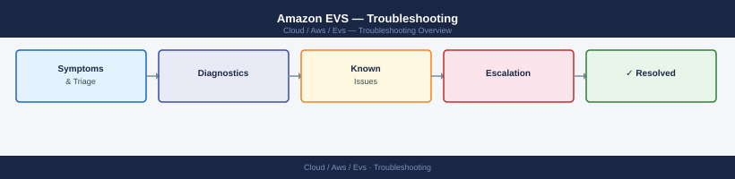
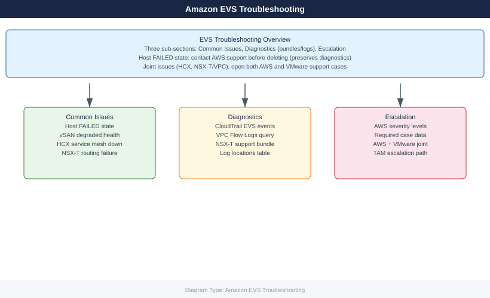

---
tags:
  - aws
  - troubleshooting
search:
  boost: 1.5
---
# Amazon EVS — Troubleshooting

<!-- diagram:evs-troubleshooting -->

EVS troubleshooting: host failures, vSAN degraded health, HCX connectivity issues, NSX-T networking failures, and AWS support escalation process.

*Applies to: Amazon EVS*

  <a class="kb-card" href="common-issues/">
    Common Issues
    Host failures, vSAN degraded, HCX down, NSX-T networking, API errors
  </a>
  <a class="kb-card" href="diagnostics/">
    Diagnostics
    AWS support bundles, vSAN HCL check, NSX-T support bundle, log collection
  </a>
  <a class="kb-card" href="escalation/">
    Escalation
    AWS support case process, TAM escalation, required data for EVS cases
  </a>

