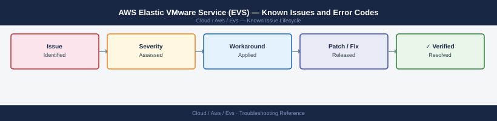

---
tags:
  - troubleshooting
  - aws-evs
  - aws
  - vmware
  - known-issues
description: "Catalog of known AWS EVS bugs and workarounds. EVS runs VMware vSphere, vSAN, and NSX on AWS bare-metal — issues may be at the AWS control plane layer or..."
---
# AWS Elastic VMware Service (EVS) — Known Issues and Error Codes

<div class="kb-summary">
Catalog of known AWS EVS bugs and workarounds. EVS runs VMware vSphere, vSAN, and NSX on AWS bare-metal — issues may be at the AWS control plane layer or within the VMware layer running on top.

*Applies to: AWS EVS (GA 2025)*
</div>



```d2
direction: down

symptom: Identify Symptom {shape: diamond}
aws_control_plane: "AWS Control Plane" {shape: rectangle}
networking: "Networking" {shape: rectangle}
vmware_layer: "VMware Layer" {shape: rectangle}
resolution: Resolve or Escalate {shape: oval}

symptom -> aws_control_plane: investigate
symptom -> networking: investigate
symptom -> vmware_layer: investigate
aws_control_plane -> resolution
networking -> resolution
vmware_layer -> resolution
```

## Before you begin

- AWS EVS control plane issues: check AWS Health Dashboard and `evs.<region>.amazonaws.com` API.
- VMware layer issues (vCenter, vSAN, NSX errors): refer to respective VMware known-issues pages.
- EVS security group misconfigurations are the most common networking issue.

## AWS Control Plane

| Error / Symptom | Affected Versions | Cause | Workaround / Fix | Fixed In |
|---|---|---|---|---|
| EVS cluster creation failing: `InsufficientCapacity` | EVS GA | i4i bare-metal capacity unavailable in requested AZ | Try different AZ; contact AWS sales for reserved capacity | N/A |
| EVS API returning `ServiceUnavailableException` | EVS GA | Transient AWS EVS control plane issue | Retry with exponential backoff; check AWS Health Dashboard | N/A |

## Networking

| Error / Symptom | Affected Versions | Cause | Workaround / Fix | Fixed In |
|---|---|---|---|---|
| Cannot reach vCenter after EVS deployment | EVS GA | VPN/Direct Connect not established; or security group blocking 443 | Verify DX/VPN connectivity; check EVS management VPC security group allows 443 from admin IPs | N/A |
| vSAN traffic degraded in EVS | EVS GA | EVS security group not allowing UDP 12345/12346 between ESXi hosts | Update EVS security group to allow vSAN ports between ESXi management IPs | N/A |

## VMware Layer

For VMware-specific issues within EVS, refer to:
- [VMware vCenter — Known Issues](../../../../../virtualization/vmware/products/vcenter/troubleshooting/known-issues/)
- [VMware vSAN — Known Issues](../../../../../virtualization/vmware/products/vsan/troubleshooting/known-issues/)
- [VMware NSX — Known Issues](../../../../../virtualization/vmware/products/nsx/troubleshooting/known-issues/)

## See also

- [AWS EVS — Common Issues](../common-issues/)
- [AWS — Known Issues](../../troubleshooting/known-issues.md)
