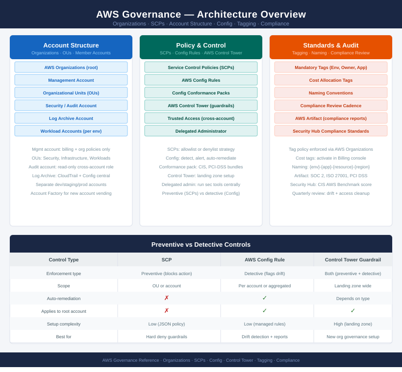

# AWS Governance

AWS governance is structured around AWS Organizations with a management account, Security/Log Archive accounts, and workload accounts per environment. SCPs enforce preventive guardrails at the OU level; AWS Config with conformance packs handles detective compliance. Tagging standards and naming conventions underpin cost allocation and resource ownership.

<a class="kb-card" href="aws-config/">
  <strong>AWS Config</strong>
  Resource inventory, compliance rules, and drift review.
</a>

<a class="kb-card" href="aws-organizations/">
  <strong>AWS Organizations</strong>
  Accounts, OUs, policies, and governance boundaries.
</a>

<a class="kb-card" href="service-control-policies/">
  <strong>Service Control Policies</strong>
  SCP design, guardrails, testing, and exceptions.
</a>

<a class="kb-card" href="account-structure/">
  <strong>Account Structure</strong>
  Account layout, ownership, environment separation, and standards.
</a>

<a class="kb-card" href="tagging-standards/">
  <strong>Tagging Standards</strong>
  Required tags, cost tags, ownership, and compliance.
</a>

<a class="kb-card" href="compliance-review/">
  <strong>Compliance Review</strong>
  Control review, evidence, drift, and remediation tracking.
</a>

