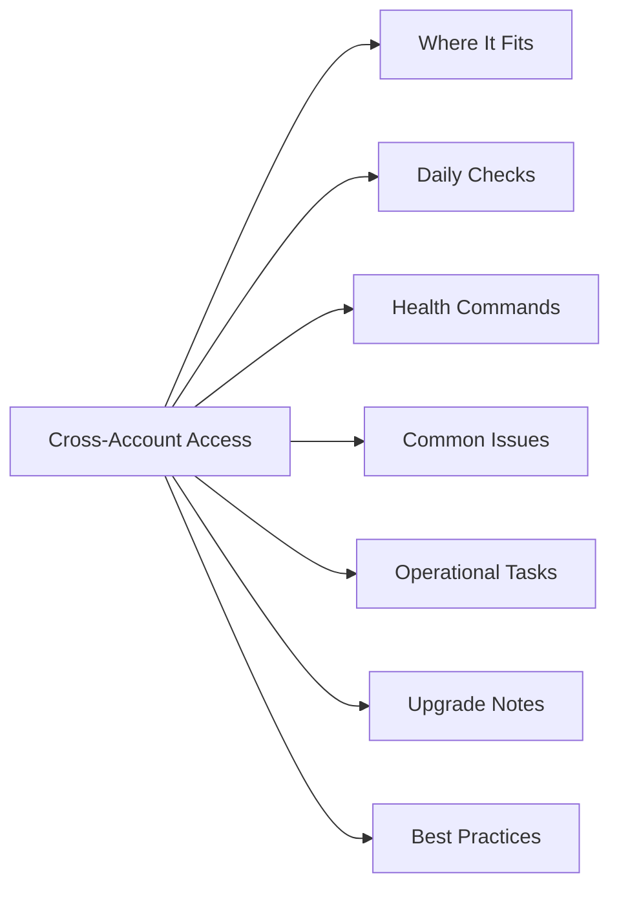

# AWS Cross-Account Access

## Overview

AWS Cross-Account Access notes for day-to-day infrastructure operations.

## Where It Fits

Use this page for build work, support checks, troubleshooting, standards, and operational review.

## Daily Checks

| Check | Command | Notes |
|---|---|---|
| Confirm service health. |  |  |
| Review alerts. |  |  |
| Check recent changes. |  |  |
| Confirm capacity and performance are within normal range. |  |  |

## Health Commands

~~~bash
# Add environment-specific commands here
~~~

## Common Issues

- Misconfiguration after change work.
- Missing access or permissions.
- Alert noise without clear ownership.
- Drift from documented standards.

## Operational Tasks

| Task | Command |
|---|---|
| Review current configuration. |  |
| Validate dependencies. |  |
| Record changes. |  |
| Confirm monitoring coverage. |  |

## Upgrade Notes

- Check release notes before upgrades.
- Validate backup or rollback options.
- Confirm maintenance window and communication plan.
- Test after the change.

## Best Practices

| Recommendation | Detail |
|---|---|
| Keep naming consistent. | Keep naming consistent. |
| Document ownership. | Document ownership. |
| Use least privilege access. | Use least privilege access. |
| Validate changes after implementation. | Validate changes after implementation. |
