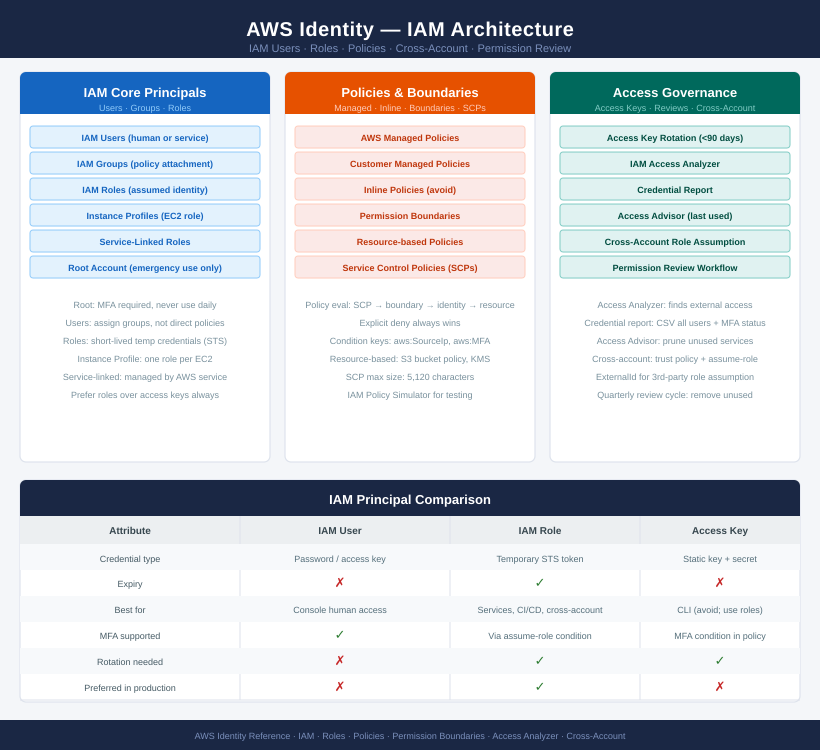

# AWS Identity

<div class="kb-summary">
AWS IAM governs every API call in the platform. The principle of least privilege is enforced through roles (not users), customer-managed policies with Permission Boundaries, and SCPs at the org level. Access Analyzer, Access Advisor, and Credential Reports feed the quarterly permission review cycle.
</div>

```text
┌──────────────────────────────────────── AWS Identity Overview ────────────────────────────────────────┐
│                                                                                                       │
│   ┌───────────────────────────────────────────────────────────────────────────────────────────────┐   │
│   │               AWS Identity — IAM, IAM Identity Center, and Permission Management              │   │
│   │  IAM: every AWS API call is authenticated via IAM; roles preferred over long-lived user keys  │   │
│   │ IAM Identity Center: SSO for AWS console and CLI; groups mapped to permission sets in accounts│   │
│   │     Least privilege: customer-managed policies + Permission Boundaries limit blast radius     │   │
│   │ Review cycle: Access Analyzer, Access Advisor, Credential Report — quarterly permission review│   │
│   └───────────────────────────────────────────────────────────────────────────────────────────────┘   │
│                                                                                                       │
│    IAM authenticates every API call · Identity Center enables SSO                                     │
│                                                                                                       │
│                  ▼                                ▼                                ▼                  │
│                                                                                                       │
│   ┌─────────────────────────────┐  ┌─────────────────────────────┐  ┌─────────────────────────────┐   │
│   │             IAM             │  │     IAM Identity Center     │  │        Access Control       │   │
│   │  Roles: EC2, Lambda, X-acct │  │   SSO: browser + CLI login  │  │     Permission Boundary     │   │
│   │   Policies: managed+inline  │  │   Groups → permission sets  │  │  Resource policies: S3/KMS  │   │
│   │  Trust policy: who assumes  │  │     IdP: Azure AD / Okta    │  │  Access Analyzer: external  │   │
│   │  Access keys: rotate/delete │  │   Permission sets: scoped   │  │  Access Advisor: last used  │   │
│   │    Cross-acct: sts assume   │  │  Assignment: user+acct+set  │  │   Credential Report: audit  │   │
│   └─────────────────────────────┘  └─────────────────────────────┘  └─────────────────────────────┘   │
│                                                                                                       │
│    IAM manages roles and policies · Identity Center enables SSO                                       │
│                                                                                                       │
│                  ▼                                ▼                                ▼                  │
│                                                                                                       │
│   ┌───────────────────────────────────────────────────────────────────────────────────────────────┐   │
│   │       IAM        │    IAM Roles     │    IAM Policies   │   Access Keys    │  Cross-Account   │   │
│   │    List users    │   Trust policy   │    Managed: AWS   │    Rotate 90d    │    Trust: sts    │   │
│   │ Password policy  │   EC2 profile    │  Managed: custom  │  Delete unused   │   assume-role    │   │
│   │   MFA: enforce   │  X-acct assume   │   Inline: tight   │  Inventory: all  │   External ID    │   │
│   │Credential report │   Lambda role    │   Boundary: max   │   Cred report    │   Session tags   │   │
│   └───────────────────────────────────────────────────────────────────────────────────────────────┘   │
│                                                                                                       │
│  Physical Infrastructure (the hardware everything above runs on):                                     │
│  AWS IAM global service · IAM Identity Center in management account · STS regional endpoints          │
│                                                                                                       │
│  Key terms:                                                                                           │
│                                                                                                       │
│  IAM Role       = Identity with trust policy; assumed by services, users, or other accounts for temp  │
│  Trust policy   = JSON document on a role defining who can call sts:AssumeRole on it                  │
│  Permission Boundary= IAM policy limiting maximum permissions a role or user can have; reduces blast  │
│  IAM Identity Center= AWS SSO; centralises human access to accounts via groups and permission sets    │
│  Permission set = Collection of IAM policies assigned to a user/group for one or more accounts via SSO│
│  Access Analyzer= Identifies resources shared outside the account or org; detects unintended external │
│  Access Advisor  = Shows last service access dates per role; helps prune unused permissions           │
│  Credential Report= CSV listing all IAM users, key age, MFA status, and last login per account        │
│  Instance profile= IAM role wrapper for EC2; metadata endpoint exposes temporary credentials to the OS│
│  Cross-account role= Role in account B trusted by account A; enables resource sharing without key     │
│  STS            = Security Token Service; issues temporary credentials for assume-role and federation │
│  External ID    = Secret added to cross-account trust policy; prevents confused deputy attacks        │
│                                                                                                       │
└───────────────────────────────────────────────────────────────────────────────────────────────────────┘
```



<div class="kb-grid kb-grid-3">

<a class="kb-card" href="iam/">
  <strong>IAM</strong>
  <span>Identity and access management basics, review, and cleanup.</span>
</a>

<a class="kb-card" href="iam-roles/">
  <strong>IAM Roles</strong>
  <span>Role trust, permissions, instance profiles, and cross-account use.</span>
</a>

<a class="kb-card" href="iam-policies/">
  <strong>IAM Policies</strong>
  <span>Policy structure, least privilege, testing, and review.</span>
</a>

<a class="kb-card" href="access-keys/">
  <strong>Access Keys</strong>
  <span>Key inventory, rotation, ownership, and cleanup.</span>
</a>

<a class="kb-card" href="permission-review/">
  <strong>Permission Review</strong>
  <span>Access review workflow and least privilege validation.</span>
</a>

<a class="kb-card" href="cross-account-access/">
  <strong>Cross-Account Access</strong>
  <span>Role assumption, trust policy, and account boundary checks.</span>
</a>

</div>
