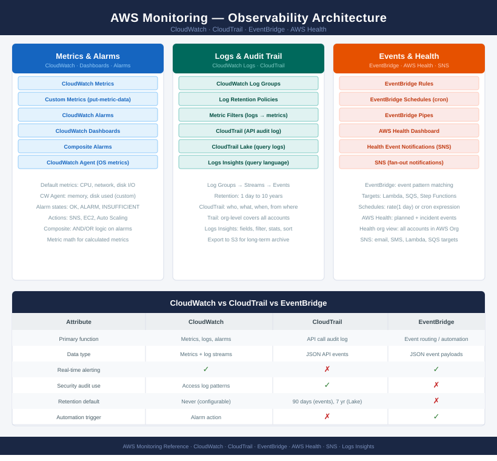

# AWS Monitoring

AWS observability is built on CloudWatch (metrics, logs, alarms), CloudTrail (API audit trail), and EventBridge (event-driven automation). Coverage includes CloudWatch Agent for OS-level metrics, alarm standards, log retention, and AWS Health for service incident visibility.

<a class="kb-card" href="cloudwatch/">
  <strong>CloudWatch</strong>
  Metrics, dashboards, alarms, and operational visibility.
</a>

<a class="kb-card" href="cloudwatch-logs/">
  <strong>CloudWatch Logs</strong>
  Log groups, retention, metric filters, and search patterns.
</a>

<a class="kb-card" href="cloudwatch-alarms/">
  <strong>CloudWatch Alarms</strong>
  Alarm standards, thresholds, actions, and review.
</a>

<a class="kb-card" href="cloudtrail/">
  <strong>CloudTrail</strong>
  API audit logs, event history, trails, and investigations.
</a>

<a class="kb-card" href="eventbridge/">
  <strong>EventBridge</strong>
  Rules, event buses, schedules, and automation triggers.
</a>

<a class="kb-card" href="aws-health/">
  <strong>AWS Health</strong>
  Service health, account events, and operational impact review.
</a>

