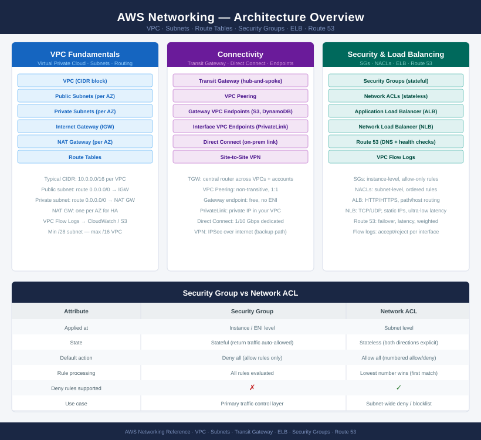

---
tags:
  - aws
  - networking
---
# AWS Networking

<div class="kb-summary">
AWS networking is built around VPCs with public and private subnets across availability zones, with Transit Gateway providing hub-and-spoke connectivity between accounts and on-premises. Coverage includes Security Groups, NACLs, route tables, VPC endpoints, load balancers, Route 53, and VPC Flow Logs.
</div>

```text
┌─────────────────────────────────────── AWS Networking Overview ───────────────────────────────────────┐
│                                                                                                       │
│   ┌───────────────────────────────────────────────────────────────────────────────────────────────┐   │
│   │               AWS Networking — VPC, Transit Gateway, Security, and Connectivity               │   │
│   │  VPC: isolated virtual network per account+region; CIDR block /16–/28; multi-AZ subnet design │   │
│   │   Transit Gateway: regional hub connecting VPCs + DirectConnect + VPN; route tables per TGW   │   │
│   │       Security: Security Groups (stateful, per-resource) + NACLs (stateless, per-subnet)      │   │
│   │   VPC Endpoints: private access to S3, DynamoDB, and 150+ services without internet gateway   │   │
│   └───────────────────────────────────────────────────────────────────────────────────────────────┘   │
│                                                                                                       │
│    VPC is the foundation · TGW connects VPCs and on-prem · SGs+NACLs protect resources                │
│                                                                                                       │
│                  ▼                                ▼                                ▼                  │
│                                                                                                       │
│   ┌─────────────────────────────┐  ┌─────────────────────────────┐  ┌─────────────────────────────┐   │
│   │        VPC & Subnets        │  │      Security Controls      │  │         Connectivity        │   │
│   │      VPC: CIDR /16-/28      │  │  Security Groups: stateful  │  │   Internet Gateway: public  │   │
│   │   Public subnet: IGW route  │  │   NACLs: stateless + order  │  │   NAT Gateway: private out  │   │
│   │    Private subnet: no IGW   │  │    Flow Logs: VPC traffic   │  │     Transit Gateway: hub    │   │
│   │  Route tables: subnet assoc │  │     Network Firewall: L7    │  │    DirectConnect: private   │   │
│   │  VPC Endpoints: private SVC │  │    WAF: ALB / CloudFront    │  │   VPN: site-to-site IPsec   │   │
│   └─────────────────────────────┘  └─────────────────────────────┘  └─────────────────────────────┘   │
│                                                                                                       │
│    VPC/subnets define the network · Security controls filter traffic                                  │
│                                                                                                       │
│                  ▼                                ▼                                ▼                  │
│                                                                                                       │
│   ┌───────────────────────────────────────────────────────────────────────────────────────────────┐   │
│   │       VPC        │     Subnets      │  Security Groups  │     Routing      │  Load Balancer   │   │
│   │  CIDR: plan /16  │ Public: AZ-a/b/c │   Inbound rules   │  IGW route: 0/0  │  ALB: L7 HTTP/S  │   │
│   │  Flow Logs: S3   │ Private: no IGW  │   Outbound rules  │  NAT: 0/0 priv   │   NLB: L4 TCP    │   │
│   │  DNS: enableDNS  │ Multi-AZ design  │    Ref by SG ID   │  TGW attachment  │  Route 53: DNS   │   │
│   │ Endpoint: S3/SVC │ NACL: stateless  │  All-outbound: no │  VPN: DX backup  │  Health checks   │   │
│   └───────────────────────────────────────────────────────────────────────────────────────────────┘   │
│                                                                                                       │
│  Physical Infrastructure (the hardware everything above runs on):                                     │
│  AWS network fabric · Availability Zones · DirectConnect physical ports · Transit Gateway routers     │
│                                                                                                       │
│  Key terms:                                                                                           │
│                                                                                                       │
│  VPC            = Virtual Private Cloud; logically isolated network within a region; one CIDR block   │
│  Subnet         = CIDR subdivision of a VPC; lives in one AZ; public if route to IGW exists           │
│  Security Group = Stateful firewall attached to ENI; return traffic automatically allowed             │
│  NACL           = Network Access Control List; stateless; rules evaluated in order; both in and out   │
│  Internet Gateway= Allows resources in public subnets to reach the internet; 1:1 to a VPC             │
│  NAT Gateway    = Allows private subnet resources to initiate outbound internet; blocks inbound       │
│  Transit Gateway= Regional router connecting VPCs and on-premises networks; route tables per TGW      │
│  VPC Endpoint   = Private connection to AWS services (S3, DynamoDB, etc.) without leaving AWS network │
│  VPC Flow Logs  = Captures network flow metadata for VPC, subnet, or ENI; written to S3 or CW Logs    │
│  DirectConnect  = Dedicated 1/10/100 Gbps private link from on-premises to AWS; lower latency than VPN│
│  ALB            = Application Load Balancer; Layer 7; supports path/host routing, WAF integration     │
│  Route 53       = AWS managed DNS; supports public/private zones, health checks, failover routing     │
│                                                                                                       │
└───────────────────────────────────────────────────────────────────────────────────────────────────────┘
```



<div class="kb-grid kb-grid-3">

<a class="kb-card" href="vpc/">
  <strong>VPC</strong>
  <span>VPC layout, routing, address planning, endpoints, and controls.</span>
</a>

<a class="kb-card" href="subnets/">
  <strong>Subnets</strong>
  <span>Subnet design, route scope, availability zones, and segmentation.</span>
</a>

<a class="kb-card" href="route-tables/">
  <strong>Route Tables</strong>
  <span>Routing paths, default routes, private routes, and validation.</span>
</a>

<a class="kb-card" href="internet-gateway/">
  <strong>Internet Gateway</strong>
  <span>Public internet routing and edge connectivity.</span>
</a>

<a class="kb-card" href="nat-gateway/">
  <strong>NAT Gateway</strong>
  <span>Private subnet outbound internet access and troubleshooting.</span>
</a>

<a class="kb-card" href="vpc-endpoints/">
  <strong>VPC Endpoints</strong>
  <span>Private service access, gateway endpoints, and interface endpoints.</span>
</a>

<a class="kb-card" href="security-groups/">
  <strong>Security Groups</strong>
  <span>Instance-level firewall rules and access validation.</span>
</a>

<a class="kb-card" href="network-acls/">
  <strong>Network ACLs</strong>
  <span>Subnet-level stateless filtering and traffic control.</span>
</a>

<a class="kb-card" href="elastic-load-balancer/">
  <strong>Elastic Load Balancer</strong>
  <span>ALB, NLB, target groups, listeners, and health checks.</span>
</a>

<a class="kb-card" href="route-53/">
  <strong>Route 53</strong>
  <span>Hosted zones, DNS records, routing policies, and resolver notes.</span>
</a>

<a class="kb-card" href="vpc-flow-logs/">
  <strong>VPC Flow Logs</strong>
  <span>Network traffic logging, query patterns, and troubleshooting.</span>
</a>

</div>
