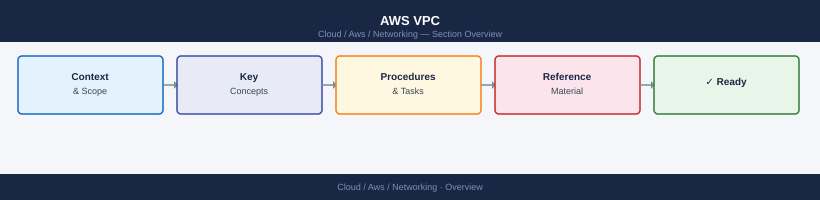

---
tags:
  - aws
  - networking
---
# AWS VPC

<div class="kb-summary">
An AWS Virtual Private Cloud (VPC) is your own isolated private network inside AWS. You control the IP ranges, subnets, routing, and security. Everything you run in AWS lives inside a VPC.

*Applies to: AWS*
</div>



```d2
direction: right

center: "AWS" {shape: hexagon}
vpc_anatomy: "VPC Anatomy" {shape: rectangle}
daily_checks: "Daily Checks" {shape: rectangle}
common_issues: "Common Issues" {shape: rectangle}
vpc_subnet_architecture: "VPC Subnet Architecture" {shape: rectangle}
aws_network_connectivity_options: "AWS Network Connectivity Options" {shape: rectangle}
route_53_routing_policies: "Route 53 Routing Policies" {shape: rectangle}

center -> vpc_anatomy
center -> daily_checks
center -> common_issues
center -> vpc_subnet_architecture
center -> aws_network_connectivity_options
center -> route_53_routing_policies
```

## VPC Anatomy


---

## Daily Checks

```bash
# List VPCs in current region
aws ec2 describe-vpcs --query 'Vpcs[*].[VpcId,CidrBlock,Tags[?Key==`Name`].Value|[0]]' --output table

# List subnets
aws ec2 describe-subnets --query 'Subnets[*].[SubnetId,VpcId,CidrBlock,AvailabilityZone,MapPublicIpOnLaunch]' --output table

# Check route tables
aws ec2 describe-route-tables --query 'RouteTables[*].[RouteTableId,VpcId,Routes[*].[DestinationCidrBlock,GatewayId]]' --output text

# Check internet gateways
aws ec2 describe-internet-gateways --query 'InternetGateways[*].[InternetGatewayId,Attachments[*].VpcId]' --output table

# Check NAT gateways and their state
aws ec2 describe-nat-gateways --query 'NatGateways[*].[NatGatewayId,VpcId,State,SubnetId]' --output table

# Check VPN connections
aws ec2 describe-vpn-connections --query 'VpnConnections[*].[VpnConnectionId,State,VgwTelemetry[*].[OutsideIpAddress,Status]]' --output text
```

---

## Common Issues

| Symptom | Likely Cause | Check |
|---|---|---|
| EC2 can't reach internet | Missing IGW route or no public IP | Route table — does 0.0.0.0/0 point to IGW? |
| Private subnet EC2 can't reach internet | Missing NAT Gateway or route | Route table — does 0.0.0.0/0 point to NAT GW? |
| Can't SSH/RDP to EC2 | Security group blocking port 22/3389 | Security group inbound rules |
| Two subnets can't talk to each other | Missing route or NACL blocking | Route table + NACL rules |
| On-prem can't reach VPC | VPN tunnel down or BGP issue | VPN connection status + BGP session |
| EC2 can't reach on-prem | Missing route to on-prem CIDR via VGW | Route table — is on-prem CIDR routed to VGW? |

---

## VPC Subnet Architecture


---

## AWS Network Connectivity Options


---

## Route 53 Routing Policies


