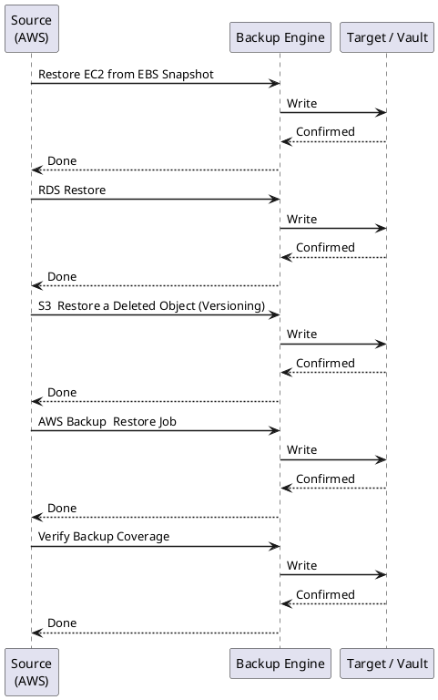

---
tags:
  - aws
  - operations
description: "Backup & Restore reference covering EBS Snapshot — Manual, Restore EC2 from EBS Snapshot, RDS Restore, S3 — Restore a Deleted Object (Versioning), AWS..."
---
# AWS — Backup & Restore

<div class="kb-summary">
Backup & Restore reference covering EBS Snapshot — Manual, Restore EC2 from EBS Snapshot, RDS Restore, S3 — Restore a Deleted Object (Versioning), AWS Backup — Restore Job and 1 more sections.

*Applies to: AWS*
</div>

---



## Before you begin

- **Access:** Admin credentials on all affected systems
- **Timing:** safe to run during business hours unless a step is marked ⚠ (causes interruption)
- **Dependencies:** no active upgrades or migrations on the same infrastructure
- **Logging:** capture command output — paste into the change record on completion

---

## Restore EC2 from EBS Snapshot

```bash
# Step 1: Create volume from snapshot
aws ec2 create-volume \
  --snapshot-id snap-0abc123def456789 \
  --availability-zone eu-west-1a \
  --volume-type gp3 \
  --tag-specifications 'ResourceType=volume,Tags=[{Key=Name,Value=restored-vol}]'

# Step 2: Stop target EC2 instance
aws ec2 stop-instances --instance-ids i-0abc123def456789

# Step 3: Detach existing root volume
aws ec2 detach-volume --volume-id vol-<existing> --instance-id i-0abc123def456789

# Step 4: Attach restored volume
aws ec2 attach-volume \
  --volume-id vol-<new> \
  --instance-id i-0abc123def456789 \
  --device /dev/xvda

# Step 5: Start instance
aws ec2 start-instances --instance-ids i-0abc123def456789
```


```text title="Expected output"
{
    "Volume": {
        "VolumeId": "vol-0xyz789abc123def",
        "Size": 100,
        "VolumeType": "gp3",
        "State": "creating",
        "AvailabilityZone": "eu-west-1a",
        "SnapshotId": "snap-0abc123def456789",
        "Tags": [
            {
                "Key": "Name",
                "Value": "restored-vol"
            }
        ]
    }
}
{
    "StoppingInstances": [
        {
            "InstanceId": "i-0abc123def456789",
            "CurrentState": {
                "Code": 64,
                "Name": "stopping"
            }
        }
    ]
}
{
    "State": "detaching",
    "VolumeId": "vol-0existing789abc",
    "InstanceId": "i-0abc123def456789",
    "Device": "/dev/xvda"
}
{
    "State": "attaching",
    "VolumeId": "vol-0xyz789abc123def",
    "InstanceId": "i-0abc123def456789",
    "Device": "/dev/xvda"
}
{
    "StartingInstances": [
        {
            "InstanceId": "i-0abc123def456789",
            "CurrentState": {
                "Code": 0,
                "Name": "pending"
            }
        }
    ]
}
```

!!! warning "Common errors"
    | Error | Fix |
    |---|---|
    | `An error occurred (InvalidSnapshot.NotFound) when calling the CreateVolume operation: The snapshot 'snap-0abc123def456789' does not exist` | Verify the snapshot ID exists in the correct region using `aws ec2 describe-snapshots --snapshot-ids snap-0abc123def456789`. |
    | `An error occurred (InvalidVolume.InUse) when calling the DetachVolume operation: The volume 'vol-0existing789abc' is still in use` | Ensure the instance is fully stopped before detaching by waiting 10-15 seconds after the stop command completes. |
    | `An error occurred (InvalidParameterValue) when calling the AttachVolume operation: Invalid device name /dev/xvda` | Use `/dev/sda1` for EBS-backed instances or verify the correct device mapping for your instance type. |
---

## RDS Restore

```bash
# List available automated snapshots for an RDS instance
aws rds describe-db-snapshots \
  --db-instance-identifier prod-mysql \
  --snapshot-type automated \
  --query 'DBSnapshots[*].[DBSnapshotIdentifier,SnapshotCreateTime,Status]' \
  --output table

# Restore RDS from snapshot to a new instance
aws rds restore-db-instance-from-db-snapshot \
  --db-instance-identifier prod-mysql-restored \
  --db-snapshot-identifier rds:prod-mysql-2026-05-15-02-30 \
  --db-instance-class db.r6g.large \
  --multi-az \
  --no-publicly-accessible

# Point-in-time restore (PITR)
aws rds restore-db-instance-to-point-in-time \
  --source-db-instance-identifier prod-mysql \
  --target-db-instance-identifier prod-mysql-pitr \
  --restore-time 2026-05-15T14:30:00Z
```


```text title="Expected output"
---------------------------------------------------------------------------------------------------------
|                                    DBSnapshots                                                      |
+------------------------------------+---------------------------+---------------+
| DBSnapshotIdentifier               | SnapshotCreateTime        | Status        |
+------------------------------------+---------------------------+---------------+
| rds:prod-mysql-2026-05-15-02-30    | 2026-05-15T02:30:45+00:00 | available     |
| rds:prod-mysql-2026-05-14-02-30    | 2026-05-14T02:30:12+00:00 | available     |
| rds:prod-mysql-2026-05-13-02-30    | 2026-05-13T02:30:33+00:00 | available     |
+------------------------------------+---------------------------+---------------+

{
    "DBInstance": {
        "DBInstanceIdentifier": "prod-mysql-restored",
        "DBInstanceStatus": "creating",
        "Engine": "mysql",
        "DBInstanceClass": "db.r6g.large",
        "AllocatedStorage": 100,
        "MasterUsername": "admin",
        "MultiAZ": true,
        "PubliclyAccessible": false,
        "StorageType": "gp3",
        "DBInstanceArn": "arn:aws:rds:us-east-1:123456789012:db:prod-mysql-restored"
    }
}

{
    "DBInstance": {
        "DBInstanceIdentifier": "prod-mysql-pitr",
        "DBInstanceStatus": "creating",
        "Engine": "mysql",
        "DBInstanceClass": "db.t3.medium",
        "RestoreTime": "2026-05-15T14:30:00Z",
        "DBInstanceArn": "arn:aws:rds:us-east-1:123456789012:db:prod-mysql-pitr"
    }
}
```

!!! warning "Common errors"
    | Error | Fix |
    |---|---|
    | `An error occurred (DBSnapshotNotFound) when calling the DescribeDBSnapshots operation: DBSnapshot rds:prod-mysql-2026-05-15-02-30 not found.` | Verify the snapshot identifier exists by running describe-db-snapshots without filters or check the snapshot region. |
    | `An error occurred (InvalidDBInstanceState) when calling the RestoreDBInstanceFromDBSnapshot operation: DB instance prod-mysql is not in a valid state.` | Ensure the source DB instance is in "available" state and not undergoing maintenance before attempting restore. |
    | `An error occurred (InvalidParameterValue) when calling the RestoreDBInstanceToPointInTime operation: The restore time must be before the current time.` | Use a restore time in the past within your backup retention period (typically 7 days by default). |
---

## S3 — Restore a Deleted Object (Versioning)

```bash
# List versions of a deleted object
aws s3api list-object-versions \
  --bucket my-prod-bucket \
  --prefix path/to/object.txt \
  --query '{Versions:Versions[*].[VersionId,LastModified,IsLatest],DeleteMarkers:DeleteMarkers[*].[VersionId,LastModified]}'

# Remove delete marker to restore object
aws s3api delete-object \
  --bucket my-prod-bucket \
  --key path/to/object.txt \
  --version-id <delete-marker-version-id>

# Copy specific version to restore
aws s3api copy-object \
  --bucket my-prod-bucket \
  --copy-source "my-prod-bucket/path/to/object.txt?versionId=<version-id>" \
  --key path/to/object.txt
```


```text title="Expected output"
{
    "Versions": [
        [
            "abc123def456ghi789jkl012",
            "2024-01-15T14:32:18.000Z",
            false
        ],
        [
            "xyz789uvw456rst123opq890",
            "2024-01-14T09:47:52.000Z",
            false
        ],
        [
            "mno345jkl678pqr901stu234",
            "2024-01-13T16:21:05.000Z",
            false
        ]
    ],
    "DeleteMarkers": [
        [
            "def789ghi012jkl345mno678",
            "2024-01-16T10:15:33.000Z"
        ]
    ]
}

(no output — command completes silently)

{
    "CopyObjectResult": {
        "ETag": "\"a1b2c3d4e5f6g7h8i9j0k1l2\"",
        "LastModified": "2024-01-16T10:16:42.000Z"
    },
    "VersionId": "pqr567stu890vwx123yza456"
}
```

!!! warning "Common errors"
    | Error | Fix |
    |---|---|
    | `An error occurred (NoSuchBucket) when calling the ListObjectVersions operation: The specified bucket does not exist` | Verify the bucket name is correct and exists in the current AWS region with `aws s3 ls`. |
    | `An error occurred (InvalidArgument) when calling the DeleteObject operation: Invalid version id specified` | Ensure the `<delete-marker-version-id>` is copied exactly from the DeleteMarkers output and is not a regular version ID. |
    | `An error occurred (NoSuchKey) when calling the CopyObject operation: The specified key does not exist.` | Confirm the `<version-id>` exists in the Versions list and the source bucket/key path matches the original object location exactly. |
---

## AWS Backup — Restore Job

```bash
# List recovery points for a resource
aws backup list-recovery-points-by-resource \
  --resource-arn arn:aws:ec2:eu-west-1:<account>:volume/vol-0abc123def456789 \
  --query 'RecoveryPoints[*].[RecoveryPointArn,CreationDate,Status]' \
  --output table

# Start restore job
aws backup start-restore-job \
  --recovery-point-arn arn:aws:ec2:eu-west-1:<account>:snapshot/snap-0abc123def456789 \
  --iam-role-arn arn:aws:iam::<account>:role/AWSBackupDefaultServiceRole \
  --resource-type EBS \
  --metadata '{"availabilityZone":"eu-west-1a","volumeType":"gp3"}'

# Check restore job status
aws backup describe-restore-job --restore-job-id <job-id>
```


```text title="Expected output"
┌─────────────────────────────────────────────────────────────────┬──────────────────────────┬──────────┐
│ RecoveryPointArn                                                │ CreationDate             │ Status   │
├─────────────────────────────────────────────────────────────────┼──────────────────────────┼───────────┤
│ arn:aws:backup:eu-west-1:123456789012:recovery-point:vol-0abc1 │ 2024-01-15T08:30:45.000Z │ COMPLETED │
│ arn:aws:backup:eu-west-1:123456789012:recovery-point:vol-0abc2 │ 2024-01-14T08:30:22.000Z │ COMPLETED │
│ arn:aws:backup:eu-west-1:123456789012:recovery-point:vol-0abc3 │ 2024-01-13T08:29:58.000Z │ COMPLETED │
└─────────────────────────────────────────────────────────────────┴──────────────────────────┴──────────┘
{
    "RestoreJobId": "a1b2c3d4-e5f6-7890-abcd-ef1234567890",
    "RecoveryPointArn": "arn:aws:backup:eu-west-1:123456789012:recovery-point:snap-0abc123def456789",
    "Status": "RUNNING",
    "CreationDate": 1705315845.0,
    "CompletionDate": null,
    "IamRoleArn": "arn:aws:iam::123456789012:role/AWSBackupDefaultServiceRole",
    "ResourceType": "EBS"
}
{
    "RestoreJobId": "a1b2c3d4-e5f6-7890-abcd-ef1234567890",
    "Status": "COMPLETED",
    "PercentProgress": "100",
    "CreationDate": 1705315845.0,
    "CompletionDate": 1705315923.0,
    "ResourceArn": "arn:aws:ec2:eu-west-1:123456789012:volume/vol-0new987654321fed"
}
```

!!! warning "Common errors"
    | Error | Fix |
    |---|---|
    | `An error occurred (InvalidParameterException) when calling the ListRecoveryPointsByResource operation: Invalid resource ARN format` | Verify the resource ARN matches the exact format for your resource type and region. |
    | `An error occurred (AccessDenied) when calling the StartRestoreJob operation: User is not authorized to perform: iam:PassRole on resource` | Ensure your IAM user has `iam:PassRole` permission for the AWSBackupDefaultServiceRole. |
    | `An error occurred (ResourceNotFoundException) when calling the DescribeRestoreJob operation: Restore job not found` | Replace `<job-id>` with the actual RestoreJobId returned from the start-restore-job command output. |
---

## Verify Backup Coverage

```bash
# List all resources NOT protected by AWS Backup (requires Config)
aws backup list-protected-resources \
  --query 'Results[*].[ResourceType,ResourceArn]' \
  --output table

# Check backup job status for last 24h
aws backup list-backup-jobs \
  --by-state FAILED \
  --by-created-after $(date -u -v-1d +%Y-%m-%dT%H:%M:%SZ 2>/dev/null || date -u -d 'yesterday' +%Y-%m-%dT%H:%M:%SZ) \
  --query 'BackupJobs[*].[ResourceArn,ResourceType,State,StatusMessage]' \
  --output table
```


```text title="Expected output"
┌──────────────────────────────────────────────────────────────────────────────┬────────────────────────┐
│ ResourceType                                                                 │ ResourceArn            │
├──────────────────────────────────────────────────────────────────────────────┼─────────────────────────────────────────────────────────────────────────────┤
│ RDS                                                                          │ arn:aws:rds:us-east-1:123456789012:db:prod-mysql-01│
│ EBS                                                                          │ arn:aws:ec2:us-east-1:123456789012:volume/vol-0a1b2c3d4e5f6g7h8│
│ EFS                                                                          │ arn:aws:elasticfilesystem:us-east-1:123456789012:file-system/fs-12ab34cd│
│ DynamoDB                                                                     │ arn:aws:dynamodb:us-east-1:123456789012:table/sessions-prod│
│ S3                                                                           │ arn:aws:s3:::legacy-archive-bucket-2019│
├──────────────────────────────────────────────────────────────────────────────┼─────────────────────────────────────────────────────────────────────────────┤

┌──────────────────────────────────────────────────────────────────────────────┬──────────────────┬──────────┬─┐
│ ResourceArn                                                                  │ ResourceType     │ State    │ StatusMessage│
├──────────────────────────────────────────────────────────────────────────────┼──────────────────┼──────────┼──────────────────────────────────────────┤
│ arn:aws:rds:us-east-1:123456789012:db:analytics-db                          │ RDS              │ FAILED   │ Insufficient IAM permissions for snapshot│
│ arn:aws:ec2:us-east-1:123456789012:volume/vol-0x9y8z7w6v5u4t3s2            │ EBS              │ FAILED   │ Volume not found or deleted│
│ arn:aws:elasticfilesystem:us-east-1:123456789012:file-system/fs-98xw76vu   │ EFS              │ FAILED   │ Backup window timeout after 12 hours│
```

!!! warning "Common errors"
    | Error | Fix |
    |---|---|
    | `An error occurred (InvalidParameterException) when calling the ListProtectedResources operation: AWS Backup is not enabled for this account` | Enable AWS Backup in the AWS Backup console or use `aws backup create-backup-vault` to initialize the service. |
    | `An error occurred (AccessDenied) when calling the ListBackupJobs operation: User is not authorized to perform: backup:ListBackupJobs` | Add the `backup:ListBackupJobs` permission to your IAM user/role policy. |
---

## See also

- [Aws — Procedures](../procedures/)
- [Aws — Health Checks](../health-checks/)
- [Aws — Common Issues](../../troubleshooting/common-issues/)
