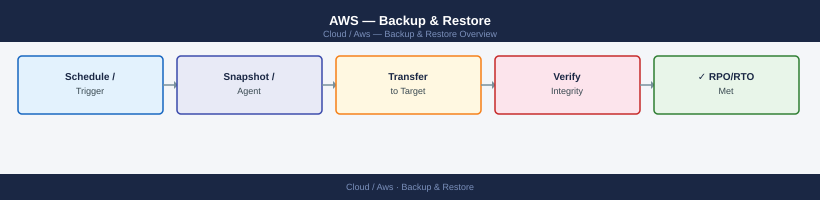

---
tags:
  - aws
  - operations
---
# AWS — Backup & Restore


<div class="kb-summary">
Backup & Restore reference covering EBS Snapshot — Manual, Restore EC2 from EBS Snapshot, RDS Restore, S3 — Restore a Deleted Object (Versioning), AWS Backup — Restore Job and 1 more sections.

*Applies to: AWS*
</div>



---

## Before you begin

- **Access:** Admin credentials on all affected systems
- **Timing:** safe to run during business hours unless a step is marked ⚠ (causes interruption)
- **Dependencies:** no active upgrades or migrations on the same infrastructure
- **Logging:** capture command output — paste into the change record on completion

---

## Restore EC2 from EBS Snapshot

```bash
# Step 1: Create volume from snapshot
aws ec2 create-volume \
  --snapshot-id snap-0abc123def456789 \
  --availability-zone eu-west-1a \
  --volume-type gp3 \
  --tag-specifications 'ResourceType=volume,Tags=[{Key=Name,Value=restored-vol}]'

# Step 2: Stop target EC2 instance
aws ec2 stop-instances --instance-ids i-0abc123def456789

# Step 3: Detach existing root volume
aws ec2 detach-volume --volume-id vol-<existing> --instance-id i-0abc123def456789

# Step 4: Attach restored volume
aws ec2 attach-volume \
  --volume-id vol-<new> \
  --instance-id i-0abc123def456789 \
  --device /dev/xvda

# Step 5: Start instance
aws ec2 start-instances --instance-ids i-0abc123def456789
```

---

## RDS Restore

```bash
# List available automated snapshots for an RDS instance
aws rds describe-db-snapshots \
  --db-instance-identifier prod-mysql \
  --snapshot-type automated \
  --query 'DBSnapshots[*].[DBSnapshotIdentifier,SnapshotCreateTime,Status]' \
  --output table

# Restore RDS from snapshot to a new instance
aws rds restore-db-instance-from-db-snapshot \
  --db-instance-identifier prod-mysql-restored \
  --db-snapshot-identifier rds:prod-mysql-2026-05-15-02-30 \
  --db-instance-class db.r6g.large \
  --multi-az \
  --no-publicly-accessible

# Point-in-time restore (PITR)
aws rds restore-db-instance-to-point-in-time \
  --source-db-instance-identifier prod-mysql \
  --target-db-instance-identifier prod-mysql-pitr \
  --restore-time 2026-05-15T14:30:00Z
```

---

## S3 — Restore a Deleted Object (Versioning)

```bash
# List versions of a deleted object
aws s3api list-object-versions \
  --bucket my-prod-bucket \
  --prefix path/to/object.txt \
  --query '{Versions:Versions[*].[VersionId,LastModified,IsLatest],DeleteMarkers:DeleteMarkers[*].[VersionId,LastModified]}'

# Remove delete marker to restore object
aws s3api delete-object \
  --bucket my-prod-bucket \
  --key path/to/object.txt \
  --version-id <delete-marker-version-id>

# Copy specific version to restore
aws s3api copy-object \
  --bucket my-prod-bucket \
  --copy-source "my-prod-bucket/path/to/object.txt?versionId=<version-id>" \
  --key path/to/object.txt
```

---

## AWS Backup — Restore Job

```bash
# List recovery points for a resource
aws backup list-recovery-points-by-resource \
  --resource-arn arn:aws:ec2:eu-west-1:<account>:volume/vol-0abc123def456789 \
  --query 'RecoveryPoints[*].[RecoveryPointArn,CreationDate,Status]' \
  --output table

# Start restore job
aws backup start-restore-job \
  --recovery-point-arn arn:aws:ec2:eu-west-1:<account>:snapshot/snap-0abc123def456789 \
  --iam-role-arn arn:aws:iam::<account>:role/AWSBackupDefaultServiceRole \
  --resource-type EBS \
  --metadata '{"availabilityZone":"eu-west-1a","volumeType":"gp3"}'

# Check restore job status
aws backup describe-restore-job --restore-job-id <job-id>
```

---

## Verify Backup Coverage

```bash
# List all resources NOT protected by AWS Backup (requires Config)
aws backup list-protected-resources \
  --query 'Results[*].[ResourceType,ResourceArn]' \
  --output table

# Check backup job status for last 24h
aws backup list-backup-jobs \
  --by-state FAILED \
  --by-created-after $(date -u -v-1d +%Y-%m-%dT%H:%M:%SZ 2>/dev/null || date -u -d 'yesterday' +%Y-%m-%dT%H:%M:%SZ) \
  --query 'BackupJobs[*].[ResourceArn,ResourceType,State,StatusMessage]' \
  --output table
```

---

## See also

- [Aws — Procedures](../procedures/)
- [Aws — Health Checks](../health-checks/)
- [Aws — Common Issues](../../troubleshooting/common-issues/)
