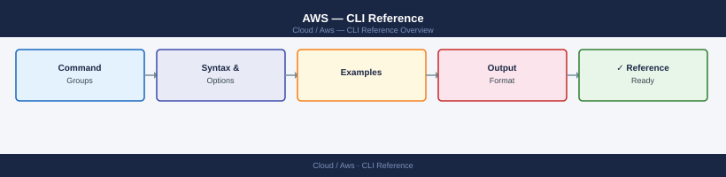

---
tags:
  - aws
  - operations
---
# AWS — CLI Reference


<div class="kb-summary">
CLI Reference reference covering EC2, S3, IAM, RDS, CloudWatch and 3 more sections.

*Applies to: AWS*
</div>



---

## Before you begin

- **Access:** Admin credentials on all affected systems
- **Timing:** safe to run during business hours unless a step is marked ⚠ (causes interruption)
- **Dependencies:** no active upgrades or migrations on the same infrastructure
- **Logging:** capture command output — paste into the change record on completion

---

## S3

```bash
# List buckets
aws s3 ls

# List contents of a bucket
aws s3 ls s3://my-bucket/ --recursive --human-readable

# Copy files
aws s3 cp file.txt s3://my-bucket/path/
aws s3 cp s3://my-bucket/path/file.txt ./

# Sync directory
aws s3 sync ./local-dir s3://my-bucket/prefix/ --delete

# Remove object
aws s3 rm s3://my-bucket/path/file.txt

# Check bucket policy
aws s3api get-bucket-policy --bucket my-bucket

# Get bucket size
aws s3api list-objects-v2 --bucket my-bucket \
  --query 'sum(Contents[*].Size)' --output text | \
  awk '{printf "%.2f GB\n", $1/1024/1024/1024}'
```

---

## IAM

```bash
# List users
aws iam list-users --query 'Users[*].[UserName,CreateDate,PasswordLastUsed]' --output table

# List roles
aws iam list-roles --query 'Roles[*].[RoleName,RoleId,CreateDate]' --output table

# Get effective policies for a user
aws iam list-attached-user-policies --user-name myuser
aws iam list-user-policies --user-name myuser  # inline policies

# Simulate policy evaluation
aws iam simulate-principal-policy \
  --policy-source-arn arn:aws:iam::<account>:user/myuser \
  --action-names s3:GetObject ec2:DescribeInstances \
  --query 'EvaluationResults[*].[EvalActionName,EvalDecision]' \
  --output table

# Rotate access key
aws iam create-access-key --user-name myuser
aws iam delete-access-key --user-name myuser --access-key-id AKIA...
```

---

## RDS

```bash
# List instances
aws rds describe-db-instances \
  --query 'DBInstances[*].[DBInstanceIdentifier,DBInstanceStatus,Engine,DBInstanceClass,Endpoint.Address]' \
  --output table

# Create manual snapshot
aws rds create-db-snapshot \
  --db-instance-identifier prod-mysql \
  --db-snapshot-identifier prod-mysql-manual-$(date +%Y-%m-%d)

# Modify instance (apply immediately or at maintenance window)
aws rds modify-db-instance \
  --db-instance-identifier prod-mysql \
  --db-instance-class db.r6g.xlarge \
  --apply-immediately

# List pending maintenance
aws rds describe-pending-maintenance-actions \
  --query 'PendingMaintenanceActions[*].[ResourceIdentifier,PendingMaintenanceActionDetails[0].Action]' \
  --output table
```

---

## CloudWatch

```bash
# List alarms in ALARM state
aws cloudwatch describe-alarms \
  --state-value ALARM \
  --query 'MetricAlarms[*].[AlarmName,StateReason,MetricName]' \
  --output table

# Get metric statistics (EC2 CPU last hour)
aws cloudwatch get-metric-statistics \
  --namespace AWS/EC2 \
  --metric-name CPUUtilization \
  --dimensions Name=InstanceId,Value=i-0abc123 \
  --start-time $(date -u -v-1H +%Y-%m-%dT%H:%M:%SZ 2>/dev/null || date -u -d '1 hour ago' +%Y-%m-%dT%H:%M:%SZ) \
  --end-time $(date -u +%Y-%m-%dT%H:%M:%SZ) \
  --period 300 \
  --statistics Average \
  --query 'Datapoints[*].[Timestamp,Average]' \
  --output table

# Get CloudWatch Logs
aws logs get-log-events \
  --log-group-name /aws/lambda/my-function \
  --log-stream-name <stream-name> \
  --start-from-head \
  --query 'events[*].[timestamp,message]' \
  --output text

# Tail logs (filter)
aws logs filter-log-events \
  --log-group-name /aws/lambda/my-function \
  --filter-pattern "ERROR" \
  --start-time $(($(date +%s) - 3600))000 \
  --query 'events[*].message' \
  --output text
```

---

## VPC / Networking

```bash
# List VPCs
aws ec2 describe-vpcs \
  --query 'Vpcs[*].[VpcId,CidrBlock,Tags[?Key==`Name`].Value|[0],IsDefault]' \
  --output table

# List subnets
aws ec2 describe-subnets \
  --filters "Name=vpc-id,Values=vpc-0abc123" \
  --query 'Subnets[*].[SubnetId,CidrBlock,AvailabilityZone,Tags[?Key==`Name`].Value|[0]]' \
  --output table

# List security groups
aws ec2 describe-security-groups \
  --filters "Name=vpc-id,Values=vpc-0abc123" \
  --query 'SecurityGroups[*].[GroupId,GroupName,Description]' \
  --output table

# Show security group rules
aws ec2 describe-security-group-rules \
  --filters "Name=group-id,Values=sg-0abc123" \
  --query 'SecurityGroupRules[*].[IsEgress,IpProtocol,FromPort,ToPort,CidrIpv4,Description]' \
  --output table
```

---

## EKS

```bash
# List clusters
aws eks list-clusters

# Update kubeconfig
aws eks update-kubeconfig --name my-cluster --region eu-west-1

# List node groups
aws eks list-nodegroups --cluster-name my-cluster

# Describe node group
aws eks describe-nodegroup --cluster-name my-cluster --nodegroup-name workers \
  --query 'nodegroup.[nodegroupName,status,scalingConfig,instanceTypes]'

# Update node group scaling
aws eks update-nodegroup-config \
  --cluster-name my-cluster \
  --nodegroup-name workers \
  --scaling-config minSize=2,maxSize=10,desiredSize=4
```

---

## SSM — Session Manager

```bash
# Start SSM session to an EC2 instance (no SSH/bastion needed)
aws ssm start-session --target i-0abc123def456789

# Run command on instance(s)
aws ssm send-command \
  --instance-ids i-0abc123 \
  --document-name "AWS-RunShellScript" \
  --parameters commands='["df -h","free -h"]' \
  --query 'Command.CommandId' --output text

# Get command result
aws ssm get-command-invocation \
  --command-id <command-id> \
  --instance-id i-0abc123 \
  --query '[Status,StandardOutputContent]' \
  --output text
```

---

## Verify

- Confirm the operation completed without errors in the log or management UI
- Verify the expected state change is visible (service running, object created, config applied)
- Document the outcome in the change record

---

## See also

- [Aws — Procedures](../procedures/)
- [Aws — Scripts](../scripts/)
- [Aws — Health Checks](../health-checks/)
