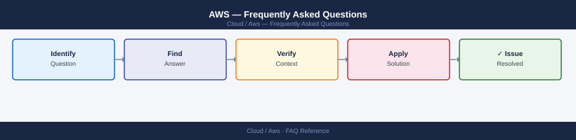

---
tags:
  - aws
  - faq
  - operations
---
# AWS — Frequently Asked Questions

*Applies to: AWS*

Common questions about AWS operations, configuration, and troubleshooting. For step-by-step procedures, see the <a href="index.md">Operations</a> section.

## General

**Q: How do I check which AWS CLI version I am using?**
A: Run `aws --version`. AWS CLI v2 is recommended; v1 is deprecated. Install v2 via the official installer: `curl 'https://awscli.amazonaws.com/awscli-exe-linux-x86_64.zip' -o awscliv2.zip`.

**Q: How do I check the current AWS version?**
A: `aws --version`

## Configuration

**Q: What is the default AWS region and how do I change it?**
A: No default is set unless configured. Set with `aws configure set region eu-west-1` or export `AWS_DEFAULT_REGION=eu-west-1`. Always specify region explicitly in scripts to avoid accidental cross-region operations.

**Q: How do I enable AWS CloudTrail for audit logging?**
A: In the AWS Console, go to CloudTrail → Create Trail. Enable for all regions, log to an S3 bucket with server-side encryption. Enable CloudWatch Logs integration for alerting on suspicious API calls.

## Operations

**Q: How do I update EC2 instances in an Auto Scaling Group without downtime?**
A: Use a rolling update: set `UpdatePolicy` in CloudFormation or use Instance Refresh in the ASG console. Configure `MinHealthyPercentage` (e.g., 80%) to maintain capacity during the refresh.

**Q: What is the correct procedure to add a new VPC?**
A: Use the VPC Wizard or IaC (Terraform/CDK). Plan CIDR carefully — avoid overlapping with on-premises or other VPCs you may need to peer. Enable DNS resolution and DNS hostnames. Tag consistently.

## Troubleshooting

**Q: CloudWatch shows 'ServiceLimitExceeded'. What does it mean?**
A: You have hit a service quota (formerly known as limit). Go to Service Quotas in the console, find the relevant quota, and submit an increase request. Some quotas increase automatically with account age.

**Q: Application latency increased — where do I start?**
A: Check CloudWatch metrics for the affected service. Review X-Ray traces if instrumented. Check EC2 CPU credit balance (T-class). Review RDS slow query log. Check NAT Gateway bandwidth limits.

## Backup and Recovery

**Q: How often should I back up AWS resources?**
A: Use AWS Backup with daily policies for EC2, RDS, EFS, and DynamoDB. Enable S3 versioning for critical buckets. Test restores quarterly via AWS Backup restore jobs.

**Q: Can I restore a single RDS table without a full database restore?**
A: Not natively. Restore the RDS snapshot to a temporary instance, export the table using `mysqldump` or `pg_dump`, then import into the production instance. Aurora supports point-in-time restore to a new cluster.

## See Also

- [AWS Operations](index.md)
- [AWS Troubleshooting](../../troubleshooting//)
