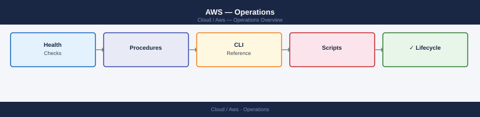

---
tags:
  - aws
  - operations
---
# AWS — Operations


<div class="kb-summary">
Operations reference covering Change Readiness, Incident Triage, Maintenance Window, Post-Change Validation.

*Applies to: AWS*
</div>



<div class="kb-grid kb-grid-3">

<a class="kb-card" href="procedures/">
  <strong>Procedures</strong>
  <span>Step-by-step operational procedures and runbooks.</span>
</a>

<a class="kb-card" href="health-checks/">
  <strong>Health Checks</strong>
  <span>Proactive AWS health monitoring and validation routines.</span>
</a>

<a class="kb-card" href="install-upgrade/">
  <strong>Install & Upgrade</strong>
  <span>AWS service deployment and version management procedures.</span>
</a>

<a class="kb-card" href="backup-restore/">
  <strong>Backup & Restore</strong>
  <span>AWS Backup jobs, snapshot restore, and RDS recovery.</span>
</a>

<a class="kb-card" href="cli-reference/">
  <strong>CLI Reference</strong>
  <span>AWS CLI command reference for day-to-day operations.</span>
</a>

<a class="kb-card" href="scripts/">
  <strong>Scripts</strong>
  <span>Automation scripts for common operational tasks.</span>
</a>

  <a class="kb-card" href="faq/"><strong>FAQ</strong><span>Frequently asked questions, common issues, and quick answers for day-to-day operations.</span></a>
</div>

```d2
direction: right

hub: "AWS\nOperations" {shape: hexagon}
change_readiness: "Change Readiness" {shape: rectangle}
incident_triage: "Incident Triage" {shape: rectangle}
maintenance_window: "Maintenance Window" {shape: rectangle}
postchange_validation: "Post-Change Validation" {shape: rectangle}

hub -> change_readiness
hub -> incident_triage
hub -> maintenance_window
hub -> postchange_validation
```

## Change Readiness

- [ ] AMI snapshot or RDS snapshot taken and verified before change
- [ ] IAM permission changes reviewed and least-privilege confirmed
- [ ] VPC and security group changes peer-reviewed
- [ ] CloudTrail is enabled in all relevant regions
- [ ] Rollback plan documented and tested
- [ ] Change window communicated to stakeholders
- [ ] Target instances/services identified and `--limit` or ARN scope set

| Item | Status | Notes |
|---|---|---|
| Pre-change snapshot | | AMI ID or RDS snapshot ID |
| IAM review | | Reviewer name |
| VPC/SG peer review | | PR or ticket reference |
| Rollback plan | | Link to runbook |
| Stakeholder notification | | Date/time sent |

## Incident Triage

- [ ] Check AWS Health Dashboard for active events affecting the region or service
- [ ] Review CloudWatch alarms to identify the affected resource
- [ ] Check service-specific logs (EC2 system log, RDS error log, ALB access log)
- [ ] Review CloudTrail for recent changes in the 2 hours before the incident
- [ ] Confirm VPC routing and security group rules have not changed unexpectedly
- [ ] Check ELB target health and deregister unhealthy targets if needed
- [ ] Engage AWS Support if the event is service-side

| Question | Answer |
|---|---|
| Is this an AWS service outage? | Check health.aws.amazon.com |
| Which resource is affected? | EC2 / RDS / ELB / S3 / Other |
| When did the issue start? | CloudTrail timestamp |
| What changed recently? | CloudTrail last 2 hours |
| Is a rollback possible? | Yes / No — snapshot available? |

## Maintenance Window

1. Notify stakeholders of the planned maintenance window start time.
2. Verify pre-change snapshot (AMI or RDS snapshot) exists and is complete.
3. For EC2: stop the instance, perform maintenance, start and confirm instance status OK.
4. For RDS: schedule the maintenance window in the RDS console or via CLI; monitor the event log.
5. For ELB: enable connection draining before removing targets; wait for active connections to drain.
6. Test Route 53 health check failover if DNS-based failover is configured.
7. Confirm all CloudWatch alarms return to OK state after the change.
8. Close the maintenance window and notify stakeholders.

## Post-Change Validation

- [ ] All CloudWatch alarms are in OK state
- [ ] EC2 instances report healthy instance and system status
- [ ] RDS instances are in `available` state
- [ ] ELB target groups show all targets as healthy
- [ ] Application-level smoke test passes (login, key transaction, API call)
- [ ] CloudTrail shows only expected operations from the maintenance window
- [ ] No new AWS Health events opened for affected services
- [ ] Cost Explorer shows no unexpected resource charge spikes from the change
