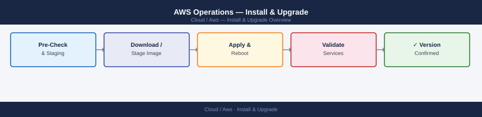

---
tags:
  - aws
  - operations
---
# AWS Operations — Install & Upgrade



```bash
# View patch compliance status
aws ssm describe-instance-patch-states --instance-ids <i-xxxx>

# Run patching on a specific instance now (ad-hoc)
aws ssm send-command \
    --document-name "AWS-RunPatchBaseline" \
    --instance-ids <i-xxxx> \
    --parameters "Operation=Install" \
    --comment "Manual patch run $(date)"

# List instances with missing patches
aws ssm describe-instance-patches --instance-id <i-xxxx> \
    --filters "Key=State,Values=Missing"
```

```bash
# List Lambda functions by runtime
aws lambda list-functions --query 'Functions[*].[FunctionName,Runtime]' --output table | sort

# Update runtime (requires testing)
aws lambda update-function-configuration --function-name <name> --runtime python3.12
```
```bash
# Check current EKS version
aws eks describe-cluster --name <cluster-name> --query 'cluster.version'

# List available upgrade versions
aws eks describe-addon-versions --kubernetes-version 1.30

# Upgrade cluster control plane
aws eks update-cluster-version --name <cluster-name> --kubernetes-version 1.30

# Upgrade node groups after control plane
aws eks update-nodegroup-version --cluster-name <cluster-name> \
    --nodegroup-name <nodegroup-name> --kubernetes-version 1.30
```
```bash
# Check RI utilisation
aws ce get-reservation-utilization --time-period Start=2026-01-01,End=2026-01-31

# List expiring RIs
aws ec2 describe-reserved-instances --filters "Name=state,Values=active" \
    --query "ReservedInstances[?End<='$(date -d '+90 days' +%Y-%m-%d)T23:59:59'].[ReservedInstancesId,InstanceType,End]"
```

```d2
direction: right

plan: "Plan" {shape: oval}
verify: "Verify" {shape: rectangle}
validate: "Validate" {shape: oval}

plan -> verify
verify -> validate
```

## Before you begin

- **Access:** Admin credentials on all affected systems
- **Timing:** safe to run during business hours unless a step is marked ⚠ (causes interruption)
- **Dependencies:** no active upgrades or migrations on the same infrastructure
- **Logging:** capture command output — paste into the change record on completion

---

---

## Verify

- Confirm the operation completed without errors in the log or management UI
- Verify the expected state change is visible (service running, object created, config applied)
- Document the outcome in the change record

---

## See also

- [Aws — Deploy](../../deploy/)
