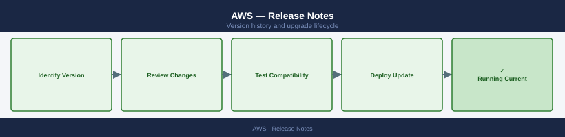

---
tags:
  - aws
---
# AWS — Release Notes

*Applies to: AWS*

Version history and release notes for AWS.

## Version History

| Version | Released | Summary | Notes |
|---------|----------|---------|-------|
| 2024-Q3 | 2024-Q3 | AWS — EC2 C8g instances GA, EBS io2 Block Express | [Release Notes](#) |
| 2024-Q1 | 2024-Q1 | AWS — EKS 1.29, RDS Graviton3 default | [Release Notes](#) |
| 2023-Q3 | 2023-Q3 | AWS — VPC Lattice GA, GuardDuty EKS runtime | [Release Notes](#) |
| 2023-Q1 | 2023-Q1 | AWS — ECS Fargate spot improvements | [Release Notes](#) |
| 2022-Q3 | 2022-Q3 | AWS — Lake Formation governed tables GA | [Release Notes](#) |

## Key Terminology

**Major Version**
: A release containing significant new features or architectural changes; may require additional planning and testing.

**Patch Release**
: A targeted fix release that addresses bugs or security issues within a major/minor version.

**EOL (End of Life)**
: Date after which the vendor no longer provides updates, security patches, or technical support.

**Upgrade Path**
: The supported sequence of versions a system must traverse to reach a target version (some versions cannot be skipped).

## Upgrade Path

Review the vendor's official upgrade documentation and compatibility matrix before beginning any version change. Validate that all dependent components (OS, drivers, integration plugins) support the target version. Perform upgrades in a staged approach: dev/test environment first, then production. Capture a snapshot or backup immediately prior to the upgrade window. After the upgrade, run post-validation health checks and confirm all services are operating normally.
