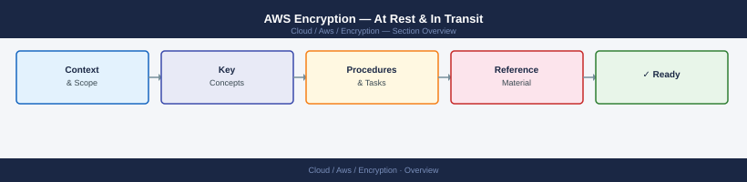

---
tags:
  - aws
  - security
---
# AWS Encryption — At Rest & In Transit



```bash
# Create a CMK with key rotation enabled
aws kms create-key \
  --description "prod-s3-cmk" \
  --key-usage ENCRYPT_DECRYPT \
  --origin AWS_KMS

KEY_ID=$(aws kms list-keys --query 'Keys[0].KeyId' --output text)

# Enable annual automatic rotation
aws kms enable-key-rotation --key-id $KEY_ID

# Create an alias
aws kms create-alias \
  --alias-name alias/prod-s3-cmk \
  --target-key-id $KEY_ID

# Verify rotation is enabled
aws kms get-key-rotation-status --key-id $KEY_ID
```

```bash
# Encryption must be enabled at creation (cannot enable on existing instance)
aws rds create-db-instance \
  --db-instance-identifier prod-mysql \
  --db-instance-class db.r6g.large \
  --engine mysql \
  --engine-version 8.0 \
  --master-username admin \
  --master-user-password '<password>' \
  --storage-type gp3 \
  --allocated-storage 100 \
  --storage-encrypted \
  --kms-key-id arn:aws:kms:eu-west-1:<account>:alias/prod-rds-cmk \
  --multi-az

# Encrypt existing unencrypted RDS (snapshot → copy encrypted → restore)
aws rds create-db-snapshot \
  --db-instance-identifier prod-mysql \
  --db-snapshot-identifier prod-mysql-for-encryption
aws rds copy-db-snapshot \
  --source-db-snapshot-identifier prod-mysql-for-encryption \
  --target-db-snapshot-identifier prod-mysql-encrypted \
  --kms-key-id arn:aws:kms:eu-west-1:<account>:alias/prod-rds-cmk
# Then restore from encrypted snapshot
```
```bash
# For MySQL/MariaDB — create parameter group with require_secure_transport=1
aws rds create-db-parameter-group \
  --db-parameter-group-name prod-mysql-tls \
  --db-parameter-group-family mysql8.0 \
  --description "Require TLS"

aws rds modify-db-parameter-group \
  --db-parameter-group-name prod-mysql-tls \
  --parameters ParameterName=require_secure_transport,ParameterValue=1,ApplyMethod=immediate

aws rds modify-db-instance \
  --db-instance-identifier prod-mysql \
  --db-parameter-group-name prod-mysql-tls \
  --apply-immediately
```
```bash
# Enable envelope encryption of Kubernetes secrets with CMK
aws eks associate-encryption-config \
  --cluster-name my-cluster \
  --encryption-config '[{
    "resources": ["secrets"],
    "provider": {
      "keyArn": "arn:aws:kms:eu-west-1:<account>:alias/prod-eks-cmk"
    }
  }]'

# Verify
aws eks describe-cluster --name my-cluster \
  --query 'cluster.encryptionConfig'
```
```bash
# Create secret with CMK
aws secretsmanager create-secret \
  --name prod/myapp/db-password \
  --secret-string '{"username":"app","password":"<pass>"}' \
  --kms-key-id arn:aws:kms:eu-west-1:<account>:alias/prod-secrets-cmk

# Retrieve secret value
aws secretsmanager get-secret-value \
  --secret-id prod/myapp/db-password \
  --query SecretString --output text | python3 -m json.tool

# Rotate secret (enable rotation)
aws secretsmanager rotate-secret \
  --secret-id prod/myapp/db-password \
  --rotation-lambda-arn arn:aws:lambda:eu-west-1:<account>:function:RotateRDSPassword \
  --rotation-rules AutomaticallyAfterDays=30
```
```bash
# Request a public ACM certificate (DNS validation)
aws acm request-certificate \
  --domain-name example.com \
  --subject-alternative-names "*.example.com" \
  --validation-method DNS \
  --region eu-west-1

# Get DNS validation records
aws acm describe-certificate \
  --certificate-arn arn:aws:acm:eu-west-1:<account>:certificate/<id> \
  --query 'Certificate.DomainValidationOptions[*].[DomainName,ResourceRecord.Name,ResourceRecord.Value]' \
  --output table

# Import existing certificate (from external CA)
aws acm import-certificate \
  --certificate fileb://cert.pem \
  --private-key fileb://key.pem \
  --certificate-chain fileb://chain.pem \
  --region eu-west-1
```
```bash
# S3 buckets without default encryption
aws s3api list-buckets --query 'Buckets[*].Name' --output text | \
  tr '\t' '\n' | while read bucket; do
    ENC=$(aws s3api get-bucket-encryption --bucket "$bucket" \
      --query 'ServerSideEncryptionConfiguration.Rules[0].ApplyServerSideEncryptionByDefault.SSEAlgorithm' \
      --output text 2>/dev/null || echo "NONE")
    echo "$bucket: $ENC"
  done

# EBS volumes not encrypted
aws ec2 describe-volumes \
  --filters "Name=encrypted,Values=false" \
  --query 'Volumes[*].[VolumeId,Size,State,Tags[?Key==`Name`].Value|[0]]' \
  --output table

# RDS instances not encrypted
aws rds describe-db-instances \
  --query 'DBInstances[?StorageEncrypted==`false`].[DBInstanceIdentifier,Engine,StorageEncrypted]' \
  --output table
```

## Before you begin

- **Access:** Admin credentials on all affected systems
- **Change management:** security changes require CAB approval in most environments
- **Rollback plan:** document current state before any security control change
- **Testing:** validate in a non-production environment first where possible

---

---

## See also

- [Aws — Hardening](../hardening/)
- [Aws — Authentication](../authentication/)
- [Aws — Access Control](../access-control/)
