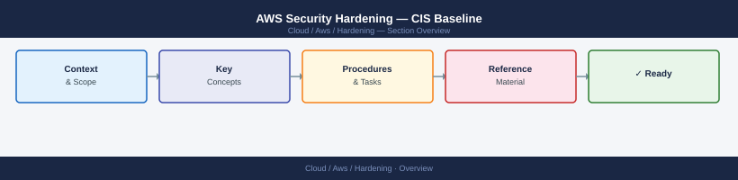

---
tags:
  - aws
  - security
---
# AWS Security Hardening — CIS Baseline



```bash
# Check root account has no access keys
aws iam get-account-summary \
  --query 'SummaryMap.[AccountAccessKeysPresent,AccountMFAEnabled]'
# Expected: AccountAccessKeysPresent=0, AccountMFAEnabled=1

# MFA for root must be enabled via Console — cannot be set via CLI
```

```bash
# Enable GuardDuty
DETECTOR_ID=$(aws guardduty create-detector \
  --enable \
  --finding-publishing-frequency FIFTEEN_MINUTES \
  --features '[
    {"Name":"S3_DATA_EVENTS","Status":"ENABLED"},
    {"Name":"EKS_AUDIT_LOGS","Status":"ENABLED"},
    {"Name":"MALWARE_PROTECTION","Status":"ENABLED"},
    {"Name":"RDS_LOGIN_EVENTS","Status":"ENABLED"},
    {"Name":"LAMBDA_NETWORK_LOGS","Status":"ENABLED"}
  ]' \
  --query 'DetectorId' --output text)

echo "Detector ID: $DETECTOR_ID"

# Export findings to S3 (for SIEM)
aws guardduty create-publishing-destination \
  --detector-id $DETECTOR_ID \
  --destination-type S3 \
  --destination-properties \
    DestinationArn=arn:aws:s3:::my-security-findings,KmsKeyArn=arn:aws:kms:eu-west-1:<account>:alias/guardduty-cmk
```
```bash
# Enable Security Hub
aws securityhub enable-security-hub \
  --enable-default-standards \
  --control-finding-generator SECURITY_CONTROL

# Enable CIS AWS Foundations Benchmark
aws securityhub batch-enable-standards \
  --standards-subscription-requests \
    StandardsArn=arn:aws:securityhub:::ruleset/cis-aws-foundations-benchmark/v/1.2.0

# List failed controls
aws securityhub get-findings \
  --filters '{
    "ComplianceStatus": [{"Value":"FAILED","Comparison":"EQUALS"}],
    "WorkflowStatus": [{"Value":"NEW","Comparison":"EQUALS"}],
    "SeverityLabel": [{"Value":"CRITICAL","Comparison":"EQUALS"}]
  }' \
  --query 'Findings[*].[Title,SeverityLabel,ProductName]' \
  --output table
```
```bash
# Create Config recorder
aws configservice put-configuration-recorder \
  --configuration-recorder '{
    "name": "default",
    "roleARN": "arn:aws:iam::<account>:role/AWSConfigRole",
    "recordingGroup": {
      "allSupported": true,
      "includeGlobalResourceTypes": true
    }
  }'

# Create delivery channel
aws configservice put-delivery-channel \
  --delivery-channel '{
    "name": "default",
    "s3BucketName": "my-config-bucket",
    "configSnapshotDeliveryProperties": {
      "deliveryFrequency": "TwentyFour_Hours"
    }
  }'

aws configservice start-configuration-recorder --configuration-recorder-name default
```
```bash
aws s3control put-public-access-block \
  --account-id $(aws sts get-caller-identity --query Account --output text) \
  --public-access-block-configuration \
    BlockPublicAcls=true,IgnorePublicAcls=true,BlockPublicPolicy=true,RestrictPublicBuckets=true

# Verify
aws s3control get-public-access-block \
  --account-id $(aws sts get-caller-identity --query Account --output text)
```
```bash
# Delete default VPC (if not in use — irreversible)
DEFAULT_VPC=$(aws ec2 describe-vpcs \
  --filters Name=isDefault,Values=true \
  --query 'Vpcs[0].VpcId' --output text)

# Before deleting, detach/delete IGW and subnets
aws ec2 describe-internet-gateways \
  --filters "Name=attachment.vpc-id,Values=$DEFAULT_VPC" \
  --query 'InternetGateways[0].InternetGatewayId' --output text | \
  xargs -I{} aws ec2 detach-internet-gateway --internet-gateway-id {} --vpc-id $DEFAULT_VPC
# Then delete subnets, then VPC

# Enable VPC Flow Logs
aws ec2 create-flow-logs \
  --resource-type VPC \
  --resource-ids vpc-0abc123 \
  --traffic-type ALL \
  --log-destination-type cloud-watch-logs \
  --log-group-name /aws/vpc/flowlogs \
  --deliver-logs-permission-arn arn:aws:iam::<account>:role/VPCFlowLogsRole
```
```json
{
  "Version": "2012-10-17",
  "Statement": [
    {
      "Sid": "DenyUnapprovedRegions",
      "Effect": "Deny",
      "NotAction": [
        "iam:*",
        "organizations:*",
        "support:*",
        "budgets:*",
        "account:*",
        "sts:*",
        "cloudfront:*",
        "route53:*",
        "waf::*"
      ],
      "Resource": "*",
      "Condition": {
        "StringNotEquals": {
          "aws:RequestedRegion": ["eu-west-1","eu-central-1","us-east-1"]
        }
      }
    }
  ]
}
```

```d2
direction: down

network_controls: "Network Controls" {shape: rectangle}
os_hardening: "OS Hardening" {shape: rectangle}
application_security: "Application Security" {shape: rectangle}
audit_monitoring: "Audit & Monitoring" {shape: rectangle}

network_controls -> os_hardening: hardens
os_hardening -> application_security: hardens
application_security -> audit_monitoring: hardens
```

## Before you begin

- **Access:** Admin credentials on all affected systems
- **Change management:** security changes require CAB approval in most environments
- **Rollback plan:** document current state before any security control change
- **Testing:** validate in a non-production environment first where possible

---

---

## See also

- [Aws — Authentication](../authentication/)
- [Aws — Access Control](../access-control/)
- [Aws — Encryption](../encryption/)
