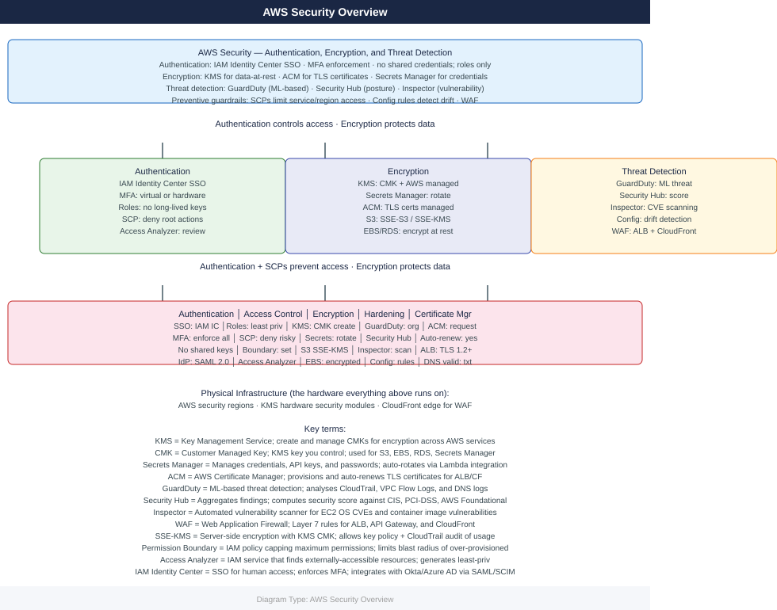
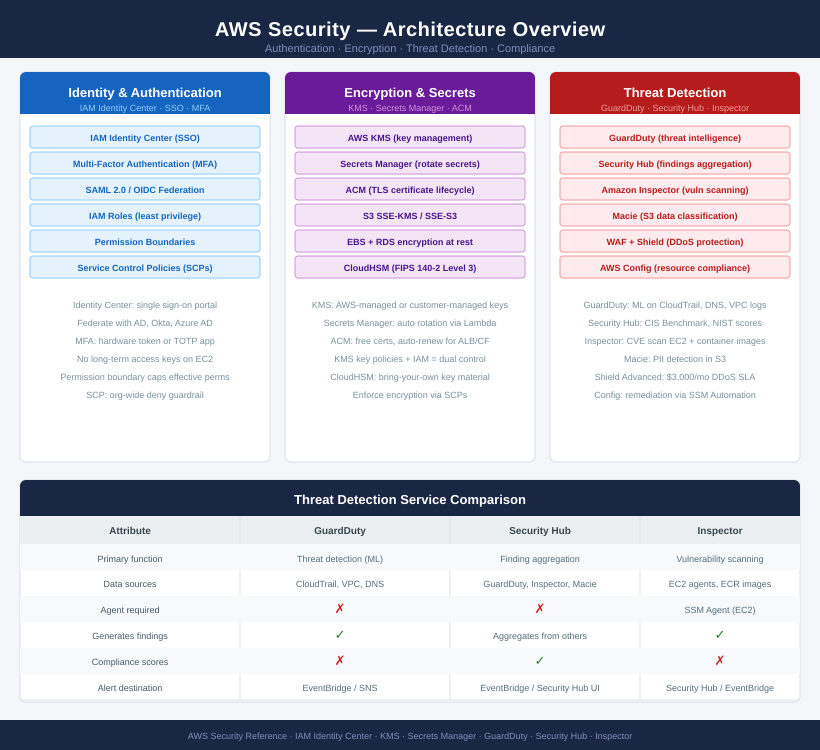
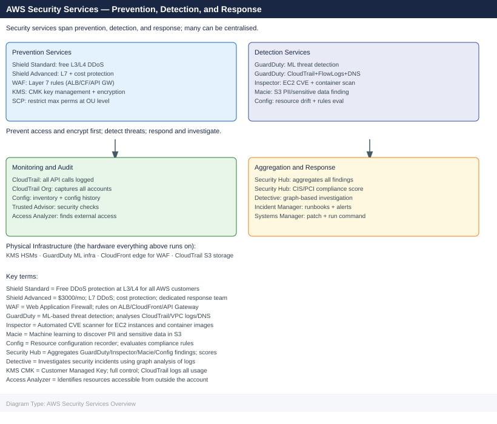

---
tags:
  - aws
  - security
description: "AWS security layers authentication (IAM Identity Center SSO, MFA), encryption (KMS, Secrets Manager, ACM), and threat detection (GuardDuty, Security Hub..."
---
# AWS — Security

AWS security layers authentication (IAM Identity Center SSO, MFA), encryption (KMS, Secrets Manager, ACM), and threat detection (GuardDuty, Security Hub, Inspector). SCPs provide org-wide preventive guardrails; Config and Security Hub score detective compliance posture.

*Applies to: AWS*

<a class="kb-card" href="authentication/">
  <strong>Authentication</strong>
  IAM Identity Center, SSO, MFA, and federated access.
</a>

<a class="kb-card" href="access-control/">
  <strong>Access Control</strong>
  IAM roles, policies, SCPs, and permission boundaries.
</a>

<a class="kb-card" href="encryption/">
  <strong>Encryption</strong>
  KMS, Secrets Manager, data-at-rest, and data-in-transit controls.
</a>

<a class="kb-card" href="hardening/"><strong>Hardening</strong>Security Hub, GuardDuty, Inspector, and AWS security baselines.</a>
<a class="kb-card" href="kms/"><strong>KMS</strong>Key Management Service — CMK creation, rotation, key policies, and cross-account access.</a>
<a class="kb-card" href="secrets-manager/"><strong>Secrets Manager</strong>Secret storage, automatic rotation, cross-service access, and audit logging.</a>
<a class="kb-card" href="certificate-manager/"><strong>Certificate Manager (ACM)</strong>TLS certificate provisioning, auto-renewal, ALB/CloudFront integration, and DNS validation.</a>
<a class="kb-card" href="guardduty/"><strong>GuardDuty</strong>ML-based threat detection — findings, suppression rules, org enablement, and response.</a>
<a class="kb-card" href="inspector/"><strong>Inspector</strong>Automated vulnerability scanning for EC2 and container images — CVE findings and remediation.</a>
<a class="kb-card" href="security-hub/"><strong>Security Hub</strong>Aggregated security findings — CIS/PCI compliance score, finding suppression, and notifications.</a>

