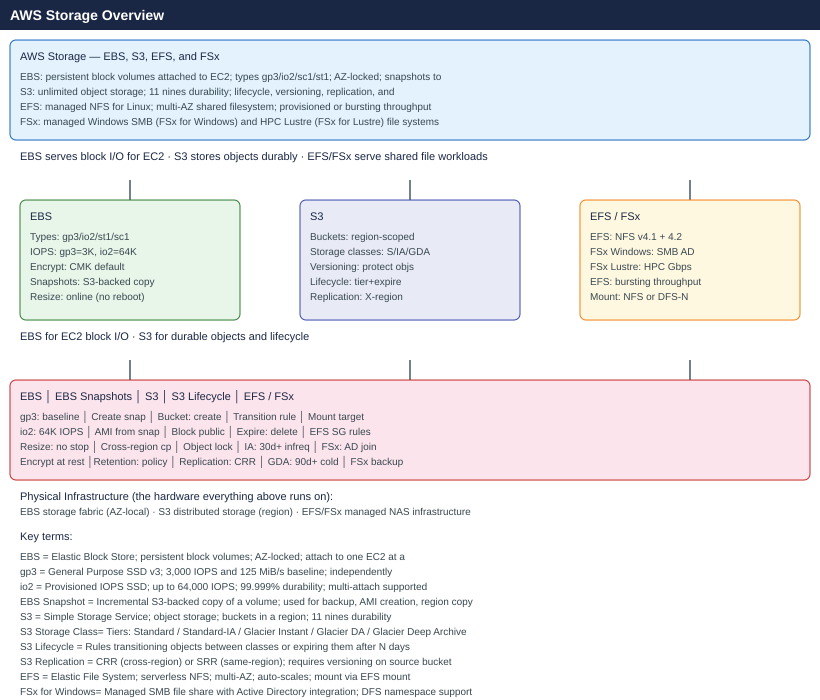

---
tags:
  - aws
description: "AWS storage covers three models: EBS block volumes for EC2 boot and data disks, S3 object storage for backups and static assets, and EFS/FSx file storage..."
---
# AWS Storage

AWS storage covers three models: EBS block volumes for EC2 boot and data disks, S3 object storage for backups and static assets, and EFS/FSx file storage for shared Linux and Windows workloads. Lifecycle policies automate tiering; snapshots and cross-region replication underpin DR.

*Applies to: AWS*

<a class="kb-card" href="ebs/">
  <strong>EBS</strong>
  Block storage, volume types, performance, encryption, and expansion.
</a>

<a class="kb-card" href="ebs-snapshots/">
  <strong>EBS Snapshots</strong>
  Snapshot protection, retention, copy, restore, and lifecycle tasks.
</a>

<a class="kb-card" href="s3/">
  <strong>S3</strong>
  Object storage, buckets, permissions, lifecycle, replication, and encryption.
</a>

<a class="kb-card" href="s3-lifecycle/">
  <strong>S3 Lifecycle</strong>
  Lifecycle policies, transitions, expiration, and storage class control.
</a>

<a class="kb-card" href="s3-replication/">
  <strong>S3 Replication</strong>
  Cross-region replication, same-region replication, and validation.
</a>

<a class="kb-card" href="efs/">
  <strong>EFS</strong>
  Managed NFS storage, mount targets, throughput, and access points.
</a>

<a class="kb-card" href="fsx/">
  <strong>FSx</strong>
  Managed file systems, Windows, Lustre, NetApp ONTAP, and OpenZFS notes.
</a>

