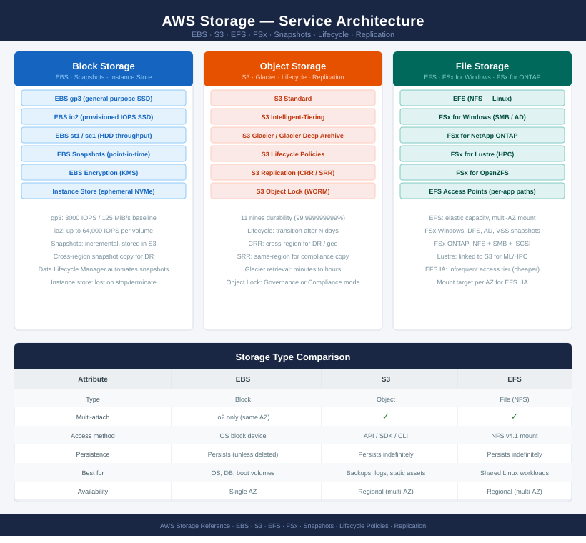

# AWS Storage

<div class="kb-summary">
AWS storage covers three models: EBS block volumes for EC2 boot and data disks, S3 object storage for backups and static assets, and EFS/FSx file storage for shared Linux and Windows workloads. Lifecycle policies automate tiering; snapshots and cross-region replication underpin DR.
</div>

```
┌──────────────────────────────────────── AWS Storage Overview ─────────────────────────────────────────┐
│                                                                                                       │
│   ┌───────────────────────────────────────────────────────────────────────────────────────────────┐   │
│   │                              AWS Storage — EBS, S3, EFS, and FSx                              │   │
│   │ EBS: persistent block volumes attached to EC2; types gp3/io2/sc1/st1; AZ-locked; snapshots to │   │
│   │   S3: unlimited object storage; 11 nines durability; lifecycle, versioning, replication, and  │   │
│   │   EFS: managed NFS for Linux; multi-AZ shared filesystem; provisioned or bursting throughput  │   │
│   │    FSx: managed Windows SMB (FSx for Windows) and HPC Lustre (FSx for Lustre) file systems    │   │
│   └───────────────────────────────────────────────────────────────────────────────────────────────┘   │
│                                                                                                       │
│    EBS serves block I/O for EC2 · S3 stores objects durably · EFS/FSx serve shared file workloads     │
│                                                                                                       │
│                  ▼                                ▼                                ▼                  │
│                                                                                                       │
│   ┌─────────────────────────────┐  ┌─────────────────────────────┐  ┌─────────────────────────────┐   │
│   │             EBS             │  │              S3             │  │          EFS / FSx          │   │
│   │    Types: gp3/io2/st1/sc1   │  │    Buckets: region-scoped   │  │     EFS: NFS v4.1 + 4.2     │   │
│   │    IOPS: gp3=3K, io2=64K    │  │  Storage classes: S/IA/GDA  │  │     FSx Windows: SMB AD     │   │
│   │     Encrypt: CMK default    │  │   Versioning: protect objs  │  │     FSx Lustre: HPC Gbps    │   │
│   │  Snapshots: S3-backed copy  │  │    Lifecycle: tier+expire   │  │   EFS: bursting throughput  │   │
│   │  Resize: online (no reboot) │  │    Replication: X-region    │  │     Mount: NFS or DFS-N     │   │
│   └─────────────────────────────┘  └─────────────────────────────┘  └─────────────────────────────┘   │
│                                                                                                       │
│    EBS for EC2 block I/O · S3 for durable objects and lifecycle                                       │
│                                                                                                       │
│                  ▼                                ▼                                ▼                  │
│                                                                                                       │
│   ┌───────────────────────────────────────────────────────────────────────────────────────────────┐   │
│   │       EBS        │  EBS Snapshots   │         S3        │   S3 Lifecycle   │    EFS / FSx     │   │
│   │  gp3: baseline   │   Create snap    │   Bucket: create  │ Transition rule  │   Mount target   │   │
│   │  io2: 64K IOPS   │  AMI from snap   │    Block public   │  Expire: delete  │   EFS SG rules   │   │
│   │ Resize: no stop  │ Cross-region cp  │    Object lock    │ IA: 30d+ infreq  │   FSx: AD join   │   │
│   │ Encrypt at rest  │Retention: policy │  Replication: CRR │  GDA: 90d+ cold  │    FSx backup    │   │
│   └───────────────────────────────────────────────────────────────────────────────────────────────┘   │
│                                                                                                       │
│  Physical Infrastructure (the hardware everything above runs on):                                     │
│  EBS storage fabric (AZ-local) · S3 distributed storage (region) · EFS/FSx managed NAS infrastructure │
│                                                                                                       │
│  Key terms:                                                                                           │
│                                                                                                       │
│  EBS            = Elastic Block Store; persistent block volumes; AZ-locked; attach to one EC2 at a    │
│  gp3            = General Purpose SSD v3; 3,000 IOPS and 125 MiB/s baseline; independently            │
│  io2            = Provisioned IOPS SSD; up to 64,000 IOPS; 99.999% durability; multi-attach supported │
│  EBS Snapshot   = Incremental S3-backed copy of a volume; used for backup, AMI creation, region copy  │
│  S3             = Simple Storage Service; object storage; buckets in a region; 11 nines durability    │
│  S3 Storage Class= Tiers: Standard / Standard-IA / Glacier Instant / Glacier DA / Glacier Deep Archive│
│  S3 Lifecycle   = Rules transitioning objects between classes or expiring them after N days           │
│  S3 Replication = CRR (cross-region) or SRR (same-region); requires versioning on source bucket       │
│  EFS            = Elastic File System; serverless NFS; multi-AZ; auto-scales; mount via EFS mount     │
│  FSx for Windows= Managed SMB file share with Active Directory integration; DFS namespace support     │
│  FSx for Lustre = High-performance parallel file system; used for ML training and HPC workloads       │
│  Object Lock    = S3 WORM; Governance or Compliance mode; prevents delete/overwrite for retention     │
│                                                                                                       │
└───────────────────────────────────────────────────────────────────────────────────────────────────────┘
```



<div class="kb-grid kb-grid-3">

<a class="kb-card" href="ebs/">
  <strong>EBS</strong>
  <span>Block storage, volume types, performance, encryption, and expansion.</span>
</a>

<a class="kb-card" href="ebs-snapshots/">
  <strong>EBS Snapshots</strong>
  <span>Snapshot protection, retention, copy, restore, and lifecycle tasks.</span>
</a>

<a class="kb-card" href="s3/">
  <strong>S3</strong>
  <span>Object storage, buckets, permissions, lifecycle, replication, and encryption.</span>
</a>

<a class="kb-card" href="s3-lifecycle/">
  <strong>S3 Lifecycle</strong>
  <span>Lifecycle policies, transitions, expiration, and storage class control.</span>
</a>

<a class="kb-card" href="s3-replication/">
  <strong>S3 Replication</strong>
  <span>Cross-region replication, same-region replication, and validation.</span>
</a>

<a class="kb-card" href="efs/">
  <strong>EFS</strong>
  <span>Managed NFS storage, mount targets, throughput, and access points.</span>
</a>

<a class="kb-card" href="fsx/">
  <strong>FSx</strong>
  <span>Managed file systems, Windows, Lustre, NetApp ONTAP, and OpenZFS notes.</span>
</a>

</div>
