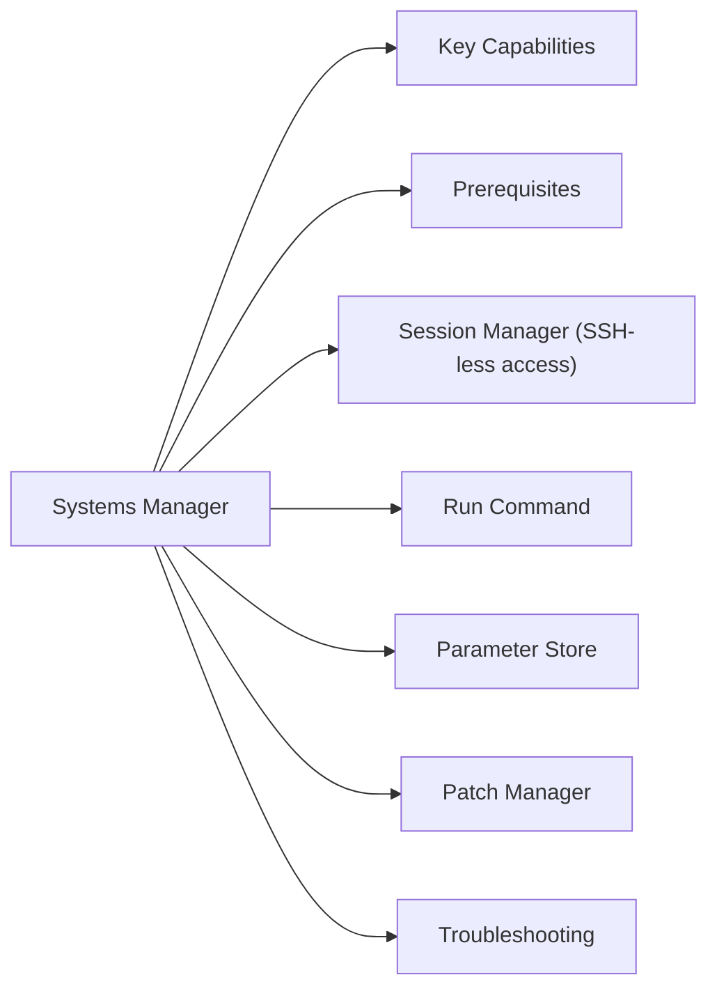

# Systems Manager

AWS Systems Manager — fleet management, patching, session management, and parameter storage.



## Key Capabilities

| Capability | Description |
|---|---|
| Session Manager | Browser/CLI shell access to EC2 without SSH or bastion |
| Patch Manager | Automate OS patching with patch baselines and maintenance windows |
| Run Command | Execute commands across fleets without SSH |
| Parameter Store | Hierarchical secret and config storage |
| Inventory | Collect software and configuration inventory from managed nodes |
| Automation | Runbook-based automation for common operational tasks |
| State Manager | Ensure instances maintain a desired configuration |

## Prerequisites

SSM Agent must be installed and running on managed instances (pre-installed on Amazon Linux 2/2023, Windows Server AMIs).

```bash
# Check SSM agent status
systemctl status amazon-ssm-agent           # Linux
Get-Service AmazonSSMAgent                  # Windows

# Verify instance is registered in SSM
aws ssm describe-instance-information \
  --query 'InstanceInformationList[*].{ID:InstanceId,OS:PlatformType,Version:PlatformVersion,Ping:PingStatus}' \
  --output table
```

## Session Manager (SSH-less access)

```bash
# Start interactive session (requires AWS CLI + session-manager-plugin)
aws ssm start-session --target <instance-id>

# Port forwarding (e.g., RDS through bastion without opening SGs)
aws ssm start-session \
  --target <instance-id> \
  --document-name AWS-StartPortForwardingSessionToRemoteHost \
  --parameters '{"host":["<rds-endpoint>"],"portNumber":["5432"],"localPortNumber":["5432"]}'
```

## Run Command

```bash
# Run a shell command on multiple instances
aws ssm send-command \
  --instance-ids <i-id1> <i-id2> \
  --document-name "AWS-RunShellScript" \
  --parameters commands="df -h" \
  --query "Command.CommandId"

# Check command output
aws ssm get-command-invocation \
  --command-id <cmd-id> \
  --instance-id <i-id> \
  --query '{Status:Status,Output:StandardOutputContent}'

# Run on all instances with a tag
aws ssm send-command \
  --targets Key=tag:Env,Values=prod \
  --document-name "AWS-RunShellScript" \
  --parameters commands="systemctl status nginx"
```

## Parameter Store

```bash
# Put a parameter
aws ssm put-parameter \
  --name "/prod/db/password" \
  --value "secret-value" \
  --type SecureString \
  --key-id alias/aws/ssm

# Get a parameter value
aws ssm get-parameter \
  --name "/prod/db/password" \
  --with-decryption \
  --query 'Parameter.Value' \
  --output text

# List parameters by path
aws ssm get-parameters-by-path \
  --path "/prod/" \
  --recursive \
  --query 'Parameters[*].{Name:Name,Type:Type}' \
  --output table
```

## Patch Manager

```bash
# List patch compliance for managed instances
aws ssm describe-instance-patch-states \
  --instance-ids <i-id> \
  --query 'InstancePatchStates[*].{ID:InstanceId,Missing:MissingCount,Critical:CriticalNonCompliantCount,Failed:FailedCount}'

# Trigger immediate patching
aws ssm send-command \
  --instance-ids <i-id> \
  --document-name "AWS-RunPatchBaseline" \
  --parameters Operation=Install
```

## Troubleshooting

| Symptom | Check | Action |
|---|---|---|
| Instance not in SSM Fleet | SSM Agent running? IAM role? | Verify `AmazonSSMManagedInstanceCore` policy on instance role |
| Session Manager access denied | SG or VPC endpoint? | No inbound SG rules needed; ensure VPC endpoint for SSM if in private subnet |
| Run Command times out | Agent responsive? | Check SSM agent logs: `/var/log/amazon/ssm/` |
| Parameter Store access denied | IAM policy | Add `ssm:GetParameter*` and `kms:Decrypt` if using SecureString |
