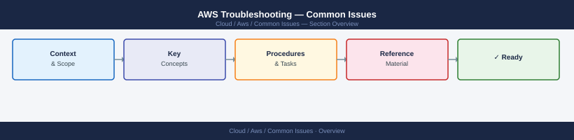
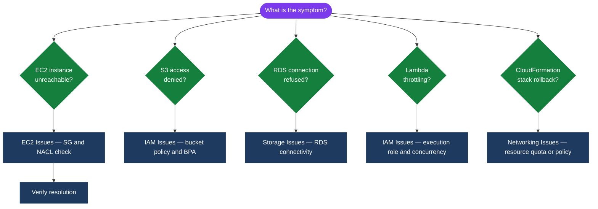

---
tags:
  - aws
  - troubleshooting
search:
  boost: 1.5
---
# AWS Troubleshooting — Common Issues



```bash
# View the stack events to identify the failed resource
aws cloudformation describe-stack-events \
  --stack-name my-stack \
  --query 'StackEvents[?ResourceStatus==`UPDATE_FAILED`].[LogicalResourceId,ResourceStatusReason]' \
  --output table

# Continue rollback (skip specific resources if they're blocking)
aws cloudformation continue-update-rollback \
  --stack-name my-stack \
  --resources-to-skip LogicalResourceId1 LogicalResourceId2
```


## Diagnostic Flow



---

## Before you begin

- **Access:** Admin credentials on all affected systems
- **Gather first:** recent error message text, event timestamps, and affected object names
- **Scope:** confirm whether the issue affects a single object, host, cluster, or site
- **Escalation:** open a vendor support ticket before running any destructive step
- **Logging:** document each command and output — required if escalation is needed

---

---

## Verify resolution

- Confirm the original symptom no longer occurs
- Check logs for any residual errors related to the issue
- Monitor for 10–15 minutes to confirm the fix is stable

---

## See also

- [Aws — Diagnostics](../diagnostics/)
- [Aws — Escalation](../escalation/)
- [Aws — Health Checks](../../operations/health-checks/)
