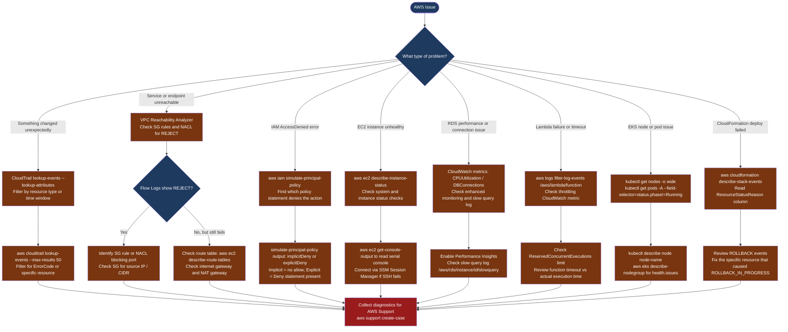

---
tags:
  - aws
  - troubleshooting
search:
  boost: 1.5
---
# AWS — Diagnostics

<div class="kb-summary">
AWS diagnostic commands: confirm account and role identity with aws sts, query CloudTrail for recent API changes, use VPC Reachability Analyzer and Flow Logs to trace connectivity, simulate IAM policy decisions, check RDS and Lambda CloudWatch metrics, inspect EKS node and pod state, and detect CloudFormation stack drift.

*Applies to: AWS CLI v2 · all regions*
</div>

```text
┌─────────────────────────────── AWS — Diagnostics Investigation Toolset ───────────────────────────────┐
│                                                                                                       │
│   ┌───────────────────────────────────────────────────────────────────────────────────────────────┐   │
│   │   Start here: aws sts get-caller-identity → CloudTrail lookup → VPC Flow Logs REJECT entries │    │
│   │   IAM denied: aws iam simulate-principal-policy to find which policy blocked the action      │    │
│   │   Service unreachable: VPC Reachability Analyzer; check SG, NACL, route table               │     │
│   └───────────────────────────────────────────────────────────────────────────────────────────────┘   │
│                                                                                                       │
│   ┌──────────────────────────────────────────────┐  ┌─────────────────────────────────────────────┐   │
│   │                 Log Sources                  │  │               Metrics and Traces            │   │
│   │   CloudTrail: management API events          │  │   CloudWatch: EC2, RDS, Lambda metrics     │    │
│   │   VPC Flow Logs: accepted and rejected flows │  │   X-Ray: distributed service latency map   │    │
│   │   CloudWatch Logs: app logs per service      │  │   Performance Insights: RDS SQL analysis    │   │
│   │   ELB access logs: per-request timing        │  │   CloudWatch Logs Insights: KQL queries     │   │
│   └──────────────────────────────────────────────┘  └─────────────────────────────────────────────┘   │
│                                                                                                       │
│  Physical Infrastructure (all managed by AWS):                                                        │
│  EC2 instances / ECS tasks / Lambda functions · VPC / ENI / SG / NACL · RDS / EKS cluster nodes       │
│                                                                                                       │
│  Key terms:                                                                                           │
│  CloudTrail        = management event log; records every API call with caller identity                │
│  Flow Log          = VPC network traffic log; ACCEPT or REJECT per 5-minute window                    │
│  simulate-principal-policy= IAM CLI that evaluates whether a policy allows or denies an action        │
│  Reachability Analyzer= VPC tool tracing the network path between two resources                       │
│  Performance Insights= RDS SQL analysis dashboard; shows wait events and top queries                  │
│  SSM Session Manager= browser/CLI shell to EC2 without SSH key or open port 22                        │
│                                                                                                       │
└───────────────────────────────────────────────────────────────────────────────────────────────────────┘
```



## Before you begin

- **Access:** AWS CLI configured with the correct profile and region; confirm with `aws sts get-caller-identity`; IAM permissions to read CloudTrail, CloudWatch Logs, and VPC Reachability
- **Gather first:** the specific error message (from the console, API response, or application log), the affected resource ARN or name, the AWS account and region, and the time the issue started
- **Scope:** confirm whether the issue affects one resource, one service, one VPC, or multiple accounts (AWS Organizations)

---

## Step 1 — Confirm identity and recent changes

```bash
# Confirm you are in the correct account and role
aws sts get-caller-identity
# Returns: UserId, Account, Arn — verify against expected account number and role

# Check active CLI profile
aws configure list

# Search CloudTrail for recent management events (last 1 hour)
aws cloudtrail lookup-events \
  --max-results 50 \
  --lookup-attributes AttributeKey=EventName,AttributeValue=DeleteSecurityGroup \
  --query 'Events[*].[EventTime,Username,EventName,Resources[0].ResourceName]' \
  --output table

# Find events by resource ARN (e.g., who modified a specific S3 bucket)
aws cloudtrail lookup-events \
  --max-results 50 \
  --lookup-attributes AttributeKey=ResourceName,AttributeValue=my-bucket \
  --query 'Events[*].[EventTime,Username,EventName,ErrorCode]' \
  --output table
# Look for: ErrorCode = AccessDenied or DeleteBucket events

# Last 1 hour of all error events in this region
aws cloudtrail lookup-events \
  --max-results 100 \
  --start-time $(date -u -d "1 hour ago" +%Y-%m-%dT%H:%M:%SZ 2>/dev/null || \
                date -u -v-1H +%Y-%m-%dT%H:%M:%SZ) \
  --query 'Events[?ErrorCode!=null].[EventTime,Username,EventName,ErrorCode]' \
  --output table
```

---

## Step 2 — Diagnose VPC connectivity with Flow Logs and Reachability Analyzer

```bash
# Find REJECT entries in VPC Flow Logs (identifies blocked traffic)
aws logs filter-log-events \
  --log-group-name /aws/vpc/flowlogs \
  --filter-pattern '[version, account, eni, source, dest, srcport, destport, protocol, packets, bytes, start, end, action="REJECT", log_status]' \
  --start-time $(($(date +%s) - 3600))000 \
  --query 'events[*].message' --output text
# Each line: source-ip destination-ip dest-port REJECT
# Find the port being rejected; match to SG inbound rule

# VPC Reachability Analyzer — trace path from EC2 to another resource
aws ec2 create-network-insights-path \
  --source i-0abc123def456 \
  --destination sg-0def456abc123 \
  --protocol TCP \
  --destination-port 443 \
  --query 'NetworkInsightsPath.NetworkInsightsPathId' --output text
# Returns: path ID

PATH_ID=nip-0abc123
aws ec2 start-network-insights-analysis \
  --network-insights-path-id $PATH_ID \
  --query 'NetworkInsightsAnalysis.NetworkInsightsAnalysisId' --output text

ANALYSIS_ID=nia-0def456
# Poll until status = succeeded (usually < 60 seconds)
aws ec2 describe-network-insights-analyses \
  --network-insights-analysis-ids $ANALYSIS_ID \
  --query 'NetworkInsightsAnalyses[0].[NetworkPathFound,Explanations]' \
  --output json
# NetworkPathFound: true = path exists; false = path blocked; Explanations shows why
```

---

## Step 3 — Diagnose IAM access denied errors

```bash
# Simulate whether a role can perform a specific action
aws iam simulate-principal-policy \
  --policy-source-arn "arn:aws:iam::<account-id>:role/MyRole" \
  --action-names "s3:PutObject" \
  --resource-arns "arn:aws:s3:::my-bucket/key" \
  --query 'EvaluationResults[*].[EvalActionName,EvalDecision,MatchedStatements[*].SourcePolicyId]' \
  --output table
# EvalDecision: allowed = permitted; implicitDeny = no allow found; explicitDeny = Deny statement

# Add context entries for condition-based policies (e.g., region, MFA)
aws iam simulate-principal-policy \
  --policy-source-arn "arn:aws:iam::<account>:role/MyRole" \
  --action-names "s3:PutObject" \
  --resource-arns "arn:aws:s3:::my-bucket/key" \
  --context-entries \
    'ContextKeyName=aws:RequestedRegion,ContextKeyValues=eu-west-1,ContextKeyType=string' \
    'ContextKeyName=aws:MultiFactorAuthPresent,ContextKeyValues=true,ContextKeyType=bool' \
  --query 'EvaluationResults[*].[EvalDecision,MatchedStatements[*].SourcePolicyId]' \
  --output table

# List all policies attached to a role
aws iam list-attached-role-policies --role-name MyRole --output table
aws iam list-role-policies --role-name MyRole   # Inline policies

# View trust policy (which services/accounts can assume this role)
aws iam get-role --role-name MyRole \
  --query 'Role.AssumeRolePolicyDocument' | python3 -m json.tool
```

---

## Step 4 — Diagnose EC2 instance health

```bash
# Check instance status checks (system = AWS infrastructure; instance = OS)
aws ec2 describe-instance-status \
  --instance-ids i-0abc123 \
  --query 'InstanceStatuses[0].[InstanceState.Name,SystemStatus.Status,InstanceStatus.Status]' \
  --output table
# Expected: running, ok, ok
# Problem: impaired = hardware or OS issue; initializing = just started

# Get serial console output (useful if SSH is unavailable)
aws ec2 get-console-output \
  --instance-id i-0abc123 \
  --output text | tail -50

# Connect without SSH via SSM Session Manager (requires SSM agent installed)
aws ssm start-session --target i-0abc123
# Opens interactive shell session in the browser or via CLI

# Check instance metadata from inside the instance
curl -s http://169.254.169.254/latest/meta-data/instance-id
curl -s http://169.254.169.254/latest/meta-data/local-ipv4

# Describe the effective SG rules for an instance
aws ec2 describe-security-groups \
  --group-ids $(aws ec2 describe-instances --instance-ids i-0abc123 \
    --query 'Reservations[0].Instances[0].SecurityGroups[*].GroupId' \
    --output text) \
  --query 'SecurityGroups[*].[GroupName,IpPermissions]' --output json
```

---

## Step 5 — Diagnose RDS performance and connectivity

```bash
# Check recent RDS events (failovers, restarts, storage full)
aws rds describe-events \
  --source-identifier prod-mysql \
  --source-type db-instance \
  --duration 60 \
  --query 'Events[*].[Date,Message]' \
  --output table

# CloudWatch metrics: CPU, connections, free storage (last 1 hour)
for METRIC in CPUUtilization DatabaseConnections FreeStorageSpace; do
  echo "--- $METRIC ---"
  aws cloudwatch get-metric-statistics \
    --namespace AWS/RDS \
    --metric-name $METRIC \
    --dimensions Name=DBInstanceIdentifier,Value=prod-mysql \
    --start-time $(date -u -d '1 hour ago' +%Y-%m-%dT%H:%M:%SZ 2>/dev/null || \
                  date -u -v-1H +%Y-%m-%dT%H:%M:%SZ) \
    --end-time $(date -u +%Y-%m-%dT%H:%M:%SZ) \
    --period 300 --statistics Average \
    --query 'sort_by(Datapoints, &Timestamp)[-1].Average' --output text
done

# Slow query log (if enabled via parameter group)
aws logs filter-log-events \
  --log-group-name /aws/rds/instance/prod-mysql/slowquery \
  --start-time $(($(date +%s) - 3600))000 \
  --query 'events[*].message' --output text | head -50
```

---

## Step 6 — Diagnose Lambda and EKS failures

```bash
# Lambda — recent error events
aws logs filter-log-events \
  --log-group-name /aws/lambda/my-function \
  --filter-pattern "ERROR" \
  --start-time $(($(date +%s) - 3600))000 \
  --query 'events[*].message' --output text

# Lambda — invoke manually and capture response + logs
aws lambda invoke \
  --function-name my-function \
  --payload '{"key":"value"}' \
  --log-type Tail \
  --query 'LogResult' --output text \
  /tmp/lambda-output.json | base64 -d
cat /tmp/lambda-output.json

# Lambda — check throttling (concurrent execution limit hit)
aws cloudwatch get-metric-statistics \
  --namespace AWS/Lambda \
  --metric-name Throttles \
  --dimensions Name=FunctionName,Value=my-function \
  --start-time $(date -u -d '1 hour ago' +%Y-%m-%dT%H:%M:%SZ 2>/dev/null || \
                date -u -v-1H +%Y-%m-%dT%H:%M:%SZ) \
  --end-time $(date -u +%Y-%m-%dT%H:%M:%SZ) \
  --period 300 --statistics Sum \
  --query 'sort_by(Datapoints, &Timestamp)[-1].Sum' --output text

# EKS — node and pod health
kubectl get nodes -o wide
kubectl describe node <node-name> | grep -A 20 "Conditions:"
kubectl get pods -A --field-selector=status.phase!=Running,status.phase!=Succeeded

# EKS — control plane audit logs
aws logs filter-log-events \
  --log-group-name /aws/eks/my-cluster/cluster \
  --log-stream-name-prefix kube-apiserver-audit \
  --start-time $(($(date +%s) - 3600))000 \
  --query 'events[*].message' --output text | python3 -m json.tool | head -100
```

---

## Step 7 — CloudFormation diagnostics and support case

```bash
# Show stack events (most recent first) — find the ROLLBACK trigger
aws cloudformation describe-stack-events \
  --stack-name my-stack \
  --query 'sort_by(StackEvents, &Timestamp)[-20:].[LogicalResourceId,ResourceStatus,ResourceStatusReason,Timestamp]' \
  --output table
# Look for: ROLLBACK_IN_PROGRESS and the ResourceStatusReason in the same block

# Detect drift (resources changed outside CloudFormation)
DRIFT_TOKEN=$(aws cloudformation detect-stack-drift \
  --stack-name my-stack \
  --query 'StackDriftDetectionId' --output text)

aws cloudformation describe-stack-drift-detection-status \
  --stack-drift-detection-id $DRIFT_TOKEN \
  --query '[StackDriftStatus,DriftedStackResourceCount]'

aws cloudformation describe-stack-resource-drifts \
  --stack-name my-stack \
  --stack-resource-drift-status-filters MODIFIED DELETED \
  --query 'StackResourceDrifts[*].[LogicalResourceId,ResourceType,StackResourceDriftStatus]' \
  --output table

# Open an AWS Support case (requires Business or Enterprise Support plan)
aws support create-case \
  --subject "VPC connectivity issue - instance unreachable" \
  --service-code "virtual-private-cloud" \
  --severity-code "urgent" \
  --category-code "connectivity" \
  --communication-body "Instance i-0abc123 unreachable since 14:30 UTC. Flow Logs show REJECT on port 443."
```

---

## Log locations

| Source | Path / Command | What to look for |
|---|---|---|
| CloudTrail | `aws cloudtrail lookup-events` | Who changed what; API errors with ErrorCode |
| VPC Flow Logs | `aws logs filter-log-events /aws/vpc/flowlogs` | REJECT entries = SG or NACL blocking traffic |
| CloudWatch Logs | `aws logs filter-log-events /aws/lambda/name` | Application errors and Lambda cold starts |
| EKS audit | `/aws/eks/cluster-name/cluster` log group | Kubernetes API audit events |
| RDS slow query | `/aws/rds/instance/name/slowquery` log group | Queries exceeding the slow_query_time threshold |
| CloudFormation | `describe-stack-events` | ROLLBACK trigger, resource creation errors |

---

## See also

- [AWS — Common Issues](../common-issues/)
- [AWS — Escalation](../escalation/)

## Verify resolution

- `aws sts get-caller-identity` confirms the correct account and role
- VPC Reachability Analyzer analysis shows `NetworkPathFound: true` for the previously failing path
- `aws iam simulate-principal-policy` returns `allowed` for the previously denied action
- CloudWatch metrics for the affected service (CPU, error rate, latency) return to baseline
- The affected workload (EC2, RDS, Lambda, EKS pod) passes a functional smoke test
