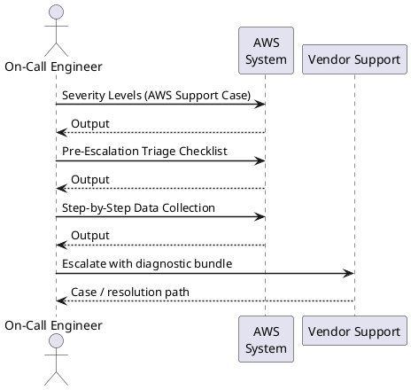
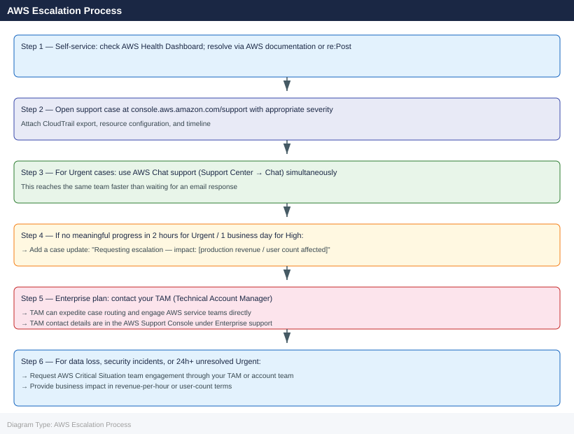

---
tags:
  - aws
  - troubleshooting
search:
  boost: 1.5
---
# AWS — Escalation

<div class="kb-summary">
AWS support case creation, severity level selection, data collection with AWS CLI, TAM escalation path, and required diagnostics before opening a case for EC2, S3, RDS, networking, and IAM issues.

*Applies to: AWS (all services)*
</div>



## Before you begin

- **Access:** AWS account with Support plan (Business or Enterprise); IAM permissions to create support cases (`support:CreateCase`)
- **Gather first:** affected resource ARNs, account ID, region, approximate start time, and any error messages or codes
- **Status check:** check `health.aws.amazon.com` and `status.aws.amazon.com` before escalating — many failures are caused by regional AWS incidents
- **Support plan:** Developer plan does not include production-level SLAs; Business or Enterprise required for < 1 hour response
- **Logging:** enable CloudTrail if not already enabled; CloudWatch Logs agent on EC2 instances before reproducing issues

---

## Severity Levels (AWS Support Case)

| Severity | Definition | Response SLA by Plan |
|---|---|---|
| Urgent | Production system completely down; no workaround | Business: 1h · Enterprise On-Ramp: 30m · Enterprise: 15m |
| High | Significant business impact; production impaired; workaround available | Business: 4h · Enterprise On-Ramp: 4h · Enterprise: 1h |
| Normal | Non-critical function impaired; development environment affected | Business: 12h · Enterprise: 4h |
| Low | General guidance; feature request; billing question | Business: 24h · Enterprise: 24h |

## Pre-Escalation Triage Checklist

| Check | Command | Expected |
|---|---|---|
| AWS Health events | `aws health describe-events --filter '{"regions":["<region>"]}'` | No active events for affected service |
| EC2 instance status | `aws ec2 describe-instance-status --instance-ids <id>` | `"Status": "ok"` on both system and instance |
| Service quota not reached | `aws service-quotas list-service-quotas --service-code ec2` | Used < quota for affected resource type |
| IAM permissions valid | `aws iam simulate-principal-policy --policy-source-arn <role-arn> --action-names <action>` | `EvalDecision: allowed` |
| CloudTrail has events | `aws cloudtrail lookup-events --lookup-attributes AttributeKey=EventName,AttributeValue=<FailingAction>` | Recent events visible |
| VPC flow logs for network issues | Enable via `aws ec2 create-flow-logs` | Flow logs present in CloudWatch |
| RDS event subscriptions | `aws rds describe-events --source-type db-instance --source-identifier <id>` | Check for error events |

---

## Step-by-Step Data Collection

### 1. Collect account and region context

```bash
# Get current account ID and caller identity
aws sts get-caller-identity

# Set the region for all subsequent commands
export AWS_REGION=<your-region>
export ACCOUNT_ID=$(aws sts get-caller-identity --query Account --output text)
```

### 2. Collect CloudTrail events for the failing action

```bash
# Find API errors in the last 4 hours for a specific service
aws cloudtrail lookup-events \
  --lookup-attributes AttributeKey=EventSource,AttributeValue=ec2.amazonaws.com \
  --start-time $(date -u -d '4 hours ago' +%FT%TZ) \
  --query 'Events[?ErrorCode!=`null`].{Time:EventTime,User:Username,Action:EventName,Error:ErrorCode,Message:CloudTrailEvent}' \
  --output json > /tmp/cloudtrail-errors.json

# For a specific resource (e.g., instance, S3 bucket)
aws cloudtrail lookup-events \
  --lookup-attributes AttributeKey=ResourceName,AttributeValue=<resource-id-or-arn> \
  --start-time $(date -u -d '2 hours ago' +%FT%TZ) \
  --output json > /tmp/cloudtrail-resource.json
```

### 3. Collect resource-specific diagnostics

```bash
# EC2: instance status and recent logs
aws ec2 describe-instance-status --instance-ids <instance-id> --output json
aws ec2 get-console-output --instance-id <instance-id> --output text > /tmp/console-output.txt
aws ec2 describe-instances --instance-ids <instance-id> \
  --query 'Reservations[].Instances[].[InstanceId,InstanceType,State.Name,PrivateIpAddress,SubnetId,VpcId,IamInstanceProfile.Arn]' \
  --output table

# RDS: events and parameter groups
aws rds describe-events --source-type db-instance --source-identifier <db-id> --duration 240
aws rds describe-db-instances --db-instance-identifier <db-id> --output json

# S3: bucket policy and ACL (for access denied errors)
aws s3api get-bucket-policy --bucket <bucket-name> 2>/dev/null || echo "No bucket policy"
aws s3api get-bucket-acl --bucket <bucket-name>
aws s3api get-bucket-versioning --bucket <bucket-name>

# IAM: simulate policy for a specific action
aws iam simulate-principal-policy \
  --policy-source-arn arn:aws:iam::${ACCOUNT_ID}:role/<role-name> \
  --action-names s3:GetObject \
  --resource-arns arn:aws:s3:::<bucket-name>/* \
  --output json
```

### 4. Collect CloudWatch metrics and logs

```bash
# Get CPU and network metrics for an EC2 instance
aws cloudwatch get-metric-statistics \
  --namespace AWS/EC2 \
  --metric-name CPUUtilization \
  --dimensions Name=InstanceId,Value=<instance-id> \
  --start-time $(date -u -d '2 hours ago' +%FT%TZ) \
  --end-time $(date -u +%FT%TZ) \
  --period 300 \
  --statistics Average \
  --output table

# Get recent application log errors from CloudWatch
aws logs filter-log-events \
  --log-group-name /var/log/app \
  --start-time $(( $(date -u +%s) - 7200 ))000 \
  --filter-pattern "ERROR" \
  --output json > /tmp/cloudwatch-errors.json
```

### 5. Write the timeline

```text
AWS Account ID: 123456789012
Region: eu-west-1
Affected resource: i-0abc123def456789 (EC2 instance, t3.large)
Support plan: Business

Issue first observed: 2026-06-15 10:30 UTC
Last known good state: 2026-06-15 09:00 UTC

Error observed:
  - EC2 instance health check failing (both system and instance check)
  - CloudTrail shows: DescribeInstances succeeds; StartInstances returns "InternalError"
  - EC2 console output shows: kernel panic at 10:28 UTC

Changes in 2h before issue:
  - User data script was modified (attached via parameter store)
  - No AWS infrastructure changes (no AMI updates, no type changes)

Blast radius:
  - Single EC2 instance offline
  - Application on this instance unavailable to 500 users
  - RDS instance and other EC2 nodes not affected
```

---

## How to Open an AWS Support Case

1. Sign in to **console.aws.amazon.com** and click the **Support** menu in the top navigation bar.

2. Click **Create case**.

3. Under **Regarding**, select **Technical** for operational issues, **Account and billing** for billing issues, or **Service limit increase** for quota requests.

4. Under **Service**, select the primary affected service (EC2, S3, RDS, VPC, IAM, etc.).

5. Under **Category**, select the specific problem category (e.g., EC2 → Connectivity, RDS → Performance).

6. Under **Severity**, select:
   - **Urgent**: Production system completely down; business operations halted; no workaround
   - **High**: Production significantly impaired; workaround available but inadequate
   - **Normal**: Non-production or limited-scope issue; development work blocked
   - **Low**: General guidance; feature request; planning question

7. In the **Subject** field: `EC2 instance i-0abc123def456789 in eu-west-1 health check failing since 10:30 UTC 2026-06-15`.

8. In the **Description**, paste:
   - Account ID and affected resource ARNs
   - Error messages from CloudTrail
   - Timeline (from step 5 above)
   - What you have already checked

9. Under **Additional contacts**, add your team's on-call email for Urgent cases.

10. Click **Submit**. You receive a case ID by email immediately.

11. **Urgent cases:** also open AWS Chat support (available in Support Center console) for faster initial response.

---

## Escalation Path



---

## What NOT to Do

| Do NOT do this | Why | What to do instead |
|---|---|---|
| Terminate and re-launch an EC2 instance before data collection | Destroys console output and system logs needed for root cause analysis | Stop the instance (do not terminate); capture console output and take a snapshot |
| Delete a failing RDS instance to recreate it | Loses all data, snapshots, and event history needed for diagnosis | Stop the RDS instance; restore from the latest automated snapshot in parallel |
| Increase all service quotas by 10× preemptively | AWS may require business justification; excessive quotas trigger billing anomaly alerts | Request quota increases only for the specific service and region where you see throttling |
| Remove IAM policies or deny-all SCPs as a quick fix | Can break other services that depend on those permissions | Use IAM policy simulator to identify the minimum change needed |
| Open duplicate support cases for the same issue | Fragments the investigation across multiple engineers | Add updates to the original case; reference the original case ID in any follow-up |

---

## Useful Commands for Case Updates

```bash
# Snapshot current AWS service health (include in every case update)
aws health describe-events \
  --filter '{"regions":["<region>"],"eventStatusCodes":["open","upcoming"]}' \
  --query 'events[].{Service:service,Type:eventTypeCode,Status:statusCode,Start:startTime}' \
  --output table

# Check if issue is quota-related
aws service-quotas list-service-quotas --service-code ec2 \
  --query 'Quotas[?UsageMetric!=`null`].{Name:QuotaName,Value:Value}' --output table

# EC2: latest console output (updated every 5 min during boot issues)
aws ec2 get-console-output --instance-id <instance-id> --latest --output text

# RDS: pending maintenance and recent events
aws rds describe-pending-maintenance-actions --resource-identifier arn:aws:rds:<region>:<acct>:db:<id>
aws rds describe-events --source-type db-instance --source-identifier <id> --duration 120

# API call rate (for throttling investigations)
aws cloudwatch get-metric-statistics \
  --namespace AWS/Usage \
  --metric-name CallCount \
  --dimensions Name=Service,Value=EC2 Name=Resource,Value=DescribeInstances Name=Type,Value=API \
  --start-time $(date -u -d '1 hour ago' +%FT%TZ) \
  --end-time $(date -u +%FT%TZ) \
  --period 60 --statistics Sum --output table
```

---

## See also

- [AWS — Diagnostics](../diagnostics/)
- [AWS — Common Issues](../common-issues/)

---

## Verify resolution

- Confirm the failing API call or resource operation succeeds without error
- Re-run the CloudTrail lookup to confirm no new error events
- Check AWS Health Dashboard to confirm no active events for the affected service
- Monitor CloudWatch alarms and metrics for 15 minutes after resolution before closing the case
