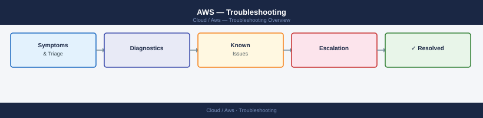

---
tags:
  - aws
  - troubleshooting
search:
  boost: 1.5
---
# AWS — Troubleshooting


<div class="kb-summary">
Troubleshooting reference covering S3 Access Denied, IAM Permission Denied, RDS Connection Issues, VPC Flow Logs — Analysing Traffic, Lambda Timeout Issues.

*Applies to: AWS*
</div>



<div class="kb-grid kb-grid-3">

<a class="kb-card" href="common-issues/">
  <strong>Common Issues</strong>
  <span>Known problems, symptoms, and resolution steps.</span>
</a>

<a class="kb-card" href="diagnostics/">
  <strong>Diagnostics</strong>
  <span>Diagnostic commands, log locations, and data collection.</span>
</a>

<a class="kb-card" href="escalation/">
  <strong>Escalation</strong>
  <span>When and how to escalate to AWS Support with the right data.</span>
</a>

</div>

## RDS Connection Issues

```bash
# Check RDS security group
aws rds describe-db-instances --db-instance-identifier <db-id> \
    --query 'DBInstances[*].VpcSecurityGroups'

# Verify security group allows inbound on DB port from app subnet
aws ec2 describe-security-groups --group-ids <rds-sg-id>

# Check RDS status
aws rds describe-db-instances --db-instance-identifier <db-id> \
    --query 'DBInstances[*].[DBInstanceStatus,Endpoint]'

# If connection refused after failover:
aws rds describe-events --source-identifier <db-id> --duration 60
```

**Expected output:** Status query returns `["available", {"Address": "<endpoint>", "Port": <port>}]`. If status is `modifying`, `rebooting`, or `failing-over`, connection refusal is expected — wait for status to return to `available`.

## VPC Flow Logs — Analysing Traffic

```bash
# Query Flow Logs in CloudWatch Insights
# CloudWatch → Logs Insights → select flow log group
fields @timestamp, srcAddr, dstAddr, dstPort, action
| filter dstAddr = "<target-ip>" and action = "REJECT"
| sort @timestamp desc
| limit 50
```

## Lambda Timeout Issues

```bash
# Check function configuration
aws lambda get-function-configuration --function-name <name> \
    --query '[Timeout, MemorySize, VpcConfig]'

# View X-Ray trace for a slow invocation
aws xray get-service-graph --start-time $(date -d '1 hour ago' +%s) --end-time $(date +%s)

# Check CloudWatch Logs for errors
aws logs get-log-events --log-group-name /aws/lambda/<name> \
    --log-stream-name <stream> --start-from-head
```
