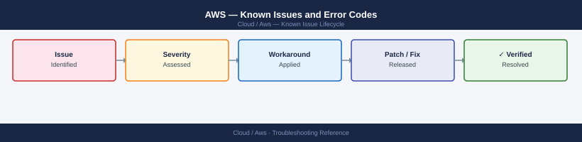

---
tags:
  - troubleshooting
  - aws
  - cloud
  - known-issues
---
# AWS — Known Issues and Error Codes

<div class="kb-summary">
Catalog of known AWS bugs, error codes, and workarounds covering IAM, EC2, networking, and service limits.

*Applies to: AWS general services — EC2, VPC, IAM, S3, RDS*
</div>



```d2
direction: down

symptom: Identify Symptom {shape: diamond}
iam_and_permissions: "IAM and Permissions" {shape: rectangle}
ec2: "EC2" {shape: rectangle}
networking: "Networking" {shape: rectangle}
service_limits: "Service Limits" {shape: rectangle}
resolution: Resolve or Escalate {shape: oval}

symptom -> iam_and_permissions: investigate
symptom -> ec2: investigate
symptom -> networking: investigate
symptom -> service_limits: investigate
iam_and_permissions -> resolution
ec2 -> resolution
networking -> resolution
service_limits -> resolution
```

## Before you begin

- AWS errors appear in CloudTrail, CloudWatch Logs, and the EC2/RDS console.
- Service limits (quotas) are the most common unexpected blocker — check `Service Quotas` in the console.
- `aws sts get-caller-identity` verifies current credential identity.

## IAM and Permissions

| Error / Symptom | Affected Versions | Cause | Workaround / Fix | Fixed In |
|---|---|---|---|---|
| `AccessDeniedException` despite correct role | All | SCP (Service Control Policy) at OU level denying action | Check SCPs: `aws organizations list-policies-for-target`; consult AWS Organizations admin | N/A |
| `InvalidClientTokenId` | All | Access key not valid or region mismatch | Verify `AWS_ACCESS_KEY_ID`; check `AWS_DEFAULT_REGION` | N/A |
| Assume role failing: `Not authorized to assume role` | All | Trust policy not including the caller principal | Update trust policy on target role to allow calling principal | N/A |

## EC2

| Error / Symptom | Affected Versions | Cause | Workaround / Fix | Fixed In |
|---|---|---|---|---|
| EC2 instance `Impaired` status | All | Underlying hardware issue on AWS host | Stop and start instance (not reboot) to migrate to healthy host | N/A |
| `InsufficientInstanceCapacity` | All | Requested instance type not available in AZ | Try different AZ; use On-Demand capacity reservation; try different instance type | N/A |
| Instance fails System Status Check | All | AWS hardware/hypervisor issue | Stop/start instance to migrate; if persistent: contact AWS support | N/A |

## Networking

| Error / Symptom | Affected Versions | Cause | Workaround / Fix | Fixed In |
|---|---|---|---|---|
| Security group change not taking effect immediately | All | SG changes apply near-instantly but connection tracking keeps existing sessions | New connections get updated rules immediately; existing sessions use cached state | N/A |
| `ENI limit reached` | All | Maximum network interfaces per instance type reached | Use fewer ENIs; upgrade to instance type with higher ENI limit | N/A |

## Service Limits

| Error / Symptom | Affected Versions | Cause | Workaround / Fix | Fixed In |
|---|---|---|---|---|
| `LimitExceededException` | All | Default quota reached for service | Request quota increase via `Service Quotas` console | N/A |
| VPC limit reached for region | All | Default 5 VPCs per region | Request VPC limit increase; or consolidate VPCs | N/A |

## See also

- [AWS — Common Issues](../common-issues/)
- [AWS EVS — Known Issues](../evs/troubleshooting/known-issues.md)
