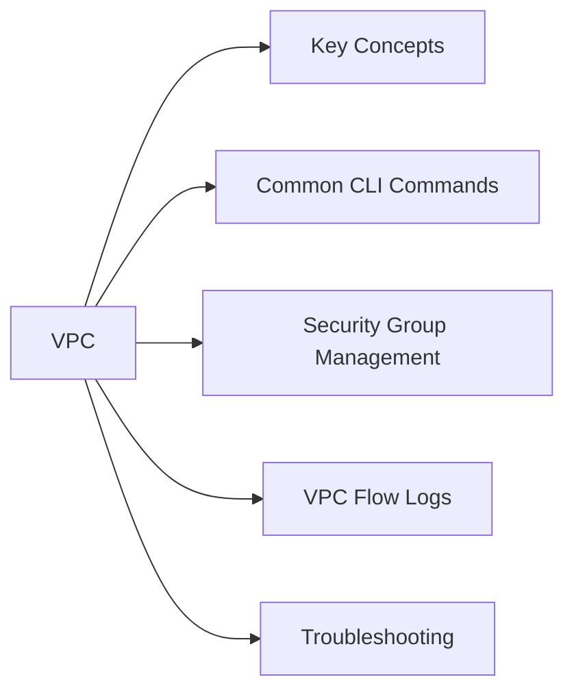

# VPC

AWS Virtual Private Cloud — networking, subnets, routing, and security group management.



## Key Concepts

| Concept | Description |
|---|---|
| VPC | Isolated virtual network in an AWS region |
| Subnet | IP range within a VPC, tied to one AZ |
| Route table | Controls traffic routing from subnet |
| Internet Gateway (IGW) | Enables internet access for public subnets |
| NAT Gateway | Allows private subnet outbound internet access |
| Security Group | Stateful firewall at the ENI level |
| Network ACL | Stateless firewall at the subnet level |
| VPC Peering | Private routing between two VPCs |
| Transit Gateway | Hub for connecting multiple VPCs and on-premises |

## Common CLI Commands

```bash
# List VPCs
aws ec2 describe-vpcs --query 'Vpcs[*].{ID:VpcId,CIDR:CidrBlock,Name:Tags[?Key==`Name`].Value|[0]}' --output table

# List subnets in a VPC
aws ec2 describe-subnets --filters "Name=vpc-id,Values=<vpc-id>" \
  --query 'Subnets[*].{ID:SubnetId,AZ:AvailabilityZone,CIDR:CidrBlock,Public:MapPublicIpOnLaunch}' --output table

# List route tables
aws ec2 describe-route-tables --filters "Name=vpc-id,Values=<vpc-id>" --output table

# List security groups
aws ec2 describe-security-groups --filters "Name=vpc-id,Values=<vpc-id>" \
  --query 'SecurityGroups[*].{ID:GroupId,Name:GroupName}' --output table

# List internet gateways
aws ec2 describe-internet-gateways --filters "Name=attachment.vpc-id,Values=<vpc-id>" --output table

# List NAT gateways
aws ec2 describe-nat-gateways --filter "Name=vpc-id,Values=<vpc-id>" \
  --query 'NatGateways[*].{ID:NatGatewayId,State:State,SubnetId:SubnetId}' --output table
```

## Security Group Management

```bash
# List rules for a security group
aws ec2 describe-security-groups --group-ids <sg-id> \
  --query 'SecurityGroups[0].{Ingress:IpPermissions,Egress:IpPermissionsEgress}'

# Add inbound rule
aws ec2 authorize-security-group-ingress \
  --group-id <sg-id> \
  --protocol tcp \
  --port 443 \
  --cidr 10.0.0.0/8

# Remove inbound rule
aws ec2 revoke-security-group-ingress \
  --group-id <sg-id> \
  --protocol tcp \
  --port 443 \
  --cidr 10.0.0.0/8
```

## VPC Flow Logs

```bash
# Create flow log to CloudWatch Logs
aws ec2 create-flow-logs \
  --resource-type VPC \
  --resource-ids <vpc-id> \
  --traffic-type ALL \
  --log-destination-type cloud-watch-logs \
  --log-group-name /aws/vpc/flowlogs \
  --deliver-logs-permission-arn arn:aws:iam::<account-id>:role/FlowLogsRole

# Query flow logs with CloudWatch Insights
# fields @timestamp, srcAddr, dstAddr, dstPort, action
# | filter action="REJECT"
# | stats count(*) by srcAddr
# | sort count desc
```

## Troubleshooting

| Symptom | Check | Action |
|---|---|---|
| EC2 can't reach internet | Route table | Confirm 0.0.0.0/0 → IGW (public) or NAT GW (private) |
| Can't connect to EC2 | Security group | Check inbound rules on instance SG |
| Private subnet no outbound | NAT Gateway | Confirm NAT GW is in public subnet; route 0.0.0.0/0 → NAT GW |
| Cross-VPC connectivity fails | VPC Peering routes | Add routes in both VPCs pointing to peering connection |
| DNS resolution failing | VPC DNS settings | Enable `enableDnsSupport` and `enableDnsHostnames` on VPC |
