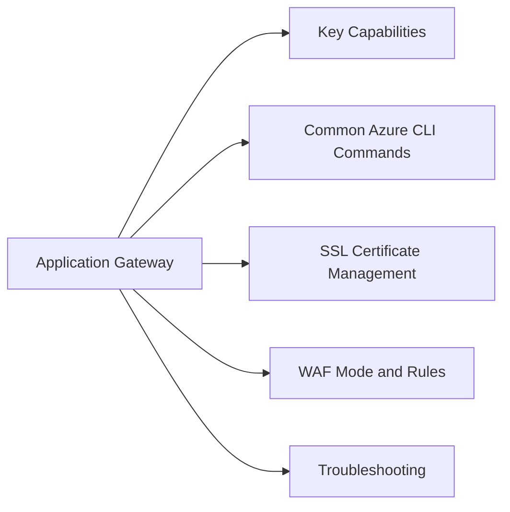

# Application Gateway

Azure Application Gateway — layer 7 load balancer with SSL termination, URL routing, WAF, and autoscaling.



## Key Capabilities

| Feature | Description |
|---|---|
| URL path-based routing | Route `/api/*` to one backend, `/static/*` to another |
| Host-based routing | Route by hostname (multi-site hosting) |
| SSL termination | Offload TLS at the gateway; backend communication in HTTP |
| SSL end-to-end | Re-encrypt traffic to backend (requires trusted root cert on backend) |
| WAF (v2) | OWASP CRS rule sets; custom rules; bot protection |
| Autoscaling (v2) | Automatic scale-out based on traffic volume |
| Rewrite rules | Modify HTTP headers and URL before sending to backend |

## Common Azure CLI Commands

```bash
# List application gateways
az network application-gateway list -g <rg> \
  --query '[*].{Name:name,SKU:sku.name,State:provisioningState,Tier:sku.tier}' -o table

# Show backend health
az network application-gateway show-backend-health -g <rg> -n <agw-name> \
  --query 'backendAddressPools[*].backendHttpSettingsCollection[*].servers[*].{Address:address,Health:health}' -o table

# List backend pools
az network application-gateway address-pool list -g <rg> --gateway-name <agw-name> \
  --query '[*].{Name:name,Backends:backendAddresses}' -o table

# List HTTP settings
az network application-gateway http-settings list -g <rg> --gateway-name <agw-name> \
  --query '[*].{Name:name,Port:port,Protocol:protocol,Timeout:requestTimeout}' -o table

# List routing rules
az network application-gateway rule list -g <rg> --gateway-name <agw-name> \
  --query '[*].{Name:name,Type:ruleType,Listener:httpListener.id,BackendPool:backendAddressPool.id}' -o table

# Add a backend pool member
az network application-gateway address-pool update -g <rg> --gateway-name <agw-name> \
  --name <pool-name> \
  --servers 10.0.1.10 10.0.1.11

# Get WAF configuration
az network application-gateway waf-config show -g <rg> --gateway-name <agw-name>
```

## SSL Certificate Management

```bash
# Add a PFX certificate
az network application-gateway ssl-cert create -g <rg> --gateway-name <agw-name> \
  --name <cert-name> \
  --cert-file cert.pfx \
  --cert-password <password>

# Use Key Vault certificate (managed identity required)
az network application-gateway ssl-cert create -g <rg> --gateway-name <agw-name> \
  --name <cert-name> \
  --key-vault-secret-id <keyvault-secret-uri>
```

## WAF Mode and Rules

```bash
# Set WAF to Prevention mode (blocks; Detection only logs)
az network application-gateway waf-config set -g <rg> --gateway-name <agw-name> \
  --enabled true \
  --firewall-mode Prevention \
  --rule-set-type OWASP \
  --rule-set-version 3.2

# Add WAF exclusion (for false positives)
az network application-gateway waf-config set -g <rg> --gateway-name <agw-name> \
  --enabled true \
  --firewall-mode Prevention \
  --rule-set-type OWASP \
  --rule-set-version 3.2 \
  --exclusion RequestHeaderNames StartsWith "X-Custom"
```

## Troubleshooting

| Symptom | Check | Action |
|---|---|---|
| 502 Bad Gateway | Backend health | Run `show-backend-health`; verify backends are healthy and reachable |
| SSL cert error | Cert attached to listener | Verify correct cert is on HTTPS listener; check expiry |
| WAF blocking legitimate traffic | WAF logs | Check Azure Monitor WAF logs; add exclusion for false positive rule |
| High latency | Connection draining / backend | Check backend response time; review timeout settings in HTTP settings |
| Path routing not working | Rule priority | Lower priority number wins; check rule order |
