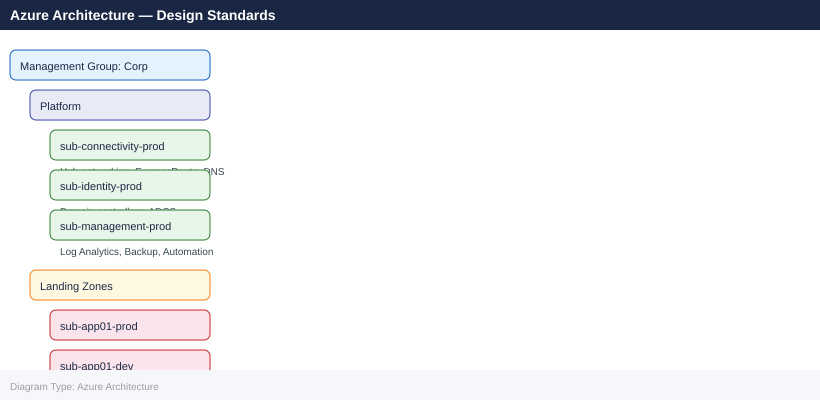

---
tags:
  - architecture
  - azure
---
# Azure Architecture — Design Standards


```bash
# Verify tag compliance
az policy state list --resource-group <rg> \
    --filter "policyDefinitionId eq '/providers/Microsoft.Authorization/policyDefinitions/<required-tags-id>'" \
    --query "[?complianceState=='NonCompliant']"
```

```bash
# Add delete lock to production resource group
az lock create --name "prod-rg-lock" --resource-group <rg> --lock-type CanNotDelete

# List locks
az lock list --resource-group <rg>
```


---

## See also

- [Azure — Deploy](../../deploy/)
