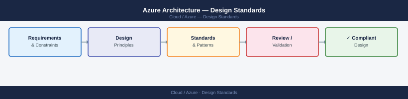

---
tags:
  - architecture
  - azure
---
# Azure Architecture — Design Standards



```bash
# Verify tag compliance
az policy state list --resource-group <rg> \
    --filter "policyDefinitionId eq '/providers/Microsoft.Authorization/policyDefinitions/<required-tags-id>'" \
    --query "[?complianceState=='NonCompliant']"
```

```bash
# Add delete lock to production resource group
az lock create --name "prod-rg-lock" --resource-group <rg> --lock-type CanNotDelete

# List locks
az lock list --resource-group <rg>
```
```text
Management Group: Corp
├── Platform
│   ├── sub-connectivity-prod       # Hub networking, ExpressRoute, DNS
│   ├── sub-identity-prod           # Domain controllers, ADCS
│   └── sub-management-prod         # Log Analytics, Backup, Automation
├── Landing Zones
│   ├── sub-app01-prod
│   ├── sub-app01-dev
│   ├── sub-app02-prod
│   └── sub-app02-dev
└── Sandbox
    └── sub-sandbox
```

---

## See also

- [Azure — Deploy](../../deploy/)
