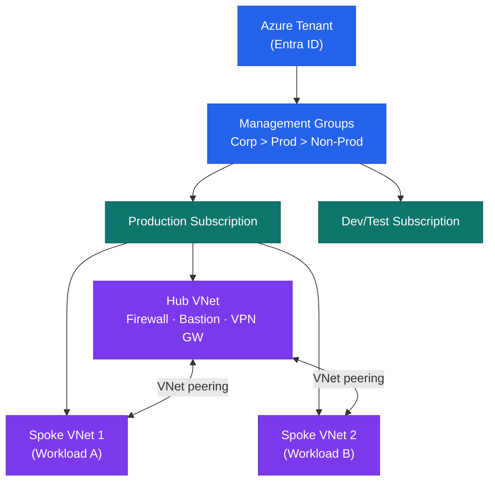
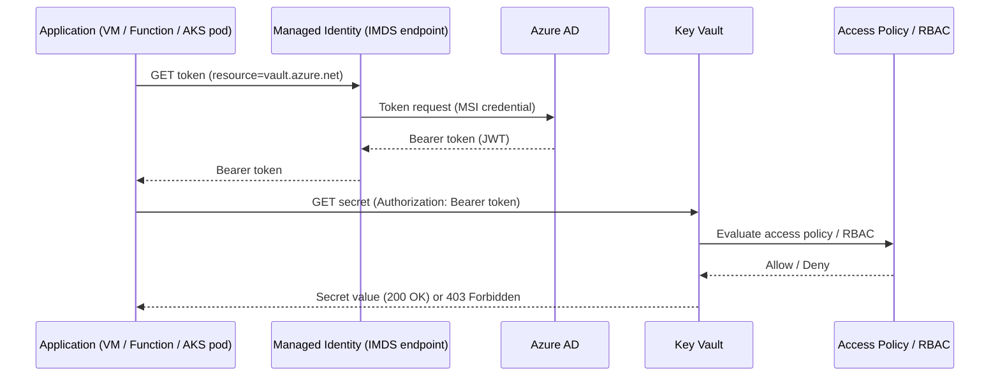

# Azure — How It Works

## Overview

Microsoft Azure is a hyperscale public cloud platform. Resources are organised in a hierarchy: Tenant (Entra ID) → Management Groups → Subscriptions → Resource Groups → Resources. Azure Policy and RBAC applied at a Management Group are inherited by all child subscriptions. A hub-and-spoke network topology connects on-premises environments via ExpressRoute to a hub VNet, with workload spoke VNets peered to the hub.

## Management Group Hierarchy



## Network Architecture

Hub-and-spoke topology with Azure Firewall in the hub controlling east-west and internet-bound traffic:

## Compute

| Service | Use Case |
|---|---|
| Azure Virtual Machines | Lift-and-shift, legacy, special OS |
| Azure Kubernetes Service (AKS) | Container workloads |
| Azure App Service | Web apps, APIs |
| Azure Container Apps | Serverless containers |
| Azure Functions | Event-driven, short-lived tasks |
| Azure Virtual Machine Scale Sets | Auto-scaling VM groups |

## High Availability

- **VMs**: Availability Zones (spread across 3 zones per region) or Availability Sets
- **Azure SQL**: Zone-redundant Business Critical tier or geo-redundant
- **AKS**: System node pool spanning ≥ 2 zones; application node pools zone-spread
- **Storage**: Zone-Redundant Storage (ZRS) for production; Geo-Redundant (GRS) for DR

## Disaster Recovery Patterns

| Pattern | Services | RPO / RTO |
|---|---|---|
| Azure Site Recovery | VM replication to secondary region | < 1 hour RPO, < 2 hours RTO |
| Geo-redundant storage | Azure Blob, ADLS Gen2 (GRS/GZRS) | Near-zero RPO |
| Azure SQL Failover Groups | Active geo-replication | < 30 seconds RPO |
| Azure Backup cross-region restore | Recovery Services Vault | 12–24 hours RTO |

## Networking Components

| Service | Purpose |
|---|---|
| Virtual Network (VNet) | Private network isolation |
| Network Security Groups | Layer 4 traffic filtering |
| Azure Firewall | Layer 7 hub egress and east-west control |
| Application Gateway | Layer 7 load balancer with WAF |
| ExpressRoute | Dedicated private connectivity to on-premises |
| VPN Gateway | Site-to-site and point-to-site VPN |
| Private Endpoints | Private connectivity to PaaS services |

## Storage

| Service | Purpose |
|---|---|
| Azure Blob Storage | Object storage, large files, backups |
| Azure Files | SMB/NFS managed file shares |
| Managed Disks | Block storage for VMs |
| Azure Data Lake Storage Gen2 | Analytics, hierarchical namespace |

## Identity

| Service | Purpose |
|---|---|
| Entra ID (Azure AD) | Cloud identity plane, SSO, MFA |
| Managed Identities | Credential-free service authentication |
| Azure RBAC | Role-based access control across resources |
| Privileged Identity Management | JIT privileged role activation |
| Conditional Access | Policy-based access control |

## Monitoring and Security

| Service | Purpose |
|---|---|
| Azure Monitor | Metrics, logs, alerts, dashboards |
| Log Analytics | Centralised log query and retention |
| Microsoft Defender for Cloud | Security posture, threat protection |
| Azure Key Vault | Secrets, keys, and certificate management |
| Microsoft Sentinel | Cloud-native SIEM and SOAR |

## Key Vault Secret Access Flow



## Identity Architecture

```text
Entra ID (cloud identity plane)
    │
    ├── Azure AD Connect sync ←── On-premises AD (source of truth)
    ├── Entra ID Governance (lifecycle, access reviews)
    ├── Privileged Identity Management (PIM — JIT role activation)
    └── Conditional Access Policies (MFA, compliant device requirements)

Humans: SSO via Entra ID, MFA required
Service Principals: used by CI/CD, Terraform (OIDC preferred; no client secrets)
Managed Identities: used by Azure services (no credentials to manage)
```
