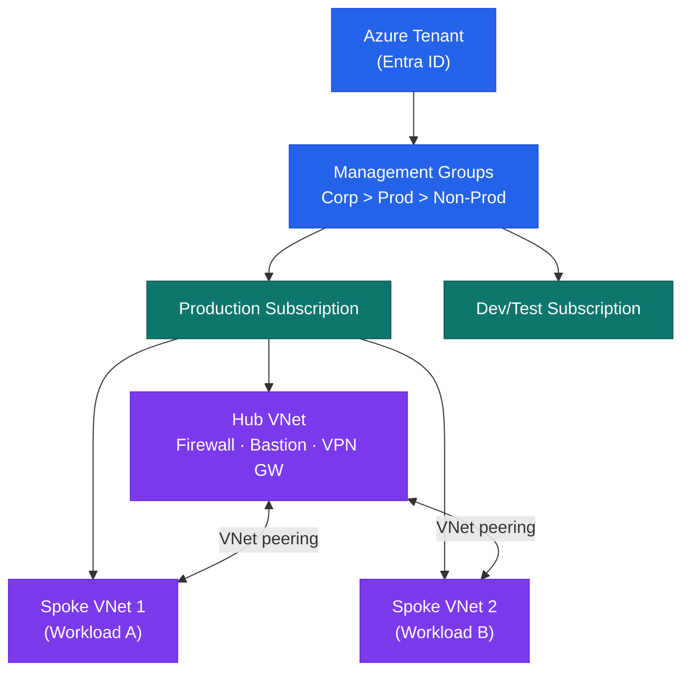

# Azure — How It Works


<div class="kb-summary">
How It Works reference covering Overview, Management Group Hierarchy, Identity Architecture.
</div>

## Overview

Microsoft Azure is a hyperscale public cloud platform. Resources are organised in a hierarchy: Tenant (Entra ID) → Management Groups → Subscriptions → Resource Groups → Resources. Azure Policy and RBAC applied at a Management Group are inherited by all child subscriptions. A hub-and-spoke network topology connects on-premises environments via ExpressRoute to a hub VNet, with workload spoke VNets peered to the hub.

## Management Group Hierarchy



```text
┌────────────────────────────────── Azure Architecture — How It Works ──────────────────────────────────┐
│                                                                                                       │
│  Azure organises resources in a hierarchy: Management Groups → Subscriptions → RGs → Resources.       │
│                                                                                                       │
│   ┌──────────────────────────────────────────────┐  ┌─────────────────────────────────────────────┐   │
│   │              Resource Hierarchy              │  │            Resource Manager (ARM)           │   │
│   │       Root Management Group: top level       │  │        ARM: single control plane API        │   │
│   │       Management Groups: OU equivalent       │  │     Resource Provider: register per svc     │   │
│   │     Subscriptions: billing + access unit     │  │         ARM template: IaC JSON/Bicep        │   │
│   │     Resource Groups: lifecycle container     │  │           RBAC: scope at any level          │   │
│   │      Resources: VMs, storage, databases      │  │        Policy: enforced via ARM layer       │   │
│   └──────────────────────────────────────────────┘  └─────────────────────────────────────────────┘   │
│                                                                                                       │
│  Policies assigned at MG inherit down; RBAC assigned at RG controls resource access.                  │
│                                                                                                       │
│                          ▼                                                 ▼                          │
│                                                                                                       │
│   ┌──────────────────────────────────────────────┐  ┌─────────────────────────────────────────────┐   │
│   │             Authentication Flow              │  │              Service Deployment             │   │
│   │         Entra ID: identity provider          │  │       Portal: web UI for all resources      │   │
│   │          Token: OAuth2 / OIDC flow           │  │          CLI: az resource commands          │   │
│   │      ARM API: accepts token + validates      │  │           SDK: .NET/Python/Java/JS          │   │
│   │        Policy evaluated at ARM layer         │  │         IaC: Bicep / Terraform / ARM        │   │
│   │       RBAC: checked before resource op       │  │         DevOps: GitHub Actions / ADO        │   │
│   └──────────────────────────────────────────────┘  └─────────────────────────────────────────────┘   │
│                                                                                                       │
│  Physical Infrastructure (the hardware everything above runs on):                                     │
│  Azure regions · Availability Zones · Physical data centres · Global backbone network                 │
│                                                                                                       │
│  Key terms:                                                                                           │
│                                                                                                       │
│  Management Group= Container above subscriptions for policy and RBAC inheritance                      │
│  Subscription    = Billing and access control boundary; contains resource groups                      │
│  Resource Group  = Logical container for related resources sharing a lifecycle                        │
│  ARM             = Azure Resource Manager; unified control plane for all Azure resources              │
│  Resource Provider= Azure service that supplies resource types, e.g. Microsoft.Compute                │
│  Bicep           = Domain-specific language that compiles to ARM templates                            │
│  RBAC            = Role-Based Access Control; assigned to identity at a scope                         │
│  Azure Policy    = Service enforcing governance rules at ARM layer; deny or audit                     │
│  Entra ID        = Azure Active Directory; cloud identity provider for all Azure auth                 │
│  OAuth2 token    = Short-lived bearer token issued by Entra ID for ARM API calls                      │
│  Root MG         = Top-level management group; all subscriptions under one tenant                     │
│  IaC             = Infrastructure as Code; define Azure resources in declarative templates            │
│                                                                                                       │
└───────────────────────────────────────────────────────────────────────────────────────────────────────┘
```
