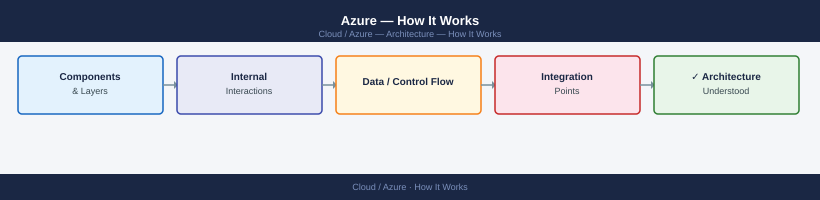
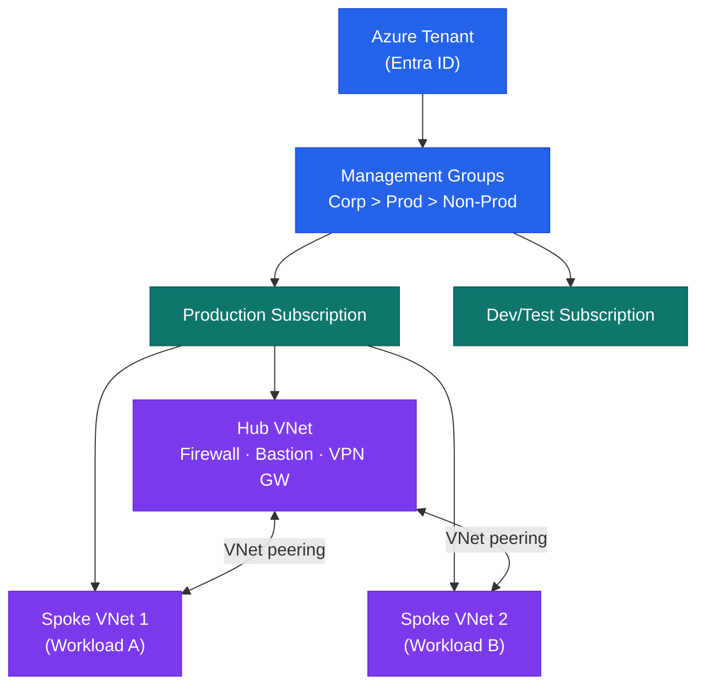

---
tags:
  - architecture
  - azure
---
# Azure — How It Works

How It Works reference covering Overview, Management Group Hierarchy, Identity Architecture.

*Applies to: Azure*

## Overview

Microsoft Azure is a hyperscale public cloud platform. Resources are organised in a hierarchy: Tenant (Entra ID) → Management Groups → Subscriptions → Resource Groups → Resources. Azure Policy and RBAC applied at a Management Group are inherited by all child subscriptions. A hub-and-spoke network topology connects on-premises environments via ExpressRoute to a hub VNet, with workload spoke VNets peered to the hub.

## Management Group Hierarchy

---

## See also

- [Azure — Design Standards](../design-standards/)
- [Azure — Integrations](../integrations/)
- [Azure — Deploy](../../deploy/)
