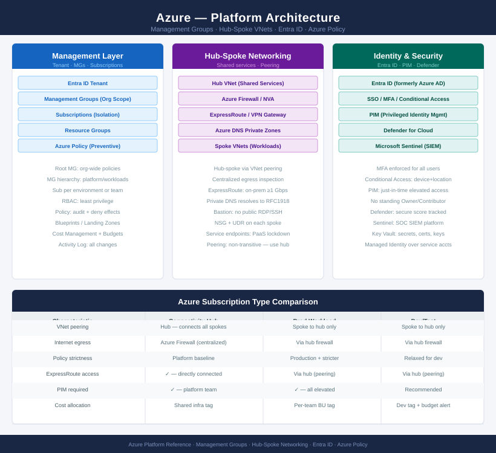

# Azure — Architecture

<div class="kb-summary">
Azure cloud platform architecture — management hierarchy, hub-and-spoke networking, compute options, HA patterns, and identity with Entra ID.
</div>

```text
┌───────────────────────────────────── Azure Platform Architecture ─────────────────────────────────────┐
│                                                                                                       │
│   ┌───────────────────────────────────────────────────────────────────────────────────────────────┐   │
│   │          Azure Platform Architecture — Management Hierarchy, Networking, and Identity         │   │
│   │      Hierarchy: Tenant > Management Groups > Subscriptions > Resource Groups > Resources      │   │
│   │ Networking: hub-and-spoke VNet peering; hub holds shared services (firewall, DNS, VPN gateway)│   │
│   │ Identity: Entra ID (formerly Azure AD); SSO, MFA, Conditional Access, PIM for privileged roles│   │
│   │   Guardrails: Azure Policy (detective + preventive) · RBAC · Management Group scope policies  │   │
│   └───────────────────────────────────────────────────────────────────────────────────────────────┘   │
│                                                                                                       │
│    Hierarchy provides scope · Hub-spoke networking connects workloads · Entra ID governs all identity │
│                                                                                                       │
│                  ▼                                ▼                                ▼                  │
│                                                                                                       │
│   ┌─────────────────────────────┐  ┌─────────────────────────────┐  ┌─────────────────────────────┐   │
│   │         How It Works        │  │         Integrations        │  │       Design Standards      │   │
│   │    Mgmt Groups: org scope   │  │    ExpressRoute: on-prem    │  │  Naming: RG + resource std  │   │
│   │   Subscriptions: isolation  │  │   IdP: on-prem AD + Entra   │  │   Tagging: env+owner+team   │   │
│   │  Hub VNet: shared services  │  │  Monitoring: Azure Monitor  │  │  Subscription design: prod  │   │
│   │    Spoke VNets: workloads   │  │  Security: Defender + SIEM  │  │  Security baseline: CIS Az  │   │
│   │  Availability Zones: 3 per  │  │   Billing: Cost Management  │  │  HA: zone + region pattern  │   │
│   └─────────────────────────────┘  └─────────────────────────────┘  └─────────────────────────────┘   │
│                                                                                                       │
│    Architecture defines hierarchy and networking · Integrations connect on-prem                       │
│                                                                                                       │
│                  ▼                                ▼                                ▼                  │
│                                                                                                       │
│   ┌───────────────────────────────────────────────────────────────────────────────────────────────┐   │
│   │    Hierarchy     │    Networking    │      Identity     │    Guardrails    │   Availability   │   │
│   │   Tenant: root   │   Hub VNet: fw   │   Entra ID: IdP   │   Policy: deny   │   Zones: 3 AZ    │   │
│   │   Mgmt Groups    │    Spoke: app    │    RBAC: scope    │    Initiative    │  Regions: pair   │   │
│   │  Subscriptions   │   Peering: hub   │      PIM: JIT     │    Compliance    │  ASR: failover   │   │
│   │ Resource Groups  │   ExpressRoute   │    Cond. Access   │   RBAC assign    │   LB + AG: HA    │   │
│   └───────────────────────────────────────────────────────────────────────────────────────────────┘   │
│                                                                                                       │
│  Physical Infrastructure (the hardware everything above runs on):                                     │
│  Azure Regions · Availability Zones · Data Centres · Global WAN backbone · ExpressRoute physical ports│
│                                                                                                       │
│  Key terms:                                                                                           │
│                                                                                                       │
│  Management Group  = Scope above subscriptions; policies and RBAC applied here cascade to all children│
│  Subscription      = Billing unit and access boundary; resources live inside subscriptions            │
│  Resource Group    = Logical container for resources; lifecycle boundary; RBAC and policy scope       │
│  Entra ID          = Microsoft cloud identity (formerly Azure AD); directory for users, groups, apps  │
│  Hub-spoke VNet    = Hub has shared services (firewall, DNS); spokes peer to hub for connectivity     │
│  VNet peering      = Private connectivity between VNets; traffic stays on Microsoft backbone          │
│  ExpressRoute      = Dedicated private circuit from on-premises to Azure; Layer 2/3; bypasses internet│
│  Azure Policy      = Governance service; defines and enforces compliance rules across resource configs│
│  RBAC              = Role-Based Access Control; Owner/Contributor/Reader built-in + custom roles      │
│  PIM               = Privileged Identity Management; just-in-time role activation; approval + audit   │
│  Availability Zone = Physically separate DC within a region; independent power/cooling/networking     │
│  Conditional Access = Entra ID policy engine; evaluates sign-in context to enforce MFA, block, or     │
│                                                                                                       │
└───────────────────────────────────────────────────────────────────────────────────────────────────────┘
```

<div class="kb-grid kb-grid-3">
<a class="kb-card" href="how-it-works/"><strong>How It Works</strong><span>Management hierarchy, hub-spoke networking, compute, identity, HA, and DR patterns.</span></a>
<a class="kb-card" href="integrations/"><strong>Integrations</strong><span>ExpressRoute, on-premises connectivity, and third-party integrations.</span></a>
<a class="kb-card" href="design-standards/"><strong>Design Standards</strong><span>Naming conventions, tagging policy, subscription design, and security baselines.</span></a>
</div>


## Azure Platform Architecture


