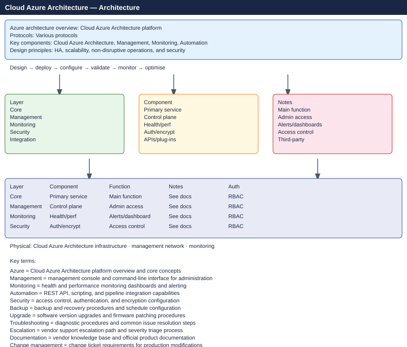

---
tags:
  - architecture
  - azure
---
# Azure — Architecture

Azure cloud platform architecture — management hierarchy, hub-and-spoke networking, compute options, HA patterns, and identity with Entra ID.

*Applies to: Azure*

<a class="kb-card" href="how-it-works/"><strong>How It Works</strong>Management hierarchy, hub-spoke networking, compute, identity, HA, and DR patterns.</a>
<a class="kb-card" href="integrations/"><strong>Integrations</strong>ExpressRoute, on-premises connectivity, and third-party integrations.</a>
<a class="kb-card" href="design-standards/"><strong>Design Standards</strong>Naming conventions, tagging policy, subscription design, and security baselines.</a>

