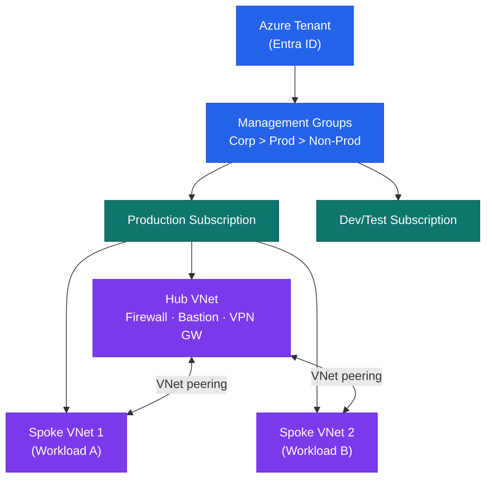

# Azure — Architecture

Azure cloud platform architecture — management hierarchy, hub-and-spoke networking, compute options, HA patterns, and identity with Entra ID.

<a class="kb-card" href="how-it-works/"><strong>How It Works</strong>Management hierarchy, hub-spoke networking, compute, identity, HA, and DR patterns.</a>
<a class="kb-card" href="integrations/"><strong>Integrations</strong>ExpressRoute, on-premises connectivity, and third-party integrations.</a>
<a class="kb-card" href="design-standards/"><strong>Design Standards</strong>Naming conventions, tagging policy, subscription design, and security baselines.</a>

| Layer | Service | Role |
|---|---|---|
| Identity | Entra ID (Azure AD) | Cloud identity plane; SSO, MFA, PIM, Conditional Access |
| Management | Management Groups / Policy | Governance hierarchy; RBAC and Policy inherited downward |
| Network | Hub VNet + Spoke VNets | Hub-and-spoke; Azure Firewall controls east-west and internet traffic |
| Compute | VMs, AKS, App Service | Lift-and-shift, containers, web apps |
| Storage | Blob, ADLS, Managed Disks | Object, data lake, and block storage |
| Observability | Azure Monitor + Log Analytics | Metrics, logs, alerts, dashboards |

