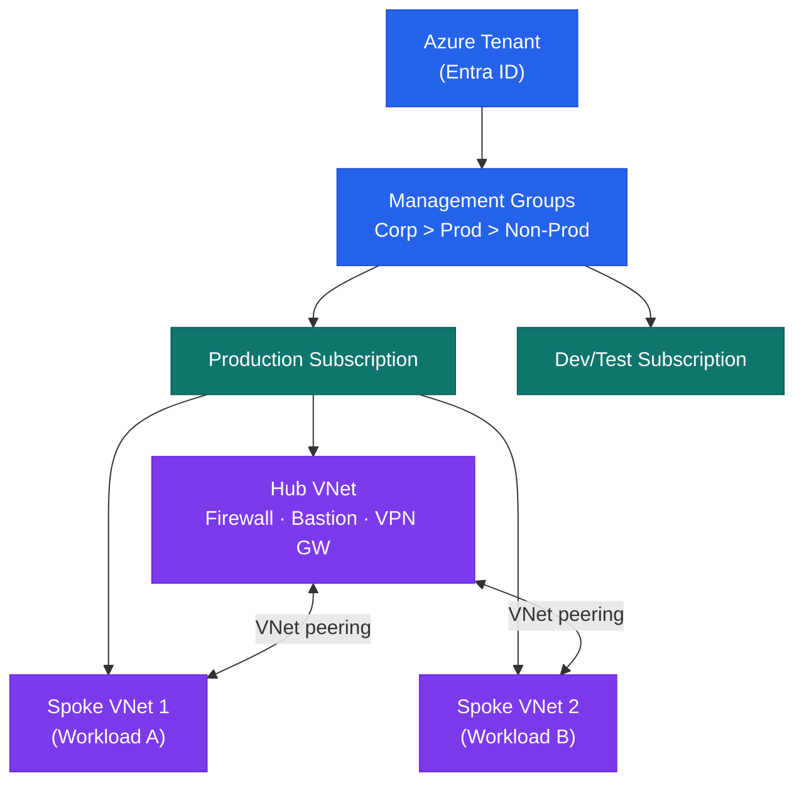

# Azure — Architecture Overview

## Management Group Hierarchy



Azure Policy and RBAC assigned at Management Group level — inherited by all child subscriptions.

## Network Architecture

Hub-and-spoke topology:

```
On-Premises ←→ ExpressRoute ←→ Hub VNet (Connectivity subscription)
                                    │
                   ┌────────────────┼────────────────┐
                   ▼                ▼                 ▼
            Prod Spoke VNet   Staging Spoke VNet   Dev Spoke VNet
            (10.1.0.0/16)    (10.2.0.0/16)        (10.3.0.0/16)
            ├── snet-web      
            ├── snet-app      
            └── snet-db (isolated — no internet)
```

Azure Firewall in the hub VNet controls all east-west and internet-bound traffic from spokes.

## Compute Options

| Service | Use Case |
|---|---|
| Azure Virtual Machines | Lift-and-shift, legacy, special OS |
| Azure Kubernetes Service (AKS) | Container workloads |
| Azure App Service | Web apps, APIs |
| Azure Container Apps | Serverless containers |
| Azure Functions | Event-driven, short-lived tasks |

## High Availability

- **VMs**: Availability Zones (spread across 3 zones per region) or Availability Sets
- **Azure SQL**: Zone-redundant Business Critical tier or Geo-redundant
- **AKS**: System node pool spanning ≥ 2 zones; application node pools zone-spread
- **Storage**: Zone-Redundant Storage (ZRS) for production; Geo-Redundant (GRS) for DR

## Disaster Recovery

| Pattern | Services | RPO / RTO |
|---|---|---|
| Azure Site Recovery | VM replication to secondary region | < 1 hour RPO, < 2 hours RTO |
| Geo-redundant storage | Azure Blob, ADLS Gen2 (GRS/GZRS) | Near-zero RPO |
| Azure SQL Failover Groups | Active geo-replication | < 30 seconds RPO |
| Azure Backup cross-region restore | Recovery Services Vault | 12–24 hours RTO |

## Identity Architecture

```
Entra ID (cloud identity plane)
    │
    ├── Azure AD Connect sync ←── On-premises AD (source of truth)
    ├── Entra ID Governance (lifecycle, access reviews)
    ├── Privileged Identity Management (PIM — JIT role activation)
    └── Conditional Access Policies (MFA, compliant device requirements)

Humans: SSO via Entra ID, MFA required
Service Principals: used by CI/CD, Terraform (OIDC preferred; no client secrets)
Managed Identities: used by Azure services (no credentials to manage)
```
