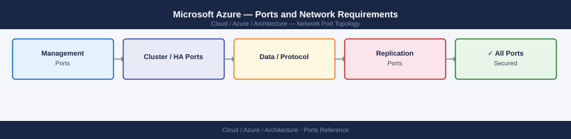
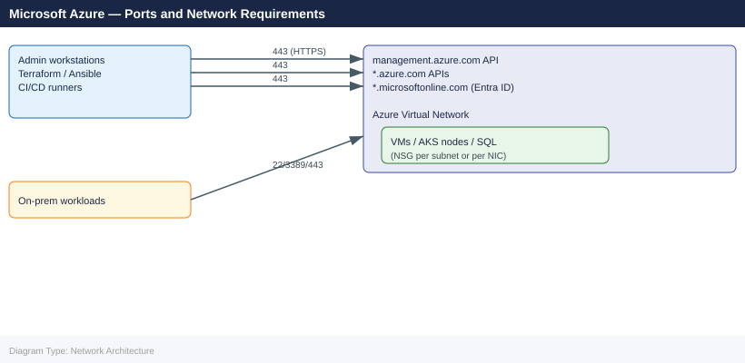

---
tags:
  - azure
  - cloud
  - networking
  - firewall
  - ports
  - nsg
---
# Microsoft Azure — Ports and Network Requirements

<div class="kb-summary">
Firewall and NSG port reference for Microsoft Azure infrastructure. Covers management access to Azure VMs, Azure API access from on-premises, Azure Virtual Network security design using Network Security Groups (NSGs), and common PaaS service ports. Azure uses NSGs (stateful, per-NIC or per-subnet) and Azure Firewall for egress control.

*Applies to: Azure IaaS/PaaS — ARM, VMs, VNet, AKS, SQL Database, Entra ID*
</div>



```d2
direction: right

center: "Azure" {shape: hexagon}
network_zones: "Network Zones" {shape: rectangle}
outbound_onpremises_to_azure_apis: "Outbound — On-Premises to Azure APIs" {shape: rectangle}
vm_management: "VM Management" {shape: rectangle}
azure_load_balancer_application_gate: "Azure Load Balancer / Application Gateway" {shape: rectangle}
azure_sql_azure_database: "Azure SQL / Azure Database" {shape: rectangle}
aks_azure_kubernetes_service: "AKS (Azure Kubernetes Service)" {shape: rectangle}

center -> network_zones
center -> outbound_onpremises_to_azure_apis
center -> vm_management
center -> azure_load_balancer_application_gate
center -> azure_sql_azure_database
center -> aks_azure_kubernetes_service
```

## Network Zones



## Before you begin

- Azure **Network Security Groups (NSGs)** are stateful — only specify the initiating direction.
- Azure has default **deny-all inbound** rules on NSGs. Management ports (22, 3389) must be explicitly allowed.
- Prefer **Azure Bastion** (browser-based RDP/SSH via HTTPS) over opening 22/3389 to internet — eliminates internet-exposed management ports.
- Azure AD / Entra ID authentication uses **443** to `login.microsoftonline.com` — required from any host using Azure RBAC or MSI.
- All Azure SDK, CLI, and Terraform calls go to `management.azure.com:443`.

## Outbound — On-Premises to Azure APIs

| Port | Protocol | Source | Destination | Purpose |
|---|---|---|---|---|
| 443 | TCP | Admin workstations, automation | management.azure.com | Azure Resource Manager API |
| 443 | TCP | Admin workstations, automation | login.microsoftonline.com | Entra ID (Azure AD) authentication — OIDC/OAuth2 |
| 443 | TCP | Admin workstations | *.azure.com | Azure Portal, KeyVault, ACR, AKS API |
| 443 | TCP | Entra ID-joined machines | enterpriseregistration.windows.net | Device registration |

## VM Management

| Port | Protocol | Source | Purpose |
|---|---|---|---|
| 22 | TCP | Bastion / Jump IP | SSH — Linux VM access |
| 3389 | TCP | Bastion / Jump IP | RDP — Windows VM access |
| 443 | TCP | Azure Bastion subnet → VMs | Azure Bastion — tunneled RDP/SSH (no direct exposure) |

## Azure Load Balancer / Application Gateway

| Port | Protocol | Source | Purpose |
|---|---|---|---|
| 443 | TCP | Internet / client IPs | HTTPS — production via Application Gateway or Load Balancer |
| 80 | TCP | Internet / client IPs | HTTP — redirect to HTTPS |
| 65200-65535 | TCP | Azure infrastructure | Application Gateway health probe traffic (required NSG allow) |

## Azure SQL / Azure Database

| Port | Protocol | Source | Purpose |
|---|---|---|---|
| 1433 | TCP | Application NSG | Azure SQL Database (public endpoint) |
| 11000-11999 | TCP | Application NSG | Azure SQL Database Redirect policy (preferred — lower latency) |
| 1433 | TCP | App VNet | Azure SQL via Private Endpoint (within VNet) |

## AKS (Azure Kubernetes Service)

| Port | Protocol | Source | Purpose |
|---|---|---|---|
| 443 | TCP | Admin workstations | AKS API server |
| 10250 | TCP | AKS nodes (VNet-internal) | Kubelet API |
| 30000-32767 | TCP | Internal/external | NodePort services |
| 8472 | UDP | AKS node ↔ AKS node | VXLAN overlay (kubenet network plugin) |
| 4789 | UDP | AKS node ↔ AKS node | VXLAN overlay (Azure CNI Overlay) |

## Azure Monitor / Log Analytics (Outbound from VMs)

| Port | Protocol | Source | Destination | Purpose |
|---|---|---|---|---|
| 443 | TCP | Azure VMs | ods.opinsights.azure.com | Log Analytics workspace — MMA/AMA agent |
| 443 | TCP | Azure VMs | oms.opinsights.azure.com | Operations Management Suite agent |

## ExpressRoute / VPN Gateway

| Port / Protocol | Traffic | Purpose |
|---|---|---|
| BGP 179 TCP | ExpressRoute circuit → VGW | BGP peering for route advertisement |
| IKE 500 UDP / NAT-T 4500 UDP | Site-to-Site VPN | IPsec VPN tunnel establishment |
| ESP (Protocol 50) | VPN tunnel | Encrypted VPN data |

## Firewall Zone Summary

| From | To | Ports | Notes |
|---|---|---|---|
| Admin / automation | management.azure.com | 443 | All ARM API calls |
| Admin / automation | login.microsoftonline.com | 443 | Entra ID auth — required |
| Bastion / VPN | Azure Linux VMs | 22 | SSH |
| Bastion / VPN | Azure Windows VMs | 3389 | RDP |
| Internet clients | App Gateway / LB | 443, 80 | Application traffic |
| Application tier | Azure SQL | 1433 or 11000-11999 | Database |
| Azure VMs | ods.opinsights.azure.com | 443 | Log Analytics egress |

## Verify

```bash
# From on-premises — test Azure API endpoint
curl -sk -o /dev/null -w "%{http_code}" https://management.azure.com/

# Azure CLI connectivity test
az account show

# Test Entra ID authentication endpoint
curl -sk -o /dev/null -w "%{http_code}" https://login.microsoftonline.com/

# From Azure VM — test Log Analytics connectivity
curl -sk -o /dev/null -w "%{http_code}" https://ods.opinsights.azure.com/

# List NSG rules for a resource group
az network nsg list --resource-group <rg-name> --output table

# Show effective NSG rules on a VM NIC
az network nic show-effective-nsg --name <nic-name> --resource-group <rg-name>
```

## See also

- [Azure — Architecture](how-it-works/)
- [AWS — Ports](../../aws/architecture/ports.md)
- [Terraform — Ports](../../../automation/terraform/architecture/ports.md)
- [Ansible — Ports](../../../automation/ansible/architecture/ports.md)
- [Windows Server — Ports](../../../compute/windows-server/architecture/ports.md)
