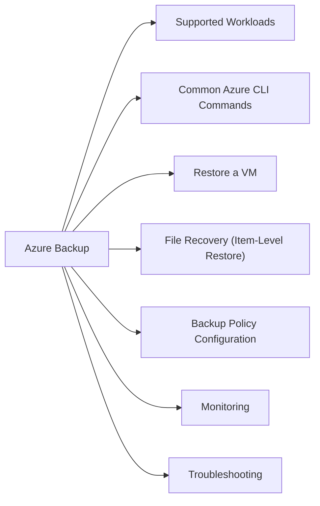

# Azure Backup

Azure Backup — VM snapshots, file recovery, database backup, and Recovery Services vault management.



## Supported Workloads

| Workload | Backup Type |
|---|---|
| Azure VM | Snapshot-based, app-consistent |
| Azure Files | Share-level snapshot |
| SQL Server on Azure VM | Log-shipping + full/differential |
| SAP HANA on Azure VM | Log + full backup via backint |
| Azure Database (PostgreSQL/MySQL) | Managed PaaS backup (separate from vault) |
| On-premises files (MARS agent) | File/folder agent backup to vault |

## Common Azure CLI Commands

```bash
# List Recovery Services vaults
az backup vault list --query '[*].{Name:name,RG:resourceGroup}' -o table

# List backup policies
az backup policy list --vault-name <vault> -g <rg> \
  --query '[*].{Name:name,WorkloadType:properties.workloadType}' -o table

# List protected items (VMs)
az backup item list --vault-name <vault> -g <rg> \
  --query '[*].{VM:properties.sourceResourceId,Status:properties.protectionStatus,LastBackup:properties.lastBackupTime}' -o table

# Trigger a manual backup
az backup protection backup-now \
  --vault-name <vault> -g <rg> \
  --container-name <vm-resource-id> \
  --item-name <vm-name> \
  --retain-until 2026-06-30 \
  --backup-management-type AzureIaasVM

# List restore points for a VM
az backup recoverypoint list \
  --vault-name <vault> -g <rg> \
  --container-name <container-name> \
  --item-name <vm-name> \
  --backup-management-type AzureIaasVM \
  --query '[*].{Name:name,Time:properties.recoveryPointTime,Type:properties.recoveryPointType}' -o table

# Check recent backup jobs
az backup job list --vault-name <vault> -g <rg> \
  --query '[*].{VM:properties.entityFriendlyName,Operation:properties.operation,Status:properties.status,Start:properties.startTime}' \
  -o table
```

## Restore a VM

```bash
# Restore VM disks to a storage account (then attach to new VM)
az backup restore restore-disks \
  --vault-name <vault> -g <rg> \
  --container-name <container> \
  --item-name <vm-name> \
  --rp-name <recovery-point-name> \
  --storage-account <storage-account-resource-id> \
  --target-resource-group <target-rg>
```

## File Recovery (Item-Level Restore)

1. Portal: Vault → Backup items → select VM → **File Recovery**
2. Select recovery point
3. Download and run the executable script — mounts the backup as a disk on a jump host
4. Copy required files
5. Unmount the recovery volume

## Backup Policy Configuration

```bash
# Create or modify a backup policy (via ARM template or portal)
# Key settings:
# - Backup frequency: Daily / Weekly / Hourly (enhanced policy)
# - Retention: Daily points (up to 9999), Weekly, Monthly, Yearly
# - Snapshot tier: Standard or Premium
# - Cross-region restore: Enable for critical VMs (additional cost)
```

## Monitoring

```bash
# Check jobs with failures in last 24 hours
az backup job list --vault-name <vault> -g <rg> \
  --status Failed \
  --query '[*].{VM:properties.entityFriendlyName,Status:properties.status,Error:properties.errorDetails[0].code}'
```

**KQL — backup alert in Log Analytics:**
```kql
AddonAzureBackupJobs
| where JobStatus == "Failed"
| project TimeGenerated, BackupItemUniqueId, JobOperation, ErrorTitle, JobDurationInSecs
| sort by TimeGenerated desc
```

## Troubleshooting

| Symptom | Check | Action |
|---|---|---|
| Backup failing with snapshot timeout | VM agent responsive? | Check VM agent status in portal; restart `WindowsAzureGuestAgent` |
| Backup job stuck | Job details | Cancel and re-trigger; check for concurrent snapshots |
| Cross-region restore not available | Policy setting | Enable cross-region restore on the vault |
| Restore point missing | Retention policy | Check policy retention — point may have been pruned |
