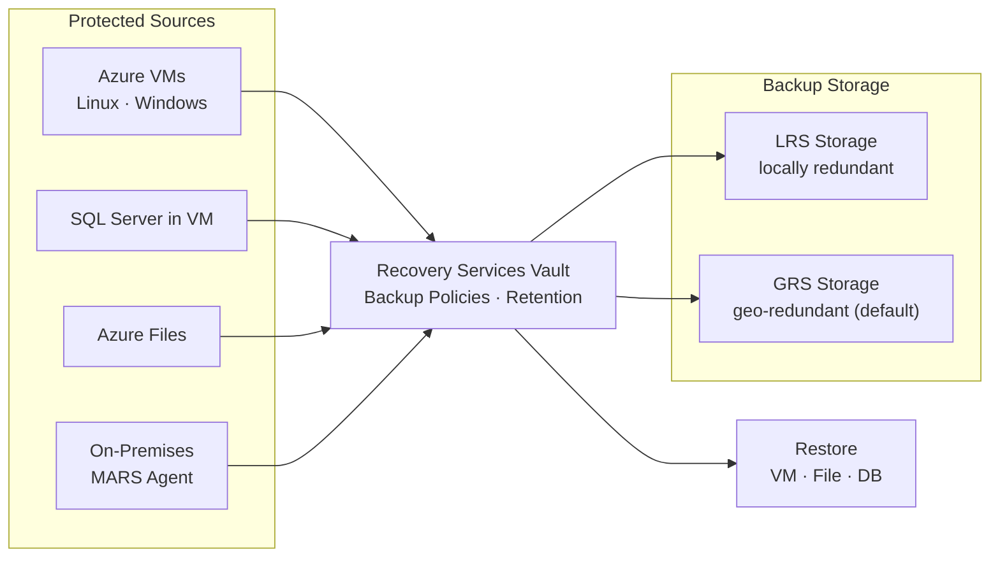

# Azure Backup


<div class="kb-summary">
Azure Backup is a cloud-native backup service that provides simple, secure, and cost-effective solutions for protecting VMs, SQL databases, file shares, and on-premises workloads.
</div>

---

## Azure Backup Architecture



## Recovery Services Vault Setup

All Azure Backup configurations are anchored to a Recovery Services Vault.

```bash
# Create a Recovery Services Vault
az backup vault create \
  --resource-group <rg> \
  --name <vault-name> \
  --location <region>

# List all vaults in a subscription
az backup vault list --output table

# Show vault details
az backup vault show \
  --resource-group <rg> \
  --name <vault-name>

# Set vault redundancy (before any backup items are registered)
az backup vault backup-properties set \
  --resource-group <rg> \
  --name <vault-name> \
  --backup-storage-redundancy GeoRedundant
```

| Redundancy Option | Description |
|---|---|
| LocallyRedundant (LRS) | 3 copies in same datacenter — lowest cost |
| ZoneRedundant (ZRS) | 3 copies across AZs in same region |
| GeoRedundant (GRS) | 6 copies — 3 local + 3 in paired region |

---

## Backup Policies

```bash
# List available backup policies in a vault
az backup policy list \
  --resource-group <rg> \
  --vault-name <vault-name> \
  --output table

# Show details of a specific policy
az backup policy show \
  --resource-group <rg> \
  --vault-name <vault-name> \
  --name <policy-name>

# Create a new VM backup policy from a JSON definition
az backup policy create \
  --resource-group <rg> \
  --vault-name <vault-name> \
  --name <policy-name> \
  --policy @policy.json \
  --backup-management-type AzureIaasVM

# Set default policy on a vault
az backup policy set \
  --resource-group <rg> \
  --vault-name <vault-name> \
  --name <policy-name>
```

---

## Enabling Protection on VMs

```bash
# Enable backup on a VM using the default policy
az backup protection enable-for-vm \
  --resource-group <rg> \
  --vault-name <vault-name> \
  --vm <vm-name> \
  --policy-name DefaultPolicy

# Enable backup on a VM using a custom policy
az backup protection enable-for-vm \
  --resource-group <rg> \
  --vault-name <vault-name> \
  --vm <vm-name> \
  --policy-name <policy-name>

# List all protected items in the vault
az backup item list \
  --resource-group <rg> \
  --vault-name <vault-name> \
  --output table

# Show protection status for a specific VM
az backup item show \
  --resource-group <rg> \
  --vault-name <vault-name> \
  --container-name <container-name> \
  --name <vm-name> \
  --backup-management-type AzureIaasVM \
  --workload-type VM
```

---

## On-Demand Backup

```bash
# Trigger an on-demand backup for a VM
az backup protection backup-now \
  --resource-group <rg> \
  --vault-name <vault-name> \
  --container-name <container-name> \
  --item-name <vm-name> \
  --backup-management-type AzureIaasVM \
  --retain-until 2026-06-30 \
  --query name --output tsv

# Monitor the backup job
az backup job show \
  --resource-group <rg> \
  --vault-name <vault-name> \
  --name <job-id>
```

---

## Recovery Points

```bash
# List recovery points for a protected VM
az backup recoverypoint list \
  --resource-group <rg> \
  --vault-name <vault-name> \
  --container-name <container-name> \
  --item-name <vm-name> \
  --backup-management-type AzureIaasVM \
  --workload-type VM \
  --output table

# Show details of a specific recovery point
az backup recoverypoint show \
  --resource-group <rg> \
  --vault-name <vault-name> \
  --container-name <container-name> \
  --item-name <vm-name> \
  --backup-management-type AzureIaasVM \
  --workload-type VM \
  --name <recovery-point-id>
```

| Recovery Point Type | Description |
|---|---|
| AppConsistent | Application-quiesced snapshot, safe for DBs |
| FileSystemConsistent | OS-level quiesce, safe for most workloads |
| CrashConsistent | Raw disk state at backup time |

---

## Restore Operations

```bash
# Restore a VM to a new VM (full VM restore)
az backup restore restore-disks \
  --resource-group <rg> \
  --vault-name <vault-name> \
  --container-name <container-name> \
  --item-name <vm-name> \
  --rp-name <recovery-point-id> \
  --storage-account <staging-storage-account> \
  --target-resource-group <target-rg>

# Restore to original location
az backup restore restore-disks \
  --resource-group <rg> \
  --vault-name <vault-name> \
  --container-name <container-name> \
  --item-name <vm-name> \
  --rp-name <recovery-point-id> \
  --storage-account <staging-storage-account> \
  --restore-to-staging-storage-account false
```

---

## Disabling and Removing Protection

```bash
# Stop backup but retain existing data
az backup protection disable \
  --resource-group <rg> \
  --vault-name <vault-name> \
  --container-name <container-name> \
  --item-name <vm-name> \
  --backup-management-type AzureIaasVM \
  --workload-type VM \
  --yes

# Stop backup and delete backup data
az backup protection disable \
  --resource-group <rg> \
  --vault-name <vault-name> \
  --container-name <container-name> \
  --item-name <vm-name> \
  --backup-management-type AzureIaasVM \
  --workload-type VM \
  --delete-backup-data true \
  --yes
```
