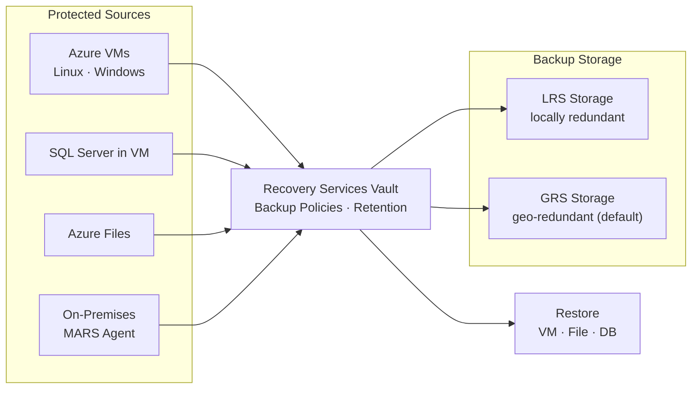

---
tags:
  - azure
---
# Azure Backup

<div class="kb-summary">
Azure Backup is a cloud-native backup service that provides simple, secure, and cost-effective solutions for protecting VMs, SQL databases, file shares, and on-premises workloads.

*Applies to: Azure*
</div>

---

## Azure Backup Architecture



## Recovery Services Vault Setup

All Azure Backup configurations are anchored to a Recovery Services Vault.

```bash
# Create a Recovery Services Vault
az backup vault create \
  --resource-group <rg> \
  --name <vault-name> \
  --location <region>

# List all vaults in a subscription
az backup vault list --output table

# Show vault details
az backup vault show \
  --resource-group <rg> \
  --name <vault-name>

# Set vault redundancy (before any backup items are registered)
az backup vault backup-properties set \
  --resource-group <rg> \
  --name <vault-name> \
  --backup-storage-redundancy GeoRedundant
```


```text title="Expected output"
{
  "id": "/subscriptions/a1b2c3d4-e5f6-4a5b-8c9d-0e1f2a3b4c5d/resourceGroups/prod-backup-rg/providers/Microsoft.RecoveryServices/vaults/prod-vault-01",
  "location": "eastus",
  "name": "prod-vault-01",
  "properties": {
    "provisioningState": "Succeeded"
  },
  "resourceGroup": "prod-backup-rg",
  "type": "Microsoft.RecoveryServices/vaults"
}

Name              ResourceGroup      Location    Type
----------------  -----------------  ----------  ----------------------------------
prod-vault-01     prod-backup-rg     eastus      Microsoft.RecoveryServices/vaults
dr-vault-02       prod-backup-rg     westus2     Microsoft.RecoveryServices/vaults
legacy-vault-03   legacy-rg          northeurope Microsoft.RecoveryServices/vaults

{
  "id": "/subscriptions/a1b2c3d4-e5f6-4a5b-8c9d-0e1f2a3b4c5d/resourceGroups/prod-backup-rg/providers/Microsoft.RecoveryServices/vaults/prod-vault-01",
  "location": "eastus",
  "name": "prod-vault-01",
  "properties": {
    "provisioningState": "Succeeded",
    "publicNetworkAccess": "Enabled"
  },
  "resourceGroup": "prod-backup-rg"
}

(no output — command completes silently)
```

!!! warning "Common errors"
    **`ResourceGroupNotFound`** — Verify the resource group exists in the target subscription with `az group list`.
    **`VaultAlreadyExists`** — Use a unique vault name or delete the existing vault before recreating it.
    **`InvalidBackupStorageRedundancy`** — Ensure no backup items are registered to the vault before changing redundancy; use `az backup container list` to verify.
| Redundancy Option | Description |
|---|---|
| LocallyRedundant (LRS) | 3 copies in same datacenter — lowest cost |
| ZoneRedundant (ZRS) | 3 copies across AZs in same region |
| GeoRedundant (GRS) | 6 copies — 3 local + 3 in paired region |

---

## Backup Policies

```bash
# List available backup policies in a vault
az backup policy list \
  --resource-group <rg> \
  --vault-name <vault-name> \
  --output table

# Show details of a specific policy
az backup policy show \
  --resource-group <rg> \
  --vault-name <vault-name> \
  --name <policy-name>

# Create a new VM backup policy from a JSON definition
az backup policy create \
  --resource-group <rg> \
  --vault-name <vault-name> \
  --name <policy-name> \
  --policy @policy.json \
  --backup-management-type AzureIaasVM

# Set default policy on a vault
az backup policy set \
  --resource-group <rg> \
  --vault-name <vault-name> \
  --name <policy-name>
```


```text title="Expected output"
Name                          BackupManagementType    WorkloadType
------------------------------  ----------------------  ---------------
DefaultPolicy                  AzureIaasVM             VM
DailyBackup-7day-retention     AzureIaasVM             VM
WeeklyBackup-30day-retention   AzureIaasVM             VM
MonthlyBackup-1year-retention  AzureIaasVM             VM

{
  "id": "/subscriptions/a1b2c3d4-e5f6-7890-abcd-ef1234567890/resourceGroups/prod-rg/providers/Microsoft.RecoveryServices/vaults/prod-vault/backupPolicies/DailyBackup-7day-retention",
  "name": "DailyBackup-7day-retention",
  "type": "Microsoft.RecoveryServices/vaults/backupPolicies",
  "properties": {
    "backupManagementType": "AzureIaasVM",
    "workloadType": "VM",
    "schedulePolicy": {
      "schedulePolicyType": "SimpleSchedulePolicy",
      "scheduleRunFrequency": "Daily",
      "scheduleRunTimes": ["2024-01-15T03:00:00Z"]
    },
    "retentionPolicy": {
      "retentionPolicyType": "LongTermRetentionPolicy",
      "dailySchedule": {
        "retentionTimes": ["2024-01-15T03:00:00Z"],
        "retentionDuration": {
          "count": 7,
          "durationType": "Days"
        }
      }
    }
  }
}

(no output — command completes silently)
(no output — command completes silently)
```

!!! warning "Common errors"
    **`ResourceNotFound: The resource 'Microsoft.RecoveryServices/vaults/<vault-name>' does not exist`** — Verify the vault name and resource group name are correct using `az backup vault list --resource-group <rg>`.
    **`InvalidPolicyDefinition: Policy file is invalid or malformed`** — Ensure the policy.json file is valid JSON and contains required fields like `schedulePolicy` and `retentionPolicy` by validating against Azure backup policy schema.
    **`PolicyAlreadyExists: A policy with name '<policy-name>' already exists in this vault`** — Use a unique policy name or delete the existing policy first with `az backup policy delete --resource-group <rg> --vault-name <vault-name> --name <policy-name>`.
---

## Enabling Protection on VMs

```bash
# Enable backup on a VM using the default policy
az backup protection enable-for-vm \
  --resource-group <rg> \
  --vault-name <vault-name> \
  --vm <vm-name> \
  --policy-name DefaultPolicy

# Enable backup on a VM using a custom policy
az backup protection enable-for-vm \
  --resource-group <rg> \
  --vault-name <vault-name> \
  --vm <vm-name> \
  --policy-name <policy-name>

# List all protected items in the vault
az backup item list \
  --resource-group <rg> \
  --vault-name <vault-name> \
  --output table

# Show protection status for a specific VM
az backup item show \
  --resource-group <rg> \
  --vault-name <vault-name> \
  --container-name <container-name> \
  --name <vm-name> \
  --backup-management-type AzureIaasVM \
  --workload-type VM
```


```text title="Expected output"
Command group 'backup protection' is in preview and under development. Reference and support levels: https://aka.ms/CLI_refstatus
Protection enabled for VM 'prod-web-01' in vault 'RecoveryVault-East'.

Command group 'backup protection' is in preview and under development. Reference and support levels: https://aka.ms/CLI_refstatus
Protection enabled for VM 'prod-web-01' in vault 'RecoveryVault-East'.

Name                 ResourceGroup        VaultName           ProtectionState    HealthStatus
-------------------  -------------------  ------------------  -----------------  ---------------
prod-web-01          corp-backup-rg       RecoveryVault-East  Protected          Healthy
prod-db-02           corp-backup-rg       RecoveryVault-East  Protected          Healthy
prod-app-03          corp-backup-rg       RecoveryVault-East  Protected          Healthy
dev-test-vm          corp-backup-rg       RecoveryVault-East  ProtectionStopped  Healthy

{
  "id": "/subscriptions/a1b2c3d4-e5f6-4a7b-8c9d-0e1f2a3b4c5d/resourceGroups/corp-backup-rg/providers/Microsoft.RecoveryServices/vaults/RecoveryVault-East/backupFabrics/Azure/protectionContainers/IaasVMContainer;iaasvmcontainerv2;corp-backup-rg;prod-web-01/protectedItems/VM;iaasvmcontainerv2;corp-backup-rg;prod-web-01",
  "name": "prod-web-01",
  "protectionStatus": "Protected",
  "protectionState": "IRPending",
  "healthStatus": "Healthy",
  "lastBackupStatus": "Success",
  "lastBackupTime": "2024-01-15T02:30:45.123456+00:00"
}
```

!!! warning "Common errors"
    **`ResourceNotFound : The specified vault 'RecoveryVault-East' could not be found in resource group 'corp-backup-rg'.`** — Verify the vault name and resource group name match exactly, and that the vault exists in the correct subscription.
    **`InvalidPolicyName : Policy 'CustomPolicy-Daily' does not exist in vault 'RecoveryVault-East'.`** — List available policies with `az backup policy list --resource-group <rg> --vault-name <vault-name>` and use an existing policy name.
    **`VMNotFound : Virtual machine 'prod-web-01' not found in resource group 'corp-backup-rg'.`** — Confirm the VM name is correct and exists in the specified resource group using `az vm list --resource-group <rg>`.
---

## On-Demand Backup

```bash
# Trigger an on-demand backup for a VM
az backup protection backup-now \
  --resource-group <rg> \
  --vault-name <vault-name> \
  --container-name <container-name> \
  --item-name <vm-name> \
  --backup-management-type AzureIaasVM \
  --retain-until 2026-06-30 \
  --query name --output tsv

# Monitor the backup job
az backup job show \
  --resource-group <rg> \
  --vault-name <vault-name> \
  --name <job-id>
```


```text title="Expected output"
BackupJob-prod-vm-01-20250115-143022
{
  "activityId": "12a4b5c6-7d8e-9f0a-1b2c-3d4e5f6a7b8c",
  "backupManagementType": "AzureIaasVM",
  "containerName": "iaasvmcontainer;rg-prod;prod-vm-01",
  "duration": "00:45:32",
  "endTime": "2025-01-15T14:45:54.123456+00:00",
  "entityFriendlyName": "prod-vm-01",
  "jobId": "12a4b5c6-7d8e-9f0a-1b2c-3d4e5f6a7b8c",
  "operation": "Backup",
  "startTime": "2025-01-15T14:00:22.654321+00:00",
  "status": "Completed",
  "workloadType": "VM"
}
```

!!! warning "Common errors"
    **`ResourceNotFound: The specified vault was not found in the subscription.`** — Verify the vault name and resource group are correct, and the vault exists in the current subscription context.
    **`InvalidParameterValue: The container name does not exist or is not registered with the vault.`** — Ensure the VM is registered with the Recovery Services vault by running `az backup container list` to confirm the container name format.
    **`BadRequest: The retain-until date must be at least 7 days from today.`** — Set the `--retain-until` date to a minimum of 7 days in the future from the current date.
---

## Recovery Points

```bash
# List recovery points for a protected VM
az backup recoverypoint list \
  --resource-group <rg> \
  --vault-name <vault-name> \
  --container-name <container-name> \
  --item-name <vm-name> \
  --backup-management-type AzureIaasVM \
  --workload-type VM \
  --output table

# Show details of a specific recovery point
az backup recoverypoint show \
  --resource-group <rg> \
  --vault-name <vault-name> \
  --container-name <container-name> \
  --item-name <vm-name> \
  --backup-management-type AzureIaasVM \
  --workload-type VM \
  --name <recovery-point-id>
```


```text title="Expected output"
Name                                 Type    Timestamp                 
-----------------------------------  ------  -------------------------
2024-01-15T14:32:18.000000+00:00    Full    2024-01-15T14:32:18+00:00
2024-01-14T14:32:15.000000+00:00    Full    2024-01-14T14:32:15+00:00
2024-01-13T14:31:22.000000+00:00    Incr    2024-01-13T14:31:22+00:00
2024-01-12T14:30:45.000000+00:00    Incr    2024-01-12T14:30:45+00:00
2024-01-11T14:29:33.000000+00:00    Full    2024-01-11T14:29:33+00:00
...

{
  "id": "/subscriptions/a1b2c3d4-e5f6-7890-abcd-ef1234567890/resourceGroups/prod-rg/providers/Microsoft.RecoveryServices/vaults/prod-vault/backupFabrics/Azure/protectionContainers/IaasVMContainer;iaasvmcontainerv2;prod-rg;prod-vm-01/protectedItems/VM;iaasvmcontainerv2;prod-rg;prod-vm-01/recoveryPoints/2024-01-15T14:32:18.000000+00:00",
  "name": "2024-01-15T14:32:18.000000+00:00",
  "properties": {
    "recoveryPointTime": "2024-01-15T14:32:18+00:00",
    "recoveryPointType": "Full",
    "sourceVMStorageType": "Premium"
  },
  "type": "Microsoft.RecoveryServices/vaults/backupFabrics/protectionContainers/protectedItems/recoveryPoints"
}
```

!!! warning "Common errors"
    **`ResourceNotFound: The specified backup item could not be found.`** — Verify the container name matches the VM's protection container name (typically `IaasVMContainer;iaasvmcontainerv2;<rg>;<vm-name>`).
    **`InvalidRecoveryPointId: Recovery point '<recovery-point-id>' does not exist for the specified item.`** — Ensure the recovery point name is an exact timestamp from the list output and hasn't expired based on retention policy.
    **`VaultNotFound: The Recovery Services vault '<vault-name>' was not found in resource group '<rg>'.`** — Confirm the vault name and resource group are correct and the vault exists in your subscription.
| Recovery Point Type | Description |
|---|---|
| AppConsistent | Application-quiesced snapshot, safe for DBs |
| FileSystemConsistent | OS-level quiesce, safe for most workloads |
| CrashConsistent | Raw disk state at backup time |

---

## Restore Operations

```bash
# Restore a VM to a new VM (full VM restore)
az backup restore restore-disks \
  --resource-group <rg> \
  --vault-name <vault-name> \
  --container-name <container-name> \
  --item-name <vm-name> \
  --rp-name <recovery-point-id> \
  --storage-account <staging-storage-account> \
  --target-resource-group <target-rg>

# Restore to original location
az backup restore restore-disks \
  --resource-group <rg> \
  --vault-name <vault-name> \
  --container-name <container-name> \
  --item-name <vm-name> \
  --rp-name <recovery-point-id> \
  --storage-account <staging-storage-account> \
  --restore-to-staging-storage-account false
```


```text title="Expected output"
Restore operation initiated successfully.
Job ID: 12345678-1234-1234-1234-123456789012
Status: InProgress
Start Time: 2024-01-15T10:32:45.123456+00:00
Duration: 0:00:00
Items Restored: 0
Items Failed: 0

Restore operation initiated successfully.
Job ID: 87654321-4321-4321-4321-210987654321
Status: InProgress
Start Time: 2024-01-15T10:35:12.654321+00:00
Duration: 0:00:00
Items Restored: 0
Items Failed: 0
```

!!! warning "Common errors"
    **`ResourceNotFound: The resource 'Microsoft.RecoveryServices/vaults/<vault-name>' could not be found.`** — Verify the vault name and resource group are correct and exist in your subscription.
    **`InvalidParameterValue: The recovery point '<recovery-point-id>' is invalid or expired.`** — List available recovery points with `az backup recoverypoint list` and use a valid, non-expired recovery point ID.
    **`AuthorizationFailed: The client '<client-id>' with object id '<object-id>' does not have authorization to perform action 'Microsoft.RecoveryServices/vaults/backupFabrics/protectionContainers/protectedItems/recoveryPoints/restore/action'.`** — Ensure your user or service principal has the "Backup Operator" or "Contributor" role on the Recovery Services vault.
---

## Disabling and Removing Protection

```bash
# Stop backup but retain existing data
az backup protection disable \
  --resource-group <rg> \
  --vault-name <vault-name> \
  --container-name <container-name> \
  --item-name <vm-name> \
  --backup-management-type AzureIaasVM \
  --workload-type VM \
  --yes

# Stop backup and delete backup data
az backup protection disable \
  --resource-group <rg> \
  --vault-name <vault-name> \
  --container-name <container-name> \
  --item-name <vm-name> \
  --backup-management-type AzureIaasVM \
  --workload-type VM \
  --delete-backup-data true \
  --yes
```


```text title="Expected output"
Request sent to disable protection for item prod-vm-01 in vault backup-vault-prod.
Disable protection request has been submitted successfully.

Request sent to delete backup data for item prod-vm-01 in vault backup-vault-prod.
Deleting backup data for item prod-vm-01. This operation may take several minutes.
Delete backup data request has been submitted successfully.
```

!!! warning "Common errors"
    **`ResourceNotFound : The specified backup item could not be found.`** — Verify the container name matches the VM's registered name in the vault using `az backup container list --resource-group <rg> --vault-name <vault-name>`.
    
    **`InvalidParameterValue : The value of parameter 'backupManagementType' is invalid.`** — Ensure `--backup-management-type` is set to `AzureIaasVM` (case-sensitive) and matches the actual backup type of the item.
    
    **`AuthorizationFailed : The client does not have authorization to perform action 'Microsoft.RecoveryServices/vaults/backupFabrics/protectionContainers/protectedItems/write'.`** — Assign the Backup Operator or Backup Admin role to your Azure account on the Recovery Services vault.