# Azure Site Recovery


<div class="kb-summary">
Azure Site Recovery (ASR) orchestrates replication, failover, and failback for Azure VMs and on-premises workloads. It enables business continuity with RPO targets as low as 30 seconds for Azure-to-Azure replication.
</div>
```text
┌──────────────────────────────────────── Cloud Azure Backup Dr ────────────────────────────────────────┐
│                                                                                                       │
│   ┌───────────────────────────────────────────────────────────────────────────────────────────────┐   │
│   │                             Azure: Cloud Azure Backup Dr platform                             │   │
│   │                                  Protocols: Various protocols                                 │   │
│   │                      Management: Cloud Azure Backup Dr management console                     │   │
│   │                Sections: Architecture · Operations · Security · Troubleshooting               │   │
│   └───────────────────────────────────────────────────────────────────────────────────────────────┘   │
│                                                                                                       │
│    Architecture → Operations → Security → Troubleshooting → Escalation                                │
│                                                                                                       │
│                  ▼                                ▼                                ▼                  │
│                                                                                                       │
│   ┌─────────────────────────────┐  ┌─────────────────────────────┐  ┌─────────────────────────────┐   │
│   │            Layer            │  │          Component          │  │            Notes            │   │
│   │             Core            │  │       Primary service       │  │        Main function        │   │
│   │          Management         │  │        Control plane        │  │         Admin access        │   │
│   │          Monitoring         │  │         Health/perf         │  │      Alerts/dashboards      │   │
│   │           Security          │  │         Auth/encrypt        │  │        Access control       │   │
│   │         Integration         │  │        APIs/plug-ins        │  │         Third-party         │   │
│   └─────────────────────────────┘  └─────────────────────────────┘  └─────────────────────────────┘   │
│                                                                                                       │
│                          ▼                                                 ▼                          │
│                                                                                                       │
│   ┌───────────────────────────────────────────────────────────────────────────────────────────────┐   │
│   │      Layer       │    Component     │      Function     │      Notes       │       Auth       │   │
│   │       Core       │ Primary service  │   Main function   │     See docs     │       RBAC       │   │
│   │    Management    │  Control plane   │    Admin access   │     See docs     │       RBAC       │   │
│   │    Monitoring    │   Health/perf    │  Alerts/dashboard │     See docs     │       RBAC       │   │
│   │     Security     │   Auth/encrypt   │   Access control  │     See docs     │       RBAC       │   │
│   └───────────────────────────────────────────────────────────────────────────────────────────────┘   │
│                                                                                                       │
│    Physical: Cloud Azure Backup Dr infrastructure · management network · monitoring                   │
│                                                                                                       │
│    Key terms:                                                                                         │
│                                                                                                       │
│    Azure              = Cloud Azure Backup Dr platform overview and core concepts                     │
│    Management         = management console and command-line interface for administration              │
│    Monitoring         = health and performance monitoring dashboards and alerting                     │
│    Automation         = REST API, scripting, and pipeline integration capabilities                    │
│    Security           = access control, authentication, and encryption configuration                  │
│    Backup             = backup and recovery procedures and schedule configuration                     │
│    Upgrade            = software version upgrades and firmware patching procedures                    │
│    Troubleshooting    = diagnostic procedures and common issue resolution steps                       │
│    Escalation         = vendor support escalation path and severity triage process                    │
│    Documentation      = vendor knowledge base and official product documentation                      │
│    Change management  = change ticket requirements for production modifications                       │
│    Audit log          = admin action logging for compliance and security review                       │
│                                                                                                       │
└───────────────────────────────────────────────────────────────────────────────────────────────────────┘
```


---

## ASR Replication Flow

```mermaid
flowchart LR
    sourceVM["Source VM\nPrimary Region"]
    asrAgent["ASR Mobility Agent\nor Azure Fabric"]
    replication["Continuous Replication\nRPO ~ 30 seconds"]
    cacheStorage["Cache Storage Account\nPrimary Region"]
    targetStorage["Replica Managed Disk\nDR Region"]
    vault["Recovery Services Vault\nDR Region"]
    failover["Failover\nTest · Planned · Unplanned"]
    targetVM["Target VM\nDR Region — running"]

    sourceVM --> asrAgent --> cacheStorage --> replication --> targetStorage --> vault
    vault --> failover --> targetVM
```



## Prerequisites and Vault Setup

```bash
# Create a Recovery Services Vault in the target (DR) region
az backup vault create \
  --resource-group <dr-rg> \
  --name <asr-vault-name> \
  --location <dr-region>

# Confirm vault exists and is active
az backup vault show \
  --resource-group <dr-rg> \
  --name <asr-vault-name> \
  --query "properties.provisioningState" --output tsv
```

ASR operations are primarily performed through the Azure portal or PowerShell/REST API. The `az` CLI has limited native ASR cmdlets; use the portal or `az rest` for full ASR control.

| Component | Purpose |
|---|---|
| Recovery Services Vault | Container for all ASR configuration and data |
| Replication Policy | Defines RPO, crash-consistent snapshot frequency |
| Network Mapping | Maps source VNets to target VNets |
| Cache Storage Account | Staging area for replication delta data |

---

## Enabling Replication (Azure-to-Azure)

```bash
# Get the source VM resource ID
az vm show \
  --resource-group <source-rg> \
  --name <vm-name> \
  --query id --output tsv

# Use az rest to trigger replication (Azure-to-Azure)
az rest --method PUT \
  --uri "https://management.azure.com/subscriptions/<sub-id>/resourceGroups/<dr-rg>/providers/Microsoft.RecoveryServices/vaults/<vault-name>/replicationFabrics/<source-fabric>/replicationProtectionContainers/<source-container>/replicationProtectedItems/<item-name>?api-version=2022-10-01" \
  --body @enable-replication.json

# List all replicated items
az rest --method GET \
  --uri "https://management.azure.com/subscriptions/<sub-id>/resourceGroups/<dr-rg>/providers/Microsoft.RecoveryServices/vaults/<vault-name>/replicationProtectedItems?api-version=2022-10-01" \
  --query "value[].{Name:name, Health:properties.replicationHealth, RPO:properties.rpoInSeconds}" \
  --output table
```

---

## Replication Policy

```bash
# Create a replication policy via az rest
az rest --method PUT \
  --uri "https://management.azure.com/subscriptions/<sub-id>/resourceGroups/<dr-rg>/providers/Microsoft.RecoveryServices/vaults/<vault-name>/replicationPolicies/<policy-name>?api-version=2022-10-01" \
  --body '{
    "properties": {
      "providerSpecificInput": {
        "instanceType": "A2A",
        "multiVmSyncStatus": "Enable"
      }
    }
  }'
```

| Policy Setting | Typical Value | Notes |
|---|---|---|
| RPO threshold (minutes) | 30 | Alert trigger threshold |
| App-consistent snapshot frequency (hours) | 4 | Higher = more overhead |
| Crash-consistent snapshot frequency (minutes) | 5 | Minimum recovery granularity |
| Recovery point retention (hours) | 24 | Max 72 for A2A |

---

## Test Failover

Test failover validates the recovery plan without impacting production replication.

```bash
# Trigger a test failover for a replicated item
az rest --method POST \
  --uri "https://management.azure.com/subscriptions/<sub-id>/resourceGroups/<dr-rg>/providers/Microsoft.RecoveryServices/vaults/<vault-name>/replicationFabrics/<fabric>/replicationProtectionContainers/<container>/replicationProtectedItems/<item-name>/testFailover?api-version=2022-10-01" \
  --body '{
    "properties": {
      "networkId": "<target-vnet-id>",
      "failoverDirection": "PrimaryToRecovery",
      "providerSpecificDetails": {"instanceType": "A2A"}
    }
  }'

# Clean up test failover resources after validation
az rest --method POST \
  --uri "https://management.azure.com/.../testFailoverCleanup?api-version=2022-10-01" \
  --body '{"properties": {"comments": "Test passed, cleaning up"}}'
```

---

## Planned Failover

```bash
# Trigger a planned failover (minimal data loss, coordinated shutdown)
az rest --method POST \
  --uri "https://management.azure.com/subscriptions/<sub-id>/resourceGroups/<dr-rg>/providers/Microsoft.RecoveryServices/vaults/<vault-name>/replicationFabrics/<fabric>/replicationProtectionContainers/<container>/replicationProtectedItems/<item-name>/plannedFailover?api-version=2022-10-01" \
  --body '{
    "properties": {
      "failoverDirection": "PrimaryToRecovery",
      "providerSpecificDetails": {"instanceType": "A2A"}
    }
  }'

# Monitor job status
az rest --method GET \
  --uri "https://management.azure.com/subscriptions/<sub-id>/resourceGroups/<dr-rg>/providers/Microsoft.RecoveryServices/vaults/<vault-name>/replicationJobs?api-version=2022-10-01" \
  --query "value[?properties.jobType=='PlannedFailover'].{Name:name, State:properties.state, StartTime:properties.startTime}" \
  --output table
```

---

## Commit Failover

After a failover, commit the operation to finalize the switch and stop reverse replication from the old primary.

```bash
# Commit failover
az rest --method POST \
  --uri "https://management.azure.com/subscriptions/<sub-id>/resourceGroups/<dr-rg>/providers/Microsoft.RecoveryServices/vaults/<vault-name>/replicationFabrics/<fabric>/replicationProtectionContainers/<container>/replicationProtectedItems/<item-name>/applyRecoveryPoint?api-version=2022-10-01" \
  --body '{"properties": {"recoveryPointId": "<rp-id>", "providerSpecificDetails": {"instanceType": "A2A"}}}'
```

---

## Failback Workflow Summary

| Phase | Action | Tool |
|---|---|---|
| 1. Re-protect | Reverse replication back to primary region | Portal / REST |
| 2. Test failback | Validate primary can host the workload | Portal |
| 3. Planned failover | Switch traffic back to primary | Portal / REST |
| 4. Commit | Finalise failback, stop DR replication | Portal / REST |
| 5. Re-enable DR | Re-enable replication from primary to DR | Portal / REST |
