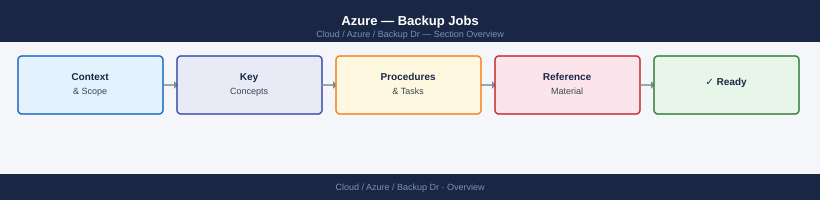

---
tags:
  - azure
---
# Azure — Backup Jobs



```text
  Trigger
     │
     ▼
```


```text
     │
     ▼
  az backup job list --status Failed
```
```bash

```d2
direction: right

center: "Azure" {shape: hexagon}
list_all_backup_jobs_in_a_vault: "List all backup jobs in a vault" {shape: rectangle}
filter_jobs_by_status_completed_fail: "Filter jobs by status (Completed, Failed, InProgress, Cancel" {shape: rectangle}
filter_jobs_by_operation_type: "Filter jobs by operation type" {shape: rectangle}
filter_jobs_within_a_specific_time_r: "Filter jobs within a specific time range" {shape: rectangle}
show_full_details_for_a_job_job_id_f: "Show full details for a job (job ID from list output)" {shape: rectangle}
get_just_the_status_and_error_detail: "Get just the status and error details" {shape: rectangle}

center -> list_all_backup_jobs_in_a_vault
center -> filter_jobs_by_status_completed_fail
center -> filter_jobs_by_operation_type
center -> filter_jobs_within_a_specific_time_r
center -> show_full_details_for_a_job_job_id_f
center -> get_just_the_status_and_error_detail
```

## List all backup jobs in a vault
az backup job list \
  --resource-group <rg> \
  --vault-name <vault-name> \
  --output table

## Filter jobs by status (Completed, Failed, InProgress, Cancelled)
az backup job list \
  --resource-group <rg> \
  --vault-name <vault-name> \
  --status Failed \
  --output table

## Filter jobs by operation type
az backup job list \
  --resource-group <rg> \
  --vault-name <vault-name> \
  --operation Backup \
  --output table

## Filter jobs within a specific time range
az backup job list \
  --resource-group <rg> \
  --vault-name <vault-name> \
  --start-date 2026-05-01T00:00:00 \
  --end-date 2026-05-07T23:59:59 \
  --output table
```
```bash
## Show full details for a job (job ID from list output)
az backup job show \
  --resource-group <rg> \
  --vault-name <vault-name> \
  --name <job-id>

## Get just the status and error details
az backup job show \
  --resource-group <rg> \
  --vault-name <vault-name> \
  --name <job-id> \
  --query "{Status:properties.status, Error:properties.errorDetails[0].errorMessage}" \
  --output table
```
```bash
## Wait for a specific job to complete (polls every 30 seconds)
az backup job wait \
  --resource-group <rg> \
  --vault-name <vault-name> \
  --name <job-id>

## Trigger on-demand backup and wait for completion
JOB_ID=$(az backup protection backup-now \
  --resource-group <rg> \
  --vault-name <vault-name> \
  --container-name <container-name> \
  --item-name <vm-name> \
  --backup-management-type AzureIaasVM \
  --retain-until 2026-06-30 \
  --query name --output tsv)

az backup job wait \
  --resource-group <rg> \
  --vault-name <vault-name> \
  --name "$JOB_ID"
```
```bash
## List all failed jobs with error messages
az backup job list \
  --resource-group <rg> \
  --vault-name <vault-name> \
  --status Failed \
  --query "[].{Item:properties.entityFriendlyName, Operation:properties.operation, Error:properties.errorDetails[0].errorString, Time:properties.startTime}" \
  --output table

## Retry a failed backup job (re-trigger on-demand)
az backup protection backup-now \
  --resource-group <rg> \
  --vault-name <vault-name> \
  --container-name <container-name> \
  --item-name <vm-name> \
  --backup-management-type AzureIaasVM \
  --retain-until 2026-06-30
```
```bash
## Cancel a job that is currently in progress
az backup job stop \
  --resource-group <rg> \
  --vault-name <vault-name> \
  --name <job-id>
```
```bash
## Query backup job alerts in Azure Monitor (requires diagnostic settings enabled)
az monitor log-analytics query \
  --workspace <workspace-id> \
  --analytics-query "AddonAzureBackupJobs | where JobStatus == 'Failed' | project TimeGenerated, JobOperation, BackupItemFriendlyName, JobFailureCode | order by TimeGenerated desc | take 20" \
  --output table

## List configured diagnostic settings on the vault
az monitor diagnostic-settings list \
  --resource <vault-resource-id> \
  --output table
```
