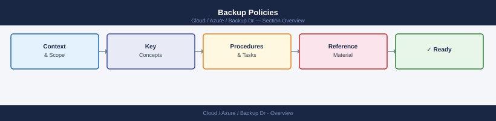

---
tags:
  - azure
---
# Backup Policies


<div class="kb-summary">
Backup policies define when backups run, how many recovery points are retained, and at what tiers

*Applies to: Azure*
</div>



---

```d2
direction: right

center: "Azure" {shape: hexagon}
creating_a_vm_backup_policy: "Creating a VM Backup Policy" {shape: rectangle}
retention_rules_reference: "Retention Rules Reference" {shape: rectangle}
modifying_an_existing_policy: "Modifying an Existing Policy" {shape: rectangle}
assigning_a_policy_to_protected_item: "Assigning a Policy to Protected Items" {shape: rectangle}
deleting_a_policy: "Deleting a Policy" {shape: rectangle}

center -> creating_a_vm_backup_policy
center -> retention_rules_reference
center -> modifying_an_existing_policy
center -> assigning_a_policy_to_protected_item
center -> deleting_a_policy
```

## Creating a VM Backup Policy

Policies are defined in JSON. Below is a minimal daily VM backup policy template.

```json
{
  "eTag": null,
  "location": "eastus",
  "properties": {
    "backupManagementType": "AzureIaasVM",
    "instantRpRetentionRangeInDays": 2,
    "schedulePolicy": {
      "schedulePolicyType": "SimpleSchedulePolicy",
      "scheduleRunFrequency": "Daily",
      "scheduleRunTimes": ["2026-01-01T02:00:00Z"]
    },
    "retentionPolicy": {
      "retentionPolicyType": "LongTermRetentionPolicy",
      "dailySchedule": {
        "retentionTimes": ["2026-01-01T02:00:00Z"],
        "retentionDuration": {"count": 30, "durationType": "Days"}
      },
      "weeklySchedule": {
        "daysOfTheWeek": ["Sunday"],
        "retentionTimes": ["2026-01-01T02:00:00Z"],
        "retentionDuration": {"count": 12, "durationType": "Weeks"}
      },
      "monthlySchedule": {
        "retentionScheduleFormatType": "Weekly",
        "retentionScheduleWeekly": [{"daysOfTheWeek": ["Sunday"], "weeksOfTheMonth": ["First"]}],
        "retentionTimes": ["2026-01-01T02:00:00Z"],
        "retentionDuration": {"count": 12, "durationType": "Months"}
      }
    },
    "timeZone": "UTC"
  }
}
```

```bash
# Create the policy from the JSON file
az backup policy create \
  --resource-group <rg> \
  --vault-name <vault-name> \
  --name <policy-name> \
  --policy @vm-backup-policy.json \
  --backup-management-type AzureIaasVM
```

---

## Retention Rules Reference

| Tier | Minimum | Maximum | Notes |
|---|---|---|---|
| Snapshot (instant restore) | 1 day | 5 days | Stored in the resource group |
| Daily vault | 7 days | 9999 days | Stored in the Recovery Services Vault |
| Weekly vault | 1 week | 5163 weeks | Each Sunday (or chosen day) |
| Monthly vault | 1 month | 1188 months | First/last week of month |
| Yearly vault | 1 year | 99 years | Specified month and week |

---

## Modifying an Existing Policy

```bash
# Export the current policy to a file for editing
az backup policy show \
  --resource-group <rg> \
  --vault-name <vault-name> \
  --name <policy-name> > current-policy.json

# Apply the modified policy (overwrites existing)
az backup policy set \
  --resource-group <rg> \
  --vault-name <vault-name> \
  --name <policy-name> \
  --policy @current-policy.json
```

---

## Assigning a Policy to Protected Items

```bash
# Change the policy for an already-protected VM
az backup item set-policy \
  --resource-group <rg> \
  --vault-name <vault-name> \
  --container-name <container-name> \
  --name <vm-name> \
  --backup-management-type AzureIaasVM \
  --workload-type VM \
  --policy-name <new-policy-name>

# List items using a specific policy
az backup item list \
  --resource-group <rg> \
  --vault-name <vault-name> \
  --query "[?properties.policyId contains '<policy-name>'].{Name:name, State:properties.protectionState}" \
  --output table
```

---

## Deleting a Policy

```bash
# Delete a policy (only if no items are assigned to it)
az backup policy delete \
  --resource-group <rg> \
  --vault-name <vault-name> \
  --name <policy-name>
```
