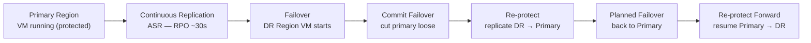

---
tags:
  - azure
---
# Failback


<div class="kb-summary">
Failback is the process of returning protected workloads from the DR (recovery) region back to the primary region after a failover event.
</div>
```text
┌──────────────────────────────────────── Cloud Azure Backup Dr ────────────────────────────────────────┐
│                                                                                                       │
│   ┌───────────────────────────────────────────────────────────────────────────────────────────────┐   │
│   │                             Azure: Cloud Azure Backup Dr platform                             │   │
│   │                                  Protocols: Various protocols                                 │   │
│   │                      Management: Cloud Azure Backup Dr management console                     │   │
│   │                Sections: Architecture · Operations · Security · Troubleshooting               │   │
│   └───────────────────────────────────────────────────────────────────────────────────────────────┘   │
│                                                                                                       │
│    Architecture → Operations → Security → Troubleshooting → Escalation                                │
│                                                                                                       │
│                  ▼                                ▼                                ▼                  │
│                                                                                                       │
│   ┌─────────────────────────────┐  ┌─────────────────────────────┐  ┌─────────────────────────────┐   │
│   │            Layer            │  │          Component          │  │            Notes            │   │
│   │             Core            │  │       Primary service       │  │        Main function        │   │
│   │          Management         │  │        Control plane        │  │         Admin access        │   │
│   │          Monitoring         │  │         Health/perf         │  │      Alerts/dashboards      │   │
│   │           Security          │  │         Auth/encrypt        │  │        Access control       │   │
│   │         Integration         │  │        APIs/plug-ins        │  │         Third-party         │   │
│   └─────────────────────────────┘  └─────────────────────────────┘  └─────────────────────────────┘   │
│                                                                                                       │
│                          ▼                                                 ▼                          │
│                                                                                                       │
│   ┌───────────────────────────────────────────────────────────────────────────────────────────────┐   │
│   │      Layer       │    Component     │      Function     │      Notes       │       Auth       │   │
│   │       Core       │ Primary service  │   Main function   │     See docs     │       RBAC       │   │
│   │    Management    │  Control plane   │    Admin access   │     See docs     │       RBAC       │   │
│   │    Monitoring    │   Health/perf    │  Alerts/dashboard │     See docs     │       RBAC       │   │
│   │     Security     │   Auth/encrypt   │   Access control  │     See docs     │       RBAC       │   │
│   └───────────────────────────────────────────────────────────────────────────────────────────────┘   │
│                                                                                                       │
│    Physical: Cloud Azure Backup Dr infrastructure · management network · monitoring                   │
│                                                                                                       │
│    Key terms:                                                                                         │
│                                                                                                       │
│    Azure              = Cloud Azure Backup Dr platform overview and core concepts                     │
│    Management         = management console and command-line interface for administration              │
│    Monitoring         = health and performance monitoring dashboards and alerting                     │
│    Automation         = REST API, scripting, and pipeline integration capabilities                    │
│    Security           = access control, authentication, and encryption configuration                  │
│    Backup             = backup and recovery procedures and schedule configuration                     │
│    Upgrade            = software version upgrades and firmware patching procedures                    │
│    Troubleshooting    = diagnostic procedures and common issue resolution steps                       │
│    Escalation         = vendor support escalation path and severity triage process                    │
│    Documentation      = vendor knowledge base and official product documentation                      │
│    Change management  = change ticket requirements for production modifications                       │
│    Audit log          = admin action logging for compliance and security review                       │
│                                                                                                       │
└───────────────────────────────────────────────────────────────────────────────────────────────────────┘
```


 In Azure Site Recovery, failback consists of re-protecting the DR VM, running a planned failover toward the primary, then committing and re-enabling replication.

---

## ASR Failover and Failback Flow



## Failback Prerequisites

Before initiating failback, confirm:

| Requirement | Verification |
|---|---|
| Failover has been committed in ASR | Check replicated item state = "Failover committed" |
| Primary region infrastructure is ready | VMs, VNets, NSGs exist or are re-created |
| Network connectivity from DR to primary | VNet peering or VPN gateway routes confirmed |
| Recovery Services Vault accessible | `az backup vault show` returns Succeeded |

```bash
# Confirm vault in DR region is accessible
az backup vault show \
  --resource-group <dr-rg> \
  --name <asr-vault-name> \
  --query "properties.provisioningState" --output tsv

# Confirm current replication state via REST
az rest --method GET \
  --uri "https://management.azure.com/subscriptions/<sub-id>/resourceGroups/<dr-rg>/providers/Microsoft.RecoveryServices/vaults/<vault-name>/replicationProtectedItems?api-version=2022-10-01" \
  --query "value[].{Name:name, Health:properties.replicationHealth, FailoverState:properties.failoverHealth}" \
  --output table
```

---

## Phase 1 — Re-Protect (Reverse Replication)

Re-protection sets up replication from the DR region back to the primary region. This must complete before failback can proceed.

```bash
# Trigger re-protect on a replicated item (DR → Primary)
az rest --method POST \
  --uri "https://management.azure.com/subscriptions/<sub-id>/resourceGroups/<dr-rg>/providers/Microsoft.RecoveryServices/vaults/<vault-name>/replicationFabrics/<dr-fabric>/replicationProtectionContainers/<dr-container>/replicationProtectedItems/<item-name>/reProtect?api-version=2022-10-01" \
  --body '{
    "properties": {
      "failoverDirection": "RecoveryToPrimary",
      "providerSpecificDetails": {
        "instanceType": "A2A",
        "recoveryContainerId": "<primary-container-id>"
      }
    }
  }'

# Monitor re-protect job
az rest --method GET \
  --uri "https://management.azure.com/subscriptions/<sub-id>/resourceGroups/<dr-rg>/providers/Microsoft.RecoveryServices/vaults/<vault-name>/replicationJobs?api-version=2022-10-01" \
  --query "value[?properties.jobType=='ReProtect'].{Name:name, State:properties.state, StartTime:properties.startTime}" \
  --output table
```

---

## Phase 2 — Validate Replication Health Before Failback

```bash
# Check RPO and replication health after re-protect
az rest --method GET \
  --uri "https://management.azure.com/subscriptions/<sub-id>/resourceGroups/<dr-rg>/providers/Microsoft.RecoveryServices/vaults/<vault-name>/replicationProtectedItems/<item-name>?api-version=2022-10-01" \
  --query "properties.{Health:replicationHealth, RPO:rpoInSeconds, LastSync:lastSuccessfulTestFailoverTime}" \
  --output json
```

| Metric | Acceptable Threshold |
|---|---|
| Replication health | Normal |
| RPO (seconds) | < 300 (5 minutes) |
| Last sync age | < 15 minutes |
| Data change rate | Within cache storage capacity |

---

## Phase 3 — Planned Failover (Back to Primary)

```bash
# Trigger planned failover back to the primary region
az rest --method POST \
  --uri "https://management.azure.com/subscriptions/<sub-id>/resourceGroups/<dr-rg>/providers/Microsoft.RecoveryServices/vaults/<vault-name>/replicationFabrics/<dr-fabric>/replicationProtectionContainers/<dr-container>/replicationProtectedItems/<item-name>/plannedFailover?api-version=2022-10-01" \
  --body '{
    "properties": {
      "failoverDirection": "RecoveryToPrimary",
      "providerSpecificDetails": {"instanceType": "A2A"}
    }
  }'
```

---

## Phase 4 — Commit Failback

Once the primary VM is running and healthy, commit the failback to clean up the DR replica.

```bash
# Commit the failback
az rest --method POST \
  --uri "https://management.azure.com/subscriptions/<sub-id>/resourceGroups/<dr-rg>/providers/Microsoft.RecoveryServices/vaults/<vault-name>/replicationFabrics/<dr-fabric>/replicationProtectionContainers/<dr-container>/replicationProtectedItems/<item-name>/failoverCommit?api-version=2022-10-01"
```

---

## Phase 5 — Re-Enable DR Replication (Primary → DR)

After a successful failback, re-enable replication in the forward direction so DR protection is restored.

```bash
# Re-protect (now from primary to DR) to restore DR posture
az rest --method POST \
  --uri "https://management.azure.com/subscriptions/<sub-id>/resourceGroups/<primary-rg>/providers/Microsoft.RecoveryServices/vaults/<vault-name>/replicationFabrics/<primary-fabric>/replicationProtectionContainers/<primary-container>/replicationProtectedItems/<item-name>/reProtect?api-version=2022-10-01" \
  --body '{
    "properties": {
      "failoverDirection": "PrimaryToRecovery",
      "providerSpecificDetails": {"instanceType": "A2A"}
    }
  }'
```

---

## Failback Checklist

| Step | Action | Status |
|---|---|---|
| 1 | Primary region infrastructure validated | |
| 2 | Re-protect job completed successfully | |
| 3 | RPO within threshold after re-protect | |
| 4 | Test failback validated (optional) | |
| 5 | Planned failover to primary completed | |
| 6 | Primary VM health checks passed | |
| 7 | Failback committed | |
| 8 | Forward replication (Primary → DR) re-enabled | |
| 9 | Stakeholders notified of recovery | |
