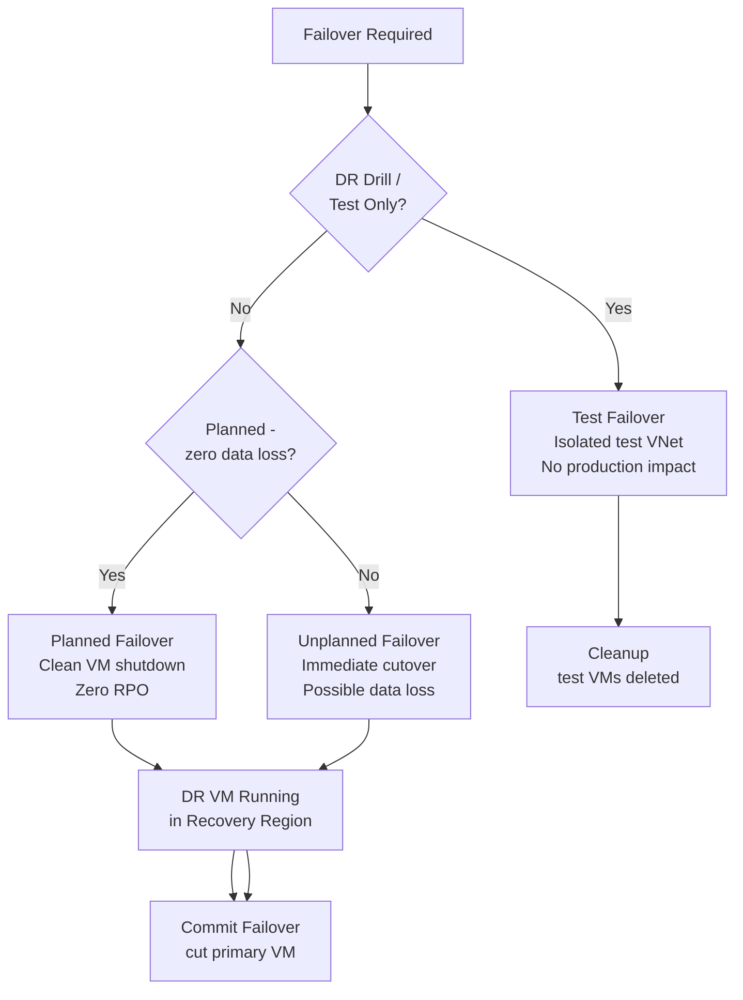

---
tags:
  - azure
---
# Failover


<div class="kb-summary">
Azure Site Recovery supports three types of failover: test failover (non-disruptive validation), planned failover (zero data loss), and unplanned failover (best-effort, used during real incidents). All failovers move protected workloads to the recovery region.

*Applies to: Azure*
</div>
```text
┌──────────────────────────────────────── Cloud Azure Backup Dr ────────────────────────────────────────┐
│                                                                                                       │
│   ┌───────────────────────────────────────────────────────────────────────────────────────────────┐   │
│   │                             Azure: Cloud Azure Backup Dr platform                             │   │
│   │                                  Protocols: Various protocols                                 │   │
│   │                      Management: Cloud Azure Backup Dr management console                     │   │
│   │                Sections: Architecture · Operations · Security · Troubleshooting               │   │
│   └───────────────────────────────────────────────────────────────────────────────────────────────┘   │
│                                                                                                       │
│    Architecture → Operations → Security → Troubleshooting → Escalation                                │
│                                                                                                       │
│                  ▼                                ▼                                ▼                  │
│                                                                                                       │
│   ┌─────────────────────────────┐  ┌─────────────────────────────┐  ┌─────────────────────────────┐   │
│   │            Layer            │  │          Component          │  │            Notes            │   │
│   │             Core            │  │       Primary service       │  │        Main function        │   │
│   │          Management         │  │        Control plane        │  │         Admin access        │   │
│   │          Monitoring         │  │         Health/perf         │  │      Alerts/dashboards      │   │
│   │           Security          │  │         Auth/encrypt        │  │        Access control       │   │
│   │         Integration         │  │        APIs/plug-ins        │  │         Third-party         │   │
│   └─────────────────────────────┘  └─────────────────────────────┘  └─────────────────────────────┘   │
│                                                                                                       │
│                          ▼                                                 ▼                          │
│                                                                                                       │
│   ┌───────────────────────────────────────────────────────────────────────────────────────────────┐   │
│   │      Layer       │    Component     │      Function     │      Notes       │       Auth       │   │
│   │       Core       │ Primary service  │   Main function   │     See docs     │       RBAC       │   │
│   │    Management    │  Control plane   │    Admin access   │     See docs     │       RBAC       │   │
│   │    Monitoring    │   Health/perf    │  Alerts/dashboard │     See docs     │       RBAC       │   │
│   │     Security     │   Auth/encrypt   │   Access control  │     See docs     │       RBAC       │   │
│   └───────────────────────────────────────────────────────────────────────────────────────────────┘   │
│                                                                                                       │
│    Physical: Cloud Azure Backup Dr infrastructure · management network · monitoring                   │
│                                                                                                       │
│    Key terms:                                                                                         │
│                                                                                                       │
│    Azure              = Cloud Azure Backup Dr platform overview and core concepts                     │
│    Management         = management console and command-line interface for administration              │
│    Monitoring         = health and performance monitoring dashboards and alerting                     │
│    Automation         = REST API, scripting, and pipeline integration capabilities                    │
│    Security           = access control, authentication, and encryption configuration                  │
│    Backup             = backup and recovery procedures and schedule configuration                     │
│    Upgrade            = software version upgrades and firmware patching procedures                    │
│    Troubleshooting    = diagnostic procedures and common issue resolution steps                       │
│    Escalation         = vendor support escalation path and severity triage process                    │
│    Documentation      = vendor knowledge base and official product documentation                      │
│    Change management  = change ticket requirements for production modifications                       │
│    Audit log          = admin action logging for compliance and security review                       │
│                                                                                                       │
└───────────────────────────────────────────────────────────────────────────────────────────────────────┘
```


---

## Failover Decision Flow



## Failover Types Compared

| Type | Data Loss | VM Shutdown | Use Case |
|---|---|---|---|
| Test Failover | None | No (production continues) | DR drills, compliance validation |
| Planned Failover | None | Yes (clean shutdown first) | Planned maintenance, region migration |
| Unplanned Failover | Possible | No (immediate cutover) | Real disaster, primary region failure |

---

## Pre-Failover Checks

```bash
# Check replication health before failover
az rest --method GET \
  --uri "https://management.azure.com/subscriptions/<sub-id>/resourceGroups/<dr-rg>/providers/Microsoft.RecoveryServices/vaults/<vault-name>/replicationProtectedItems?api-version=2022-10-01" \
  --query "value[].{Name:name, Health:properties.replicationHealth, RPO:properties.rpoInSeconds}" \
  --output table

# Confirm the vault is accessible
az backup vault show \
  --resource-group <dr-rg> \
  --name <vault-name> \
  --query "properties.provisioningState" --output tsv

# Verify target network exists in DR region
az network vnet show \
  --resource-group <dr-rg> \
  --name <target-vnet-name> \
  --query "provisioningState" --output tsv
```

---

## Test Failover

Test failover spins up a replica VM in an isolated network. Production replication is unaffected.

```bash
# Trigger test failover
az rest --method POST \
  --uri "https://management.azure.com/subscriptions/<sub-id>/resourceGroups/<dr-rg>/providers/Microsoft.RecoveryServices/vaults/<vault-name>/replicationFabrics/<source-fabric>/replicationProtectionContainers/<source-container>/replicationProtectedItems/<item-name>/testFailover?api-version=2022-10-01" \
  --body '{
    "properties": {
      "networkId": "<test-vnet-id>",
      "failoverDirection": "PrimaryToRecovery",
      "providerSpecificDetails": {"instanceType": "A2A"}
    }
  }'

# Monitor the test failover job
az rest --method GET \
  --uri "https://management.azure.com/subscriptions/<sub-id>/resourceGroups/<dr-rg>/providers/Microsoft.RecoveryServices/vaults/<vault-name>/replicationJobs?api-version=2022-10-01" \
  --query "value[?properties.jobType=='TestFailover'].{Name:name, State:properties.state}" \
  --output table

# Clean up test failover (mandatory after validation)
az rest --method POST \
  --uri "https://management.azure.com/subscriptions/<sub-id>/resourceGroups/<dr-rg>/providers/Microsoft.RecoveryServices/vaults/<vault-name>/replicationFabrics/<source-fabric>/replicationProtectionContainers/<source-container>/replicationProtectedItems/<item-name>/testFailoverCleanup?api-version=2022-10-01" \
  --body '{"properties": {"comments": "DR drill completed - clean up"}}'
```

---

## Planned Failover

Planned failover shuts down the source VM cleanly, synchronises all pending data, then brings up the target VM. Zero data loss guaranteed.

```bash
# Trigger planned failover
az rest --method POST \
  --uri "https://management.azure.com/subscriptions/<sub-id>/resourceGroups/<dr-rg>/providers/Microsoft.RecoveryServices/vaults/<vault-name>/replicationFabrics/<source-fabric>/replicationProtectionContainers/<source-container>/replicationProtectedItems/<item-name>/plannedFailover?api-version=2022-10-01" \
  --body '{
    "properties": {
      "failoverDirection": "PrimaryToRecovery",
      "providerSpecificDetails": {"instanceType": "A2A"}
    }
  }'
```

---

## Unplanned Failover

Used when the primary region is unavailable. Accept potential data loss of up to one RPO cycle.

```bash
# Trigger unplanned failover to latest recovery point
az rest --method POST \
  --uri "https://management.azure.com/subscriptions/<sub-id>/resourceGroups/<dr-rg>/providers/Microsoft.RecoveryServices/vaults/<vault-name>/replicationFabrics/<source-fabric>/replicationProtectionContainers/<source-container>/replicationProtectedItems/<item-name>/unplannedFailover?api-version=2022-10-01" \
  --body '{
    "properties": {
      "failoverDirection": "PrimaryToRecovery",
      "sourceSiteOperations": "NotRequired",
      "providerSpecificDetails": {
        "instanceType": "A2A",
        "recoveryPointId": "latest"
      }
    }
  }'
```

---

## Recovery Plans

Recovery plans define the order in which VMs are failed over and allow pre/post scripts.

```bash
# List all recovery plans in the vault
az rest --method GET \
  --uri "https://management.azure.com/subscriptions/<sub-id>/resourceGroups/<dr-rg>/providers/Microsoft.RecoveryServices/vaults/<vault-name>/replicationRecoveryPlans?api-version=2022-10-01" \
  --query "value[].{Name:name, Groups:properties.groups}" \
  --output table

# Trigger a recovery plan failover
az rest --method POST \
  --uri "https://management.azure.com/subscriptions/<sub-id>/resourceGroups/<dr-rg>/providers/Microsoft.RecoveryServices/vaults/<vault-name>/replicationRecoveryPlans/<plan-name>/plannedFailover?api-version=2022-10-01" \
  --body '{"properties": {"failoverDirection": "PrimaryToRecovery", "providerSpecificDetails": [{"instanceType": "A2A"}]}}'
```

---

## Commit Failover

After a failover (planned or unplanned), commit to finalize the state and stop reverse delta sync.

```bash
# Commit failover for a protected item
az rest --method POST \
  --uri "https://management.azure.com/subscriptions/<sub-id>/resourceGroups/<dr-rg>/providers/Microsoft.RecoveryServices/vaults/<vault-name>/replicationFabrics/<source-fabric>/replicationProtectionContainers/<source-container>/replicationProtectedItems/<item-name>/failoverCommit?api-version=2022-10-01"
```

---

## Post-Failover Validation

```bash
# Confirm DR VM is running
az vm show \
  --resource-group <dr-rg> \
  --name <dr-vm-name> \
  --show-details \
  --query "powerState" --output tsv

# Check activity log for failover-related events
az monitor activity-log list \
  --resource-group <dr-rg> \
  --start-time $(date -u -d '2 hours ago' +%Y-%m-%dT%H:%M:%SZ) \
  --query "[].{Time:eventTimestamp, Op:operationName.value, Status:status.value}" \
  --output table
```
