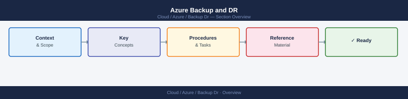

# Azure Backup and DR

Backup and recovery notes for Azure Backup, Site Recovery, vaults, jobs, and restore validation.

*Applies to: Azure*

<a class="kb-card" href="azure-backup/">
  <strong>Azure Backup</strong>
  Azure Backup notes, checks, commands, troubleshooting, and validation.
</a>

<a class="kb-card" href="recovery-services-vault/">
  <strong>Recovery Services Vault</strong>
  Recovery Services Vault notes, checks, commands, troubleshooting, and validation.
</a>

<a class="kb-card" href="backup-jobs/">
  <strong>Backup Jobs</strong>
  Backup Jobs notes, checks, commands, troubleshooting, and validation.
</a>

<a class="kb-card" href="backup-policies/">
  <strong>Backup Policies</strong>
  Backup Policies notes, checks, commands, troubleshooting, and validation.
</a>

<a class="kb-card" href="restore-testing/">
  <strong>Restore Testing</strong>
  Restore Testing notes, checks, commands, troubleshooting, and validation.
</a>

<a class="kb-card" href="azure-site-recovery/">
  <strong>Azure Site Recovery</strong>
  Azure Site Recovery notes, checks, commands, troubleshooting, and validation.
</a>

<a class="kb-card" href="replication-health/">
  <strong>Replication Health</strong>
  Replication Health notes, checks, commands, troubleshooting, and validation.
</a>

<a class="kb-card" href="failover/">
  <strong>Failover</strong>
  Failover notes, checks, commands, troubleshooting, and validation.
</a>

<a class="kb-card" href="failback/">
  <strong>Failback</strong>
  Failback notes, checks, commands, troubleshooting, and validation.
</a>

