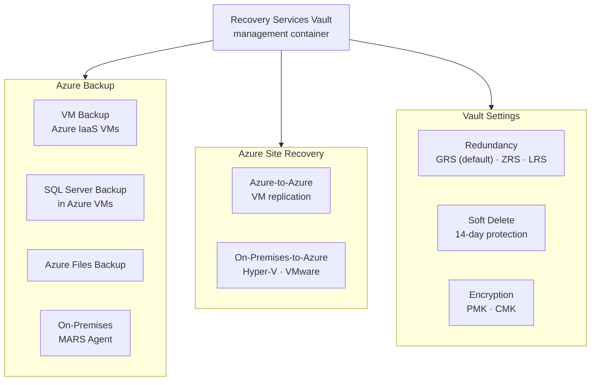

# Recovery Services Vault


<div class="kb-summary">
The Recovery Services Vault is the top-level management container for both Azure Backup and Azure Site Recovery. It stores backup data, holds replication configuration, and controls access, redundancy, and security settings.
</div>

---

## Recovery Services Vault Structure



## Vault Creation

```bash
# Create a Recovery Services Vault
az backup vault create \
  --resource-group <rg> \
  --name <vault-name> \
  --location <region>

# Create a vault with tags
az backup vault create \
  --resource-group <rg> \
  --name <vault-name> \
  --location eastus \
  --tags env=prod owner=platform-team

# List all vaults in the current subscription
az backup vault list --output table

# Show vault details
az backup vault show \
  --resource-group <rg> \
  --name <vault-name>
```

---

## Storage Redundancy Settings

Set redundancy before registering any backup items. Changing it afterward requires removing all protected items.

```bash
# View current redundancy setting
az backup vault backup-properties show \
  --resource-group <rg> \
  --name <vault-name> \
  --query "properties.storageModelType" --output tsv

# Set storage redundancy to Geo-Redundant (recommended for production)
az backup vault backup-properties set \
  --resource-group <rg> \
  --name <vault-name> \
  --backup-storage-redundancy GeoRedundant

# Set to Zone-Redundant (AZ-protected, same region)
az backup vault backup-properties set \
  --resource-group <rg> \
  --name <vault-name> \
  --backup-storage-redundancy ZoneRedundant
```

| Redundancy | RTO / RPO | Cross-Region Restore | Cost |
|---|---|---|---|
| LocallyRedundant (LRS) | Lowest | No | Lowest |
| ZoneRedundant (ZRS) | Low | No | Medium |
| GeoRedundant (GRS) | Low | Yes (opt-in) | Higher |

---

## Soft Delete

Soft delete retains deleted backup data for 14 days, protecting against accidental or malicious deletion.

```bash
# Check if soft delete is enabled
az backup vault backup-properties show \
  --resource-group <rg> \
  --name <vault-name> \
  --query "properties.softDeleteFeatureState" --output tsv

# Enable soft delete (default: Enabled)
az backup vault backup-properties set \
  --resource-group <rg> \
  --name <vault-name> \
  --soft-delete-feature-state Enable

# Disable soft delete (requires explicit confirmation — high risk)
az backup vault backup-properties set \
  --resource-group <rg> \
  --name <vault-name> \
  --soft-delete-feature-state Disable
```

---

## Cross-Region Restore

Cross-Region Restore (CRR) lets you restore backup data to the paired secondary region without an ASR failover.

```bash
# Enable Cross-Region Restore on a GRS vault
az backup vault backup-properties set \
  --resource-group <rg> \
  --name <vault-name> \
  --cross-region-restore-flag true

# List backup items in the secondary region
az backup item list \
  --resource-group <rg> \
  --vault-name <vault-name> \
  --use-secondary-region \
  --output table

# List recovery points in secondary region
az backup recoverypoint list \
  --resource-group <rg> \
  --vault-name <vault-name> \
  --container-name <container-name> \
  --item-name <vm-name> \
  --backup-management-type AzureIaasVM \
  --workload-type VM \
  --use-secondary-region \
  --output table
```

---

## Access Control

```bash
# List current role assignments on the vault
az role assignment list \
  --scope <vault-resource-id> \
  --output table

# Assign Backup Operator role to a service principal
az role assignment create \
  --assignee <principal-id> \
  --role "Backup Operator" \
  --scope <vault-resource-id>

# Assign Backup Reader role (read-only)
az role assignment create \
  --assignee <principal-id> \
  --role "Backup Reader" \
  --scope <vault-resource-id>
```

| Built-in Role | Permissions |
|---|---|
| Backup Contributor | Full backup management, no vault delete |
| Backup Operator | Manage protection, trigger jobs, no policy changes |
| Backup Reader | View-only — no changes |

---

## Vault Deletion

```bash
# A vault must have no backup items before deletion
# List remaining items
az backup item list \
  --resource-group <rg> \
  --vault-name <vault-name> \
  --output table

# Delete the vault once empty
az backup vault delete \
  --resource-group <rg> \
  --name <vault-name> \
  --yes
```

---

## Diagnostic Settings

```bash
# Enable diagnostics to send logs to a Log Analytics workspace
az monitor diagnostic-settings create \
  --name vault-diagnostics \
  --resource <vault-resource-id> \
  --workspace <workspace-id> \
  --logs '[{"category":"AzureBackupReport","enabled":true},{"category":"CoreAzureBackup","enabled":true}]'

# List existing diagnostic settings on the vault
az monitor diagnostic-settings list \
  --resource <vault-resource-id> \
  --output table
```
